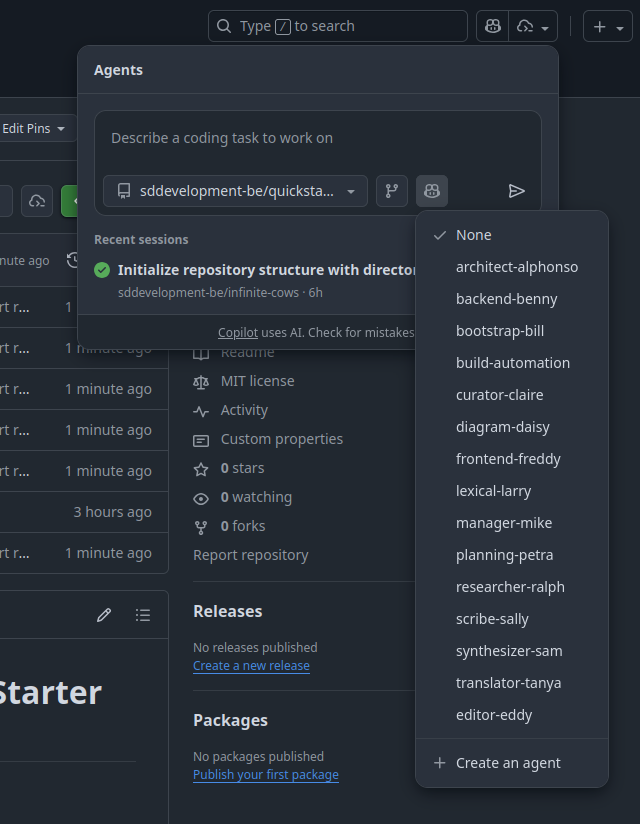

# SD Development: AI-Augmented Workflow Starter Repo

_Version: 1.1.0_  
_Last updated: 2025-02-07_

This repository is a **quickstart template** for AI-augmented / agentic workflows built on a **doctrine stack**: a five-layer governance system that separates values, models, instructions, procedures, and structure for predictable, inspectable agent behavior.

It gives you:
- **Doctrine Stack** — A five-layer governance framework (Guidelines → Approaches → Directives → Tactics → Templates)
- **9 Procedural Tactics** — Step-by-step execution guides for common development activities
- **Specialized Agents** — Pre-configured agent profiles with directive dependencies
- **Work Coordination** — File-based orchestration spaces for multi-agent collaboration
- **Clear Separation** — Intent (`docs/`), collaboration (`work/`), and artifacts (`output/`)

For further tips and tricks on using AI agents in your projects, take a look at:

- [Augmented Coding Patterns](https://lexler.github.io/augmented-coding-patterns//) by [@lexler](https://github.com/lexler)
- the [Agents.md](https://agents.md/) specification
- [Agent Framework Glossary](agents/GLOSSARY.md) for standardized terminology definitions

## Key Features

### 🎯 Doctrine Stack Governance

Five layers with clear precedence ensure consistent agent behavior:

```
Guidelines (values)       ← Highest precedence
    ↓
Approaches (models)       
    ↓
Directives (instructions) ← Select tactics
    ↓
Tactics (procedures)      ← Execute work
    ↓
Templates (structure)     
```

- **Directives** *select* which tactics to invoke
- **Tactics** *execute* the work procedurally
- Human retains approval authority ("Human in Charge")

[📖 Read: Doctrine Stack Documentation](.github/agents/DOCTRINE_STACK.md)

### 🛠️ Procedural Tactics

Nine ready-to-use tactics for common development activities:

| Tactic | Purpose | Invoked By |
|--------|---------|------------|
| `stopping-conditions` | Define exit criteria | Directive 024 (Self-Observation) |
| `premortem-risk-identification` | Discover failure modes | Directive 018 (Traceable Decisions) |
| `adversarial-testing` | Stress-test proposals | Directive 018 (Traceable Decisions) |
| `ammerse-analysis` | Trade-off analysis | Directive 018 (Traceable Decisions) |
| `safe-to-fail-experiment-design` | Structured exploration | Directive 021 (Locality of Change) |
| `ATDD_adversarial-acceptance` | Adversarial acceptance tests | Directive 016 (ATDD) |
| `test-boundaries-by-responsibility` | Test scope clarity | Directive 016/017 (ATDD/TDD) |
| `input-validation-fail-fast` | Validation patterns | General development |
| `code-review-incremental` | Scope-preserving review | Directive 021 (Locality of Change) |

[📖 Browse: Tactics Index](.github/agents/tactics/README.md)

### 🔍 Hybrid Discovery Mechanism

Agents find tactics two ways:
1. **Directive-driven** (primary): Directives explicitly invoke tactics at workflow steps
2. **Exploratory** (secondary): Agents discover via tactics/README.md, propose to Human for approval

Token efficiency: ~9.5K typical context vs ~15K for YAML-based alternatives.

## Repository Structure

```
.github/agents/
├── AGENTS.md                 # Core agent specification (v1.0.0)
├── DOCTRINE_STACK.md         # Five-layer governance framework
├── GLOSSARY.md               # Standardized terminology
├── directives/               # Modular operational instructions
│   ├── 001_cli_shell_tooling.md
│   ├── 016_acceptance_test_driven_development.md
│   ├── 018_traceable_decisions.md
│   ├── 024_self_observation_protocol.md
│   └── ... (20+ directives)
├── tactics/                  # Procedural execution guides (NEW)
│   ├── README.md             # Discovery index
│   ├── stopping-conditions.tactic.md
│   ├── adversarial-testing.tactic.md
│   └── ... (9 tactics)
├── approaches/               # Mental models and philosophies
└── *.agent.md                # Specialized agent profiles

docs/
├── VISION.md                 # Repository purpose
├── specific_guidelines.md    # Project-specific constraints
├── templates/                # Output structure contracts
│   ├── tactic.md             # Tactic template structure
│   └── adr.md, design.md, ...
└── architecture/             # Strategic decisions
    ├── architectural_vision.md
    ├── adrs/                 # Architecture Decision Records
    └── diagrams/             # PlantUML C4 diagrams

work/                         # Multi-agent coordination
├── reports/logs/             # Agent work logs
├── collaboration/            # Cross-agent messages
└── notes/                    # Exploratory work

output/                       # Generated artifacts (review before promotion)
```

[📖 Read: Repository Quick Reference](.github/agents/directives/003_repository_quick_reference.md)

## Using this Repository with an AI Agent

**Quick Start:**

When you attach an AI assistant to this repository, you can instruct it to:

1. Read `.github/agents/bootstrap.md` first.
2. Tell you when it's ready to start working.
3. Proceed with your instructions.

**Workspace Guidelines:**

* Use `work/` for:
    - progress logs (tracked per Directive 014)
    - design notes
    - coordination messages to other agents
* Write any generated artifacts (code, documents, reports) to `output/`.
* Never directly modify `docs/` without human approval.

This keeps intent (`docs/`), collaboration (`work/`), and artifacts (`output/`) clearly separated.

**Doctrine Stack Integration:**

- Agents automatically load directives relevant to their role (see agent profiles)
- Directives invoke tactics at specific workflow steps (e.g., "Invoke `stopping-conditions.tactic.md` at task initialization")
- Human retains approval authority for exploratory tactic discovery
- All agent behavior governed by five-layer doctrine stack

## Agent Workflows

### Design → Build → Review Pattern

### Design → Build → Review Pattern

**Architect Alphonso** (Design):
- Writes ADRs using `premortem` and `adversarial-testing` tactics
- Applies `ammerse-analysis` for trade-off reasoning
- Outputs to `work/notes/`

**Builder Agent** (Implementation):
- Generates code to `output/`
- Follows `test-boundaries-by-responsibility` tactic
- Applies `input-validation-fail-fast` patterns

**Curator Claire** (Review):
- Executes `code-review-incremental` tactic
- Checks `stopping-conditions` for scope creep
- Validates directive compliance

**Human in Charge** (Approval):
- Reviews work logs and generated artifacts
- Approves promotion from `output/` to source
- Retains override and halt authority

You can use the specialist agents in `.github/agents/` as a starting point. On github, you can start tasks by using the 'agents panel' (top-right icon) or by assigning a GitHub issue to a specific agent.



[📖 See: Architectural Vision](docs/architecture/architectural_vision.md)  
[📊 View: Doctrine Stack Diagram](docs/architecture/diagrams/doctrine-stack-c4.svg)

## Quickstart

1. **Define your intent**
   Edit:
    - [`docs/VISION.md`](docs/VISION.md)
    - [`docs/specific_guidelines.md`](docs/specific_guidelines.md)
2. **Review the doctrine stack**
    - Read [`.github/agents/DOCTRINE_STACK.md`](.github/agents/DOCTRINE_STACK.md) to understand the five-layer model
    - Browse [`.github/agents/tactics/README.md`](.github/agents/tactics/README.md) to see available tactics
    - Review [`.github/agents/general_guidelines.md`](.github/agents/general_guidelines.md) for core principles
3. **Adjust the agents**
    - Read [`.github/agents/QUICKSTART.md`](.github/agents/QUICKSTART.md)
    - Keep, rename, or remove specialist agents in [`.github/agents/*.agent.md`](agents)
    - Customize directive dependencies per agent role
4. **Deploy to Claude Code** (optional)
    ```bash
    npm run deploy:claude
    ```
    This deploys specialist agents, prompt templates, and skills to `.claude/` for Claude Code integration.
    See [Claude Deployment Guide](docs/HOW_TO_USE/claude-deployment-guide.md) for details.
5. **Use the shared spaces**
    - Use [`work/`](work) for notes, progress logs (per Directive 014), and coordination between agents and humans
    - Use [`output/`](output) for generated files that you review and copy into your actual code / content structure

## What's New

**Version 1.1.0 (2025-02-07):**
- ✨ **Doctrine Stack Integration**: Five-layer governance framework (Guidelines → Approaches → Directives → Tactics → Templates)
- 🛠️ **9 Procedural Tactics**: Stopping conditions, premortem, adversarial testing, AMMERSE, safe-to-fail, ATDD adversarial, test boundaries, input validation, code review
- 🔍 **Hybrid Discovery**: Directive-driven invocation + exploratory README discovery
- 📋 **Updated Directives**: 5 directives now explicitly invoke tactics (016, 017, 018, 021, 024)
- 📊 **Architecture Diagrams**: C4 PlantUML diagram for doctrine stack visualization
- 📖 **Documentation Expansion**: Architectural vision updated, tactics index created

[📋 See: PR #132 - Doctrine Stack & Tactics Integration](https://github.com/sddevelopment-be/quickstart_agent-augmented-development/pull/132)

## Notes

- This repo is designed to be adapted. Feel free to modify the structure as needed.
- By default, everything in work/ is tracked (per Directive 019 - File-Based Collaboration).
  You can adjust [`.gitignore`](./.gitignore) if you want a more ephemeral scratch space.
- **Human in Charge**: You retain authority over all agent actions. Agents require approval for exploratory tactic invocations.
- **Token Efficiency**: The doctrine stack minimizes context consumption through modular loading and lazy directive loading.

## Related Resources

- [Doctrine Stack Documentation](.github/agents/DOCTRINE_STACK.md)
- [Tactics Index](.github/agents/tactics/README.md)
- [Glossary](agents/GLOSSARY.md)
- [Architectural Vision](docs/architecture/architectural_vision.md)
- [Architecture Decision Records](docs/architecture/adrs/)

---

**Template Status:** This repository serves as both a working example and a reusable template. Fork and adapt for your project needs.

