# CI/CD Orchestration Guide

**Audience:** Release engineers and maintainers configuring automation.

This guide explains the automated CI/CD workflows that support the file-based multi-agent orchestration framework.

## Overview

Three GitHub Actions workflows automate orchestration execution, validation, and diagram rendering:

| Workflow | Purpose | Trigger | Duration |
|----------|---------|---------|----------|
| **Orchestration** | Auto-assign tasks from inbox | Hourly schedule + manual | ~1-2 min |
| **Validation** | Validate work directory on PRs | Pull requests + push to main | ~30-60s |
| **Diagram Rendering** | Validate PlantUML diagrams | PRs with .puml changes | ~1-2 min |

## Orchestration Workflow

**File:** `.github/workflows/orchestration.yml`

### What It Does

The orchestration workflow automatically runs the agent orchestrator to:
- Assign new tasks from `work/inbox/` to appropriate agents
- Create follow-up tasks based on `next_agent` handoffs
- Monitor for timed-out tasks
- Update `work/collaboration/WORKFLOW_LOG.md`

### Triggers

**Scheduled (Automatic):**
- Runs every hour at minute 0
- Cron schedule: `0 * * * *`

**Manual Dispatch:**
- Navigate to: Actions → Agent Orchestration → Run workflow
- Options:
  - **Branch:** Select branch to run on (usually `main`)
  - **Dry-run mode:** Enable to test without committing changes

### Configuration

**Python Environment:**
- Version: 3.10
- Dependencies: PyYAML (cached for performance)

**Permissions:**
- `contents: write` - Commit task assignments
- `issues: write` - Create failure notifications

**Timeout:** 5 minutes (prevents stuck runs)

**Concurrency:** Cancel-in-progress for same branch (prevents conflicts)

### How to Trigger Manually

1. Go to repository **Actions** tab
2. Select **Agent Orchestration** workflow
3. Click **Run workflow** button
4. Choose options:
   - **Branch:** `main` (or your working branch)
   - **Dry-run mode:** Check for testing, uncheck for actual execution
5. Click **Run workflow** (green button)

### Understanding Results

**Successful Run:**
- ✅ Green checkmark on workflow run
- Check commit history for `[orchestrator] Auto-assign tasks`
- Review `work/collaboration/WORKFLOW_LOG.md` for details

**No Changes:**
- ✅ Green checkmark (success)
- No new commits (no tasks to assign)
- Log entry: "Orchestrator run completed: No changes"

**Failed Run:**
- ❌ Red X on workflow run
- Automatic GitHub issue created with label `orchestration`
- Check workflow logs for error details
- Review `work/` directory state

### Troubleshooting

**Problem:** Orchestrator commits unexpected changes

**Solution:**
- Review orchestrator logs in workflow run
- Check `work/collaboration/WORKFLOW_LOG.md` for reasoning
- Verify task YAML files are valid (run validation workflow)
- Use dry-run mode to test without committing

**Problem:** Workflow times out after 5 minutes

**Solution:**
- Indicates orchestrator is stuck or slow
- Check for large number of tasks in inbox
- Review orchestrator logic for performance issues
- May need to increase timeout in `.github/workflows/orchestration.yml`

**Problem:** Workflow runs too frequently / not frequently enough

**Solution:**
- Edit cron schedule in `.github/workflows/orchestration.yml`
- Current: `0 * * * *` (every hour)
- Examples:
  - Every 30 minutes: `*/30 * * * *`
  - Every 3 hours: `0 */3 * * *`
  - Once daily at 9 AM: `0 9 * * *`
- See [Crontab Guru](https://crontab.guru/) for schedule syntax

### Dry-Run Mode

Use dry-run mode to test orchestrator logic without making changes:

1. Manual dispatch the workflow
2. Enable **dry_run** option
3. Review logs to see what would have happened
4. No commits will be made
5. Workflow log will show "Dry-run mode (skipped)"

## Validation Workflow

**File:** `.github/workflows/validation.yml`

### What It Does

The validation workflow checks work directory integrity on every PR:
- **Structure:** All required directories exist (`inbox`, `assigned`, `done`, etc.)
- **Schema:** Task YAML files conform to schema (required fields, types)
- **Naming:** Task files follow `YYYY-MM-DDTHHMM-agent-slug.yaml` pattern
- **E2E Tests:** Run orchestration end-to-end tests (if available)

### Triggers

**Automatic:**
- Every pull request to `main` branch
- Every push to `main` branch

### Results Display

**PR Check Status:**
- ✅ Green checkmark: All validations passed
- ❌ Red X: One or more validations failed

**PR Comment:**
- Automatically posted by bot
- Table of validation results
- Common fix suggestions
- Local validation commands

**GitHub Job Summary:**
- Visible in Actions tab
- Detailed results for each check
- Error messages and file paths

### Validation Checks

**1. Work Directory Structure**

Ensures these directories exist:
```
work/
  inbox/
  assigned/
  done/
  archive/
  logs/
  collaboration/
  schemas/
  scripts/
```

**Fix:** Run `bash work/scripts/init-work-structure.sh`

**2. Task YAML Schema**

Validates each task file has:
- `id`: Matches filename
- `agent`: Valid agent name
- `status`: One of [new, assigned, in_progress, done, error]
- `title`: Non-empty string
- `created_at`: ISO 8601 timestamp

**Fix:** Check validation error for specific file and field

**3. Task Naming Convention**

Validates filename pattern: `YYYY-MM-DDTHHMM-agent-slug.yaml`

Examples:
- ✅ `2025-11-23T1430-curator-repo-audit.yaml`
- ❌ `task-curator-repo-audit.yaml` (no timestamp)
- ❌ `2025-11-23-curator-repo-audit.yaml` (wrong separator)

**Fix:** Rename file to match pattern

**4. E2E Tests (Optional)**

Runs `work/scripts/test_orchestration_e2e.py` if it exists.

Validates:
- Task assignment logic
- Handoff creation
- Timeout detection
- Status transitions

**Fix:** Check pytest output for specific test failures

### Running Validation Locally

Before pushing changes, run validation locally:

```bash
# Structure check
bash work/scripts/validate-work-structure.sh

# Schema validation (single file)
python work/scripts/validate-task-schema.py work/inbox/my-task.yaml

# Schema validation (all files)
find work/ -name "*.yaml" -type f -exec python work/scripts/validate-task-schema.py {} \;

# Naming convention
bash work/scripts/validate-task-naming.sh

# E2E tests
python -m pytest work/scripts/test_orchestration_e2e.py -v
```

### Troubleshooting

**Problem:** Validation fails on unrelated files

**Solution:**
- Check if old/archived tasks have schema issues
- Consider moving problematic files out of `work/` temporarily
- Update schema if legitimate fields are being rejected

**Problem:** E2E tests fail intermittently

**Solution:**
- Check for test dependency on external state
- Review test fixtures for correctness
- Consider increasing test timeouts if environment is slow

**Problem:** Too many false positives

**Solution:**
- Review schema definition in `work/scripts/validate-task-schema.py`
- Adjust required fields vs optional fields
- Update validation logic if too strict

## Diagram Rendering Workflow

**File:** `.github/workflows/diagram-rendering.yml`

### What It Does

The diagram rendering workflow validates PlantUML diagrams on PRs:
- Compiles all `.puml` files to SVG format
- Detects syntax errors before merge
- Uploads rendered SVGs as workflow artifacts
- Reports results in PR comment

### Triggers

**Automatic:**
- Pull requests with changes to `.puml` files
- Path filter: `**.puml` or `docs/architecture/diagrams/**`

**Not Triggered:**
- PRs without diagram changes (efficiency optimization)
- Pushes to main (assumes PR validation already passed)

### Results Display

**PR Check Status:**
- ✅ Green: All diagrams compiled successfully
- ❌ Red: One or more diagrams failed to compile

**PR Comment:**
- Table showing success/failure counts
- Links to workflow artifacts (rendered SVGs)
- Common PlantUML syntax errors
- Local testing instructions

**Workflow Artifacts:**
- Rendered SVG files (7-day retention)
- Download from Actions tab → Workflow run → Artifacts

### PlantUML Setup

**Java:** Version 17 (Temurin distribution)  
**PlantUML:** v1.2023.13 (cached for performance)  
**Output Format:** SVG (scalable, web-friendly)

### Common Diagram Errors

**Missing Tags:**

```plantuml
# ❌ Missing @startuml
A --> B
@enduml

# ✅ Correct
@startuml
A --> B
@enduml
```


**Invalid Syntax:**
```plantuml
# ❌ Wrong arrow type
A -> B

# ✅ Correct (for class diagram)
A --> B
```

**Unclosed Blocks:**
```plantuml
@startuml
alt success case
    A -> B
# ❌ Missing 'end'
@enduml

# ✅ Correct
@startuml
alt success case
    A -> B
end
@enduml
```

### Testing Diagrams Locally

**Install PlantUML:**
```bash
# Download JAR
wget https://github.com/plantuml/plantuml/releases/download/v1.2023.13/plantuml-1.2023.13.jar

# Or use package manager (may be older version)
# Ubuntu/Debian:
sudo apt-get install plantuml
```

**Compile Diagram:**
```bash
# Compile to SVG
java -jar plantuml-1.2023.13.jar -tsvg docs/architecture/diagrams/my-diagram.puml

# Output: my-diagram.svg in same directory

# Compile all diagrams in directory
java -jar plantuml-1.2023.13.jar -tsvg docs/architecture/diagrams/*.puml
```

**Check for Errors:**
- Compilation errors printed to console
- Exit code 0 = success, non-zero = failure
- SVG file not created if compilation fails

### Viewing Rendered Diagrams

**From CI Artifacts:**
1. Go to Actions tab
2. Select diagram validation workflow run
3. Scroll to **Artifacts** section
4. Download **rendered-diagrams.zip**
5. Extract and open SVG files in browser

**Online Editor (for testing):**
- [PlantUML Online](https://www.plantuml.com/plantuml/uml/)
- Paste diagram code
- See live rendering and errors

### Troubleshooting

**Problem:** Diagram compiles locally but fails in CI

**Solution:**
- Check PlantUML version difference (CI uses v1.2023.13)
- Verify all external dependencies available (fonts, etc.)
- Check for environment-specific paths or includes

**Problem:** Workflow takes too long (>3 minutes timeout)

**Solution:**
- Check diagram complexity (thousands of nodes)
- Consider splitting large diagrams
- Increase timeout in `.github/workflows/diagram-rendering.yml` if justified

**Problem:** SVG artifacts not available

**Solution:**
- Check if compilation succeeded (failures don't upload artifacts)
- Artifacts expire after 7 days
- Download during retention period or re-run workflow

## Status Badges

Add workflow status badges to README for visibility:

```markdown
## CI Status

[](https://github.com/sddevelopment-be/quickstart_agent-augmented-development/actions/workflows/orchestration.yml)

[](https://github.com/sddevelopment-be/quickstart_agent-augmented-development/actions/workflows/validation.yml)

[](https://github.com/sddevelopment-be/quickstart_agent-augmented-development/actions/workflows/diagram-rendering.yml)
```

## Workflow Maintenance

### Adjusting Orchestration Schedule

Edit `.github/workflows/orchestration.yml`:

```yaml
on:
  schedule:
    - cron: '0 * * * *'  # Change this line
```

Common patterns:
- Every 30 minutes: `*/30 * * * *`
- Every 2 hours: `0 */2 * * *`
- Daily at 8 AM UTC: `0 8 * * *`
- Weekdays only at noon: `0 12 * * 1-5`

### Adjusting Timeouts

Edit workflow files:

```yaml
jobs:
  job-name:
    timeout-minutes: 5  # Change this value
```

Recommendations:
- Orchestration: 5-10 minutes
- Validation: 2-5 minutes
- Diagram rendering: 3-5 minutes

### Adjusting Cache Keys

If dependencies change, update cache keys to force refresh:

```yaml
- uses: actions/cache@v3
  with:
    key: ${{ runner.os }}-pip-orchestrator-v2  # Increment version
```

### Disabling Workflows Temporarily

Add to workflow file (top level):

```yaml
name: Agent Orchestration
on:
  schedule: []  # Disable schedule
  workflow_dispatch:  # Keep manual trigger
```

Or delete the workflow file (will stop running but preserve history).

## Security Considerations

**Token Permissions:**
- Workflows use `GITHUB_TOKEN` (automatic, scoped)
- Orchestration: Needs `contents: write` to commit changes
- Validation: Read-only, minimal permissions
- Diagram rendering: Read-only, minimal permissions

**Sensitive Data:**
- No secrets required for current workflows
- Task YAML files visible in commits
- Workflow logs are public (for public repos)

**Commit Safety:**
- Orchestrator commits are atomic (all-or-nothing)
- Change detection prevents empty commits
- Dry-run mode available for testing

## Related Documentation

- **Multi-Agent Orchestration:** `docs/HOW_TO_USE/multi-agent-orchestration.md`
- **Testing Orchestration:** `docs/HOW_TO_USE/testing-orchestration.md`
- **File-Based Orchestration Approach:** `.github/agents/approaches/file-based-orchestration.md`
- **Orchestrator Script:** `work/scripts/agent_orchestrator.py`

## Support

**Issues:**
- CI failures: Check workflow logs in Actions tab
- Validation errors: Run scripts locally for detailed output
- Diagram errors: Test in PlantUML online editor

**Questions:**
- See `.github/agents/build-automation.agent.md` for DevOps Danny profile
- Check `work/collaboration/WORKFLOW_LOG.md` for orchestration history
- Review `work/logs/` for detailed agent execution logs

---

_Last updated: 2025-11-23_  
_Maintained by: DevOps Danny (Build Automation Agent)_
