# CI Validation Guide: Prompt Quality Checks

## Overview

This guide explains the automated prompt quality validation system that runs on every Pull Request. The CI workflow validates all prompt template files against the quality schema defined in [ADR-023](../../architecture/adrs/ADR-023-prompt-optimization-framework.md), ensuring consistent prompt quality and catching anti-patterns before merge.

**Quick Reference:**
- **CI Workflow:** `.github/workflows/validate-prompts.yml`
- **Validator Module:** `ops/validation/prompt-validator.js`
- **CLI Tool:** `ops/validation/prompt-validator-cli.js`
- **Quality Schema:** `validation/schemas/prompt-schema.json`
- **Quality Threshold:** 70/100 (configurable)

## How CI Validation Works

### Trigger Conditions

The validation workflow automatically runs when:
1. A Pull Request is opened to the `main` branch
2. New commits are pushed to an open PR
3. Any of these file paths are modified:
   - `docs/templates/prompts/**.yaml`
   - `work/collaboration/**/**.yaml`
   - `ops/validation/prompt-validator*.js`
   - `validation/schemas/prompt-schema.json`

### Validation Process

```mermaid
graph LR
    A[PR Created/Updated] --> B[Checkout Code]
    B --> C[Install Dependencies]
    C --> D[Run Validator CLI]
    D --> E{Quality Score >= 70?}
    E -->|Yes| F[✅ CI Passes]
    E -->|No| G[❌ CI Fails]
    D --> H[Post PR Comment]
    D --> I[Generate Summary]
```



**Steps:**
1. **Checkout**: Pull latest code from the PR branch
2. **Setup**: Install Node.js 18 and npm dependencies
3. **Validate**: Run `npm run validate:prompts` on all prompt files
4. **Report**: Generate JSON and Markdown reports
5. **Comment**: Post validation results to PR as a comment
6. **Gate**: Fail CI if any prompt scores below 70/100

### What Gets Validated

The validator checks prompts against:

1. **Schema Compliance** (from `prompt-schema.json`)
   - Required fields: objective, deliverables, success_criteria, constraints, context_files
   - Field types and formats
   - Value constraints (min/max lengths, patterns)

2. **Anti-Pattern Detection** (from ADR-023)
   - ❌ Vague success criteria (P1)
   - ❌ Missing file extensions (P2)
   - ❌ Scope creep language (P4)
   - ❌ Relative paths (P5)
   - ❌ Overloaded time boxes (P12)
   - ❌ Vague deliverable validation

3. **Best Practice Warnings**
   - ⚠️ Tasks >60 min without checkpoints
   - ⚠️ Too many critical context files (>8)
   - ⚠️ Large tasks without token budget
   - ⚠️ Too many success criteria (>8)

### Quality Scoring

Prompts are scored from 0-100:

**Starting Score:** 100 points

**Deductions:**
- Schema error: -10 points each
- Anti-pattern: -5 points each

**Bonuses** (if schema valid):
- Token budget provided: +5 points
- Checkpoints defined: +5 points
- Handoff plan included: +5 points

**Threshold:** 70/100 to pass CI

**Examples:**
- Perfect prompt with bonuses: 115 (capped at 100)
- 2 schema errors: 80
- 6 anti-patterns: 70 (threshold)
- 7 anti-patterns: 65 (fails CI)

## Reading Validation Results

### PR Comment Format

When validation completes, a comment is posted to your PR:

```markdown
## 🔍 Prompt Quality Report

**Overall Status:** ❌ Fail (2/3 prompts valid)

### Summary
- **Prompts Validated:** 3
- **Passed:** 2 (67%)
- **Failed:** 1 (33%)
- **Average Quality Score:** 82/100
- **Threshold:** 70/100

### Details

#### ❌ Failed Prompts

##### my-task.yaml (Score: 65/100)

**Errors:**
- **success_criteria[0]**: Success criterion too vague - needs specific validation method or metric
  - 💡 Add specific pass/fail condition (e.g., "All 15 tests pass" instead of "Check tests")
- **deliverables[0].file**: Deliverable missing file extension
  - 💡 Add file extension (e.g., .md, .js, .yaml, .json)

**Warnings:**
- [risk] Task >60 min (120 min) without checkpoints risks work loss
  - 💡 Add checkpoint guidance every 30-45 minutes

#### ✅ Passed Prompts

- **bug-fix.yaml** (Score: 95/100) - 1 warning(s)
- **feature-add.yaml** (Score: 90/100)

---
*Validation took 1.24 seconds*
```

### Understanding Errors

**Schema Errors** (type: `schema`):
- Indicate missing required fields or invalid formats
- Must be fixed before merge
- Usually straightforward to resolve

**Anti-Pattern Errors** (type: `anti-pattern`):
- Detect known problematic patterns from ADR-023
- Include pattern ID (e.g., `vague-success-criteria`)
- Come with specific fix suggestions

**Warnings** (non-blocking):
- Best practice violations
- Don't fail CI but should be addressed
- Types: `efficiency`, `risk`, `best-practice`

### Common Error Messages

| Error | Meaning | Fix |
|-------|---------|-----|
| Missing required property 'objective' | Prompt lacks objective field | Add `objective: "..."` to YAML |
| Deliverable missing file extension | File path has no extension | Change `my-file` to `my-file.md` |
| Success criterion too vague | Criterion not measurable | Add specific metric or test name |
| Use absolute paths for context files | Relative path used | Change `./docs/file.md` to `docs/file.md` |
| Scope creep risk | Unbounded scope words | Replace "all files" with "top 5 files" |

## Local Validation Workflow

### Before Pushing

**Always validate locally before pushing to avoid CI failures:**

```bash
# Basic validation (default threshold: 70)
npm run validate:prompts

# Verbose output with detailed errors
npm run validate:prompts:verbose

# Strict mode (threshold: 85)
npm run validate:prompts:strict

# JSON output for scripting
npm run validate:prompts:json
```

### Typical Development Flow

```bash
# 1. Create or modify a prompt file
vim work/collaboration/assigned/my-agent/new-task.yaml

# 2. Validate the changes
npm run validate:prompts:verbose

# 3. Fix any errors reported
# ... edit the file ...

# 4. Re-validate until passing
npm run validate:prompts

# 5. Commit and push
git add work/collaboration/assigned/my-agent/new-task.yaml
git commit -m "Add new task prompt"
git push

# 6. CI will run automatically on the PR
```

### Validating Specific Files

```bash
# Validate a single directory
node ops/validation/prompt-validator-cli.js docs/templates/prompts/

# Validate with custom threshold
node ops/validation/prompt-validator-cli.js work/collaboration/ --threshold 80

# Get JSON output for parsing
node ops/validation/prompt-validator-cli.js docs/templates/prompts/ --format json > results.json
```

### CLI Options

```bash
node ops/validation/prompt-validator-cli.js [directory] [options]

Options:
  -t, --threshold <n>   Minimum quality score (default: 70)
  -f, --format <type>   Output: text, json, markdown (default: text)
  -v, --verbose         Show detailed info
  -h, --help            Show help
```

## Fixing Common Issues

### Issue: "Missing required property 'objective'"

**Problem:** Prompt file missing required field

**Fix:**
```yaml
# Add the missing field at the top level
objective: "Create authentication module with JWT token support"
```

### Issue: "Deliverable missing file extension"

**Problem:** File path has no extension

**Before:**
```yaml
deliverables:
  - file: docs/architecture/design-doc
```

**After:**
```yaml
deliverables:
  - file: docs/architecture/design-doc.md
```

### Issue: "Success criterion too vague"

**Problem:** Success criteria not specific or measurable

**Before:**
```yaml
success_criteria:
  - Check tests pass
  - Ensure code quality
```

**After:**
```yaml
success_criteria:
  - All 23 unit tests in test/auth/*.test.js pass without modification
  - ESLint reports 0 errors with --max-warnings 0
  - Code coverage remains above 85% (measured by Jest)
```

### Issue: "Use absolute paths for context files"

**Problem:** Context file path starts with `./` or `../`

**Before:**
```yaml
context_files:
  critical:
    - path: ../docs/guide.md
```

**After:**
```yaml
context_files:
  critical:
    - path: docs/guide.md
```

### Issue: "Scope creep risk"

**Problem:** Objective uses unbounded language

**Before:**
```yaml
objective: "Refactor all files to improve code quality"
```

**After:**
```yaml
objective: "Refactor the top 5 most complex files in src/auth/ to reduce cyclomatic complexity below 10"
```

### Issue: Task >60 min without checkpoints

**Problem:** Long task lacks checkpoints (warning, not error)

**Fix:**
```yaml
checkpoints:
  - time: 30min
    status: "Schema validation complete"
  - time: 60min
    status: "Core business logic implemented"
  - time: 90min
    status: "Tests written and passing"
```

## Integration with Development Workflow

### Pull Request Workflow

1. **Create Feature Branch**
   ```bash
   git checkout -b feature/add-deployment-task
   ```

2. **Add/Modify Prompts**
   ```bash
   # Create new task prompt
   cp docs/templates/prompts/task-execution.yaml work/collaboration/assigned/devops/deploy-task.yaml
   # Edit the prompt...
   ```

3. **Validate Locally**
   ```bash
   npm run validate:prompts:verbose
   # Fix any errors...
   ```

4. **Commit Changes**
   ```bash
   git add work/collaboration/assigned/devops/deploy-task.yaml
   git commit -m "Add deployment automation task"
   ```

5. **Push and Create PR**
   ```bash
   git push origin feature/add-deployment-task
   # Create PR on GitHub
   ```

6. **Review CI Results**
   - Check PR comment for validation results
   - View workflow summary in Actions tab
   - Download artifacts for detailed analysis

7. **Address Failures**
   ```bash
   # Fix validation errors
   vim work/collaboration/assigned/devops/deploy-task.yaml
   npm run validate:prompts:verbose
   git add work/collaboration/assigned/devops/deploy-task.yaml
   git commit -m "Fix prompt validation errors"
   git push
   ```

8. **Merge When Green**
   - All validations pass ✅
   - Code review approved ✅
   - CI checks green ✅

### CI Performance Expectations

- **Target Time:** < 2 minutes
- **Typical Time:** 30-60 seconds
- **Timeout:** 3 minutes

**Factors affecting speed:**
- Number of prompt files
- Size of each file
- npm dependency cache hit

### Bypassing Validation (Not Recommended)

Validation is a quality gate and should not be bypassed. However, in exceptional circumstances:

**Option 1: Increase threshold temporarily**
```bash
# Allow lower scores (emergency only)
PROMPT_VALIDATOR_THRESHOLD=60 npm run validate:prompts
```

**Option 2: Skip specific files**
- Move files out of validated directories temporarily
- Add them back after fixing

**⚠️ Warning:** Bypassing validation can introduce low-quality prompts that cause agent confusion and task failures.

## Troubleshooting

### CI Passes Locally But Fails in GitHub

**Possible causes:**
1. File not committed to git
2. Different Node.js version (CI uses v18)
3. Uncommitted changes to validator/schema

**Solution:**
```bash
# Ensure all files committed
git status

# Test with Node 18
nvm use 18
npm run validate:prompts

# Check schema is committed
git ls-files validation/schemas/prompt-schema.json
```

### Validation Timeout

**Symptom:** CI job times out after 3 minutes

**Causes:**
- Too many prompt files (>100)
- Very large prompt files (>50KB)
- npm install issues

**Solutions:**
1. Split large prompts into smaller tasks
2. Archive old prompts to `work/archive/`
3. Check npm cache in workflow

### JSON Parse Errors

**Symptom:** "Unexpected token in JSON at position X"

**Cause:** Malformed YAML or special characters

**Solution:**
```bash
# Validate YAML syntax first
npx js-yaml docs/templates/prompts/my-file.yaml

# Check for tabs (YAML requires spaces)
grep -P '\t' docs/templates/prompts/my-file.yaml

# Look for invalid characters
file docs/templates/prompts/my-file.yaml
```

### Missing Artifacts

**Symptom:** Can't download validation-output.json

**Cause:** Validation failed before artifact upload

**Solution:**
- Check workflow logs for earlier error
- Artifacts only uploaded if job runs to completion
- Use "Continue on error" setting in workflow

## Advanced Usage

### Custom Validation Rules

To add custom anti-patterns, edit `ops/validation/prompt-validator.js`:

```javascript
// In initAntiPatterns() method
{
  id: 'my-custom-pattern',
  description: 'Description of what to detect',
  pattern: /regex-pattern/i,
  field: 'field-to-check',
  message: 'Error message',
  suggestion: 'How to fix it'
}
```

Then update tests and re-run validation.

### Batch Validation Scripts

For bulk validation:

```bash
#!/bin/bash
# validate-all-prompts.sh

DIRS=(
  "docs/templates/prompts"
  "work/collaboration/assigned/backend"
  "work/collaboration/assigned/frontend"
  "work/collaboration/assigned/devops"
)

for dir in "${DIRS[@]}"; do
  echo "Validating $dir..."
  node ops/validation/prompt-validator-cli.js "$dir" --format json > "report-$(basename $dir).json"
done

echo "All validations complete"
```

### CI Badge in README

Add a status badge to show validation status:

```markdown
[](https://github.com/your-org/your-repo/actions/workflows/validate-prompts.yml)
```

### Integrating with Pre-Commit Hooks

```bash
# .git/hooks/pre-commit
#!/bin/bash

echo "Running prompt validation..."
if ! npm run validate:prompts; then
  echo "❌ Prompt validation failed. Fix errors before committing."
  exit 1
fi

echo "✅ Prompt validation passed"
```

## Reference Links

- **ADR-023:** [Prompt Optimization Framework](../../architecture/adrs/ADR-023-prompt-optimization-framework.md)
- **Prompt Schema:** [validation/schemas/prompt-schema.json](../../../validation/schemas/prompt-schema.json)
- **Validator Implementation:** [ops/validation/prompt-validator.js](../../../ops/validation/prompt-validator.js)
- **CLI Tool:** [ops/validation/prompt-validator-cli.js](../../../ops/validation/prompt-validator-cli.js)
- **Workflow Definition:** [.github/workflows/validate-prompts.yml](../../../.github/workflows/validate-prompts.yml)
- **Template Examples:** [docs/templates/prompts/](../../templates/prompts/)

## Getting Help

**Validation errors?**
1. Check this guide's "Fixing Common Issues" section
2. Review the error suggestions in the CLI output
3. Consult ADR-023 for pattern explanations
4. Run with `--verbose` for detailed context

**CI failures?**
1. Check workflow logs in GitHub Actions
2. Download validation artifacts for analysis
3. Run locally with same Node version (18)
4. Verify all files are committed

**Feature requests?**
1. File an issue describing the use case
2. Propose changes to the schema or anti-patterns
3. Submit a PR with tests

---

**Last Updated:** 2026-01-30  
**Maintainer:** DevOps Danny (Build Automation)  
**Related ADRs:** ADR-023 (Prompt Optimization Framework)
