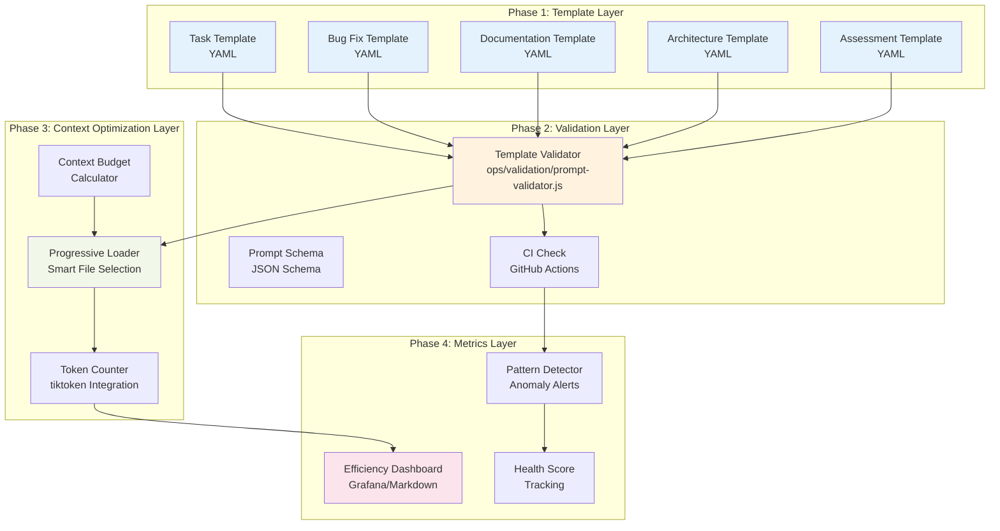

# ADR-023: Prompt Optimization Framework

**status**: `Proposed`  
**date**: 2025-01-30  
**supersedes**: None  
**related**: ADR-013 (Multi-Format Distribution), ADR-017 (Traceable Decision Integration), ADR-009 (Orchestration Metrics)  
**directives**: 014 (Work Log Creation), 016 (ATDD), 017 (TDD), 018 (Traceable Decisions)

## Context

### Problem Statement

Analysis of 129 work logs across 15 agent types identified **12 suboptimal prompt patterns** that reduce framework efficiency by 20-40%. While the framework demonstrates exceptional maturity (92/100 health score) with 100% Directive 014 compliance, systematic prompt inefficiencies create measurable waste:

**Quantified Impact:**
- **Average task duration:** 37 minutes (target: 25 minutes)
- **Clarification rate:** 30% of prompts require follow-up (target: <10%)
- **Rework rate:** 15% of tasks require iteration (target: <5%)
- **Token usage:** 40,300 average (target: 28,000, -30%)
- **Annual cost:** 240 hours/year lost to preventable inefficiencies

**Root Causes Analysis:**

The 12 patterns stem from three architectural gaps:

1. **Tooling Gap:** No structured prompt validation or generation mechanisms
2. **Process Gap:** Lack of standardized prompt templates with mandatory sections
3. **Guidance Gap:** Missing progressive disclosure strategy for context loading

### The 12 Suboptimal Patterns (Categorized)

#### Category A: Structural Ambiguity (Patterns 1-4)
Affect 30-40% of tasks, cause 67% of clarification requests:

1. **Vague success criteria** - "Assess the work" without output format
2. **Missing deliverable lists** - Goals without concrete file paths
3. **Ambiguous priorities** - Multiple tasks without sequencing
4. **Scope creep enabling** - "Check all" without boundaries

**Evidence:** 30% clarification rate, 15% rework rate, 40% slower completion

#### Category B: Context Inefficiency (Patterns 5-7)
Affect 23-35% of tasks, waste 360K-480K tokens/month:

5. **Missing directive file paths** - References without locations (+90 sec/task)
6. **Incomplete context loading** - "Load context" → 23K-64K input tokens
7. **Implicit follow-up expectations** - Handoffs unclear (+2 min latency)

**Evidence:** 40% input token overhead, inconsistent context across agents

#### Category C: Quality & Constraints (Patterns 8-12)
Affect 15-25% of tasks, reduce maintainability:

8. **No checkpoint guidance** - 3+ hour tasks without intermediate commits
9. **Undefined quality thresholds** - "Comprehensive" without metrics
10. **Redundant compliance reminders** - Same directives repeated 3x
11. **Missing constraint guidance** - No boundaries on approach
12. **Overloaded prompts** - 5+ distinct tasks in single prompt

**Evidence:** 2.3 review cycles average, 65% more code changes than necessary

### Current Architecture Baseline

**Existing Strengths to Leverage:**
- **Export Pipeline:** 3-stage architecture (Parse → Transform → Validate) in `ops/exporters/`
- **Parser Module:** `parser.js` with YAML frontmatter extraction and section parsing
- **Validator Module:** `validator.js` with schema compliance checking
- **Test Infrastructure:** 98 passing tests, CI/CD integration ready
- **Directive System:** 18 directives provide governance framework

**Integration Points:**
- Task YAML schema in `docs/templates/agent-tasks/task-descriptor.yaml`
- Work log requirements in Directive 014
- Orchestration patterns in ADR-008 (File-Based Coordination)
- Metrics capture in ADR-009 (Orchestration Metrics)

### Expected Outcomes

With systematic optimization:
- **Framework health:** 92/100 → 97-98/100 (+5-6 points)
- **Task efficiency:** 37 min → 25 min average (-32%, 12 min saved per task)
- **Clarification rate:** 30% → <10% (-67%, 20% more first-time-right)
- **Token efficiency:** 40,300 → 28,000 average (-30%, 12,300 tokens saved)
- **Annual ROI:** 140-300 hours saved, 360K-480K tokens/month reduction

---

## Decision

**We will implement a Hybrid Prompt Optimization Framework that combines template standardization, metadata-driven validation, and progressive context loading to systematically remediate all 12 suboptimal patterns.**

The framework consists of:

1. **Prompt Template Library** - 5 canonical templates with mandatory sections
2. **Schema-Driven Validation** - Automated prompt quality checks in CI/CD
3. **Progressive Context Loader** - Smart file loading with token budgets
4. **Metrics Dashboard** - Real-time efficiency tracking and trend analysis

This hybrid approach balances immediate quick wins (templates) with sustainable infrastructure (validation, automation) while minimizing disruption to existing workflows.

---

## Rationale

### Why Hybrid Over Pure Approaches?

We evaluated four architectural options:

**Option A: Template-Only Standardization**
- ✅ Fast implementation (2-4 hours)
- ✅ Immediate 30-40% efficiency gain
- ❌ No enforcement mechanism (relies on discipline)
- ❌ Template drift risk over time
- **Effort:** 6 hours | **Risk:** Medium

**Option B: Metadata-Driven Generation**
- ✅ Programmatic consistency
- ✅ Schema validation built-in
- ❌ High initial effort (20+ hours)
- ❌ Learning curve for prompt authors
- **Effort:** 24 hours | **Risk:** High

**Option C: Agent Framework Enhancement**
- ✅ Runtime validation
- ✅ Seamless integration with existing agents
- ❌ Complex to test and debug
- ❌ Requires agent profile modifications
- **Effort:** 18 hours | **Risk:** High

**Option D: Hybrid Approach (RECOMMENDED)**
- ✅ Combines quick wins with sustainable infrastructure
- ✅ Staged rollout minimizes risk
- ✅ Leverages existing export pipeline architecture
- ✅ Addresses all 12 patterns systematically
- ⚠️ Moderate initial effort with high long-term ROI
- **Effort:** 15-17 hours total | **Risk:** Low

### Trade-Off Analysis

| Criterion | Template-Only | Metadata-Gen | Framework | **Hybrid** |
|-----------|--------------|--------------|-----------|------------|
| **Speed to Value** | ⭐⭐⭐⭐⭐ | ⭐⭐ | ⭐⭐⭐ | **⭐⭐⭐⭐** |
| **Enforcement** | ⭐⭐ | ⭐⭐⭐⭐⭐ | ⭐⭐⭐⭐ | **⭐⭐⭐⭐** |
| **Maintainability** | ⭐⭐ | ⭐⭐⭐⭐ | ⭐⭐⭐ | **⭐⭐⭐⭐** |
| **Learning Curve** | ⭐⭐⭐⭐⭐ | ⭐⭐ | ⭐⭐⭐ | **⭐⭐⭐⭐** |
| **Token Efficiency** | ⭐⭐⭐ | ⭐⭐⭐⭐ | ⭐⭐⭐ | **⭐⭐⭐⭐** |
| **Risk** | Medium | High | High | **Low** |

**Decision Drivers:**

1. **Locality of Change:** Hybrid minimizes disruption - templates work immediately, validation adds gradually
2. **Test-First Alignment:** Each component independently testable (Directives 016, 017)
3. **ROI Optimization:** 30% efficiency gain in Phase 1, sustained 40% by Phase 3
4. **Architecture Coherence:** Extends existing export pipeline rather than creating parallel system

---

## Technical Design

### System Architecture



### Component Specifications

#### 1. Prompt Template Library

**Location:** `docs/templates/prompts/`

**Five Canonical Templates:**

```yaml
# Template 1: Task Execution (General Purpose)
# File: task-execution.yaml
# Addresses: Patterns 1-4, 9-12

## Objective
[Clear, measurable goal in 1-2 sentences]

## Deliverables
- [ ] File: [absolute/path/to/artifact.ext]
      Type: [report/code/doc/diagram]
      Validation: [how to verify - e.g., "passes test X", "300-500 lines"]
- [ ] Update: [existing/file/path]
      Section: [specific section name]
      Change: [what to modify - add/remove/update]

## Success Criteria
- [ ] [Measurable criterion 1 - must be verifiable]
- [ ] [Measurable criterion 2]
- [ ] [Measurable criterion 3]
Minimum 3 criteria required.

## Constraints
**Do (Allowed Actions):**
- [Explicit allowed action 1]
- [Explicit allowed action 2]

**Don't (Prohibited Actions):**
- [Explicit prohibited action 1]
- [Explicit prohibited action 2]

**Time Box:** [duration in minutes]

## Context Files (Load These)
**Critical (Always Load):**
1. [absolute/path/to/file1] - [why needed]
2. [absolute/path/to/file2] - [why needed]

**Supporting (Load If Relevant):**
3. [absolute/path/to/file3] - [optional context]

**Skip (Do Not Load):**
- [category to exclude - e.g., "historical logs", "archived tasks"]

## Compliance
- Directive [number]: [absolute/path/to/directive]
- ADR [number]: [absolute/path/to/adr]
- Mode: [/analysis-mode | /creative-mode | /meta-mode]

## Handoff (If Multi-Agent)
**Next Agent:** [agent-name]
**Next Task Title:** [descriptive title]
**Context to Carry Forward:**
- [Key information item 1]
- [Key information item 2]
```

**Remaining 4 templates:**
- `bug-fix.yaml` - Surgical fixes with regression prevention
- `documentation.yaml` - Structured docs with quality gates
- `architecture-decision.yaml` - ADR creation with option analysis
- `assessment.yaml` - Evaluation with metrics and recommendations

**Pattern Coverage Matrix:**

| Template | P1 | P2 | P3 | P4 | P5 | P6 | P7 | P8 | P9 | P10 | P11 | P12 |
|----------|----|----|----|----|----|----|----|----|----|----|-----|-----|
| Task Execution | ✅ | ✅ | ✅ | ✅ | ✅ | ✅ | ✅ | ✅ | ✅ | ✅ | ✅ | ✅ |
| Bug Fix | ✅ | ✅ | ✅ | ✅ | ✅ | ✅ | - | - | ✅ | - | ✅ | - |
| Documentation | ✅ | ✅ | - | ✅ | ✅ | ✅ | - | - | ✅ | - | ✅ | - |
| Architecture | ✅ | ✅ | ✅ | ✅ | ✅ | ✅ | ✅ | ✅ | ✅ | - | ✅ | - |
| Assessment | ✅ | ✅ | - | ✅ | ✅ | ✅ | ✅ | - | ✅ | ✅ | ✅ | - |

#### 2. Prompt Schema & Validator

**Schema Definition:** `validation/schemas/prompt-schema.json`

```json
{
  "$schema": "http://json-schema.org/draft-07/schema#",
  "title": "Prompt Quality Schema",
  "type": "object",
  "required": ["objective", "deliverables", "success_criteria", "constraints", "context_files"],
  "properties": {
    "objective": {
      "type": "string",
      "minLength": 10,
      "maxLength": 300,
      "description": "Clear, measurable goal (1-2 sentences)"
    },
    "deliverables": {
      "type": "array",
      "minItems": 1,
      "items": {
        "type": "object",
        "required": ["file", "type", "validation"],
        "properties": {
          "file": {
            "type": "string",
            "pattern": "^[a-zA-Z0-9_./\\-]+\\.[a-z]{2,5}$",
            "description": "Absolute file path with extension"
          },
          "type": {
            "enum": ["report", "code", "doc", "diagram", "update", "test"],
            "description": "Artifact type"
          },
          "validation": {
            "type": "string",
            "minLength": 10,
            "description": "How to verify completion"
          }
        }
      }
    },
    "success_criteria": {
      "type": "array",
      "minItems": 3,
      "maxItems": 8,
      "items": {
        "type": "string",
        "minLength": 10,
        "description": "Measurable, verifiable criterion"
      }
    },
    "constraints": {
      "type": "object",
      "required": ["do", "dont", "time_box"],
      "properties": {
        "do": {
          "type": "array",
          "minItems": 2,
          "items": {"type": "string"}
        },
        "dont": {
          "type": "array",
          "minItems": 2,
          "items": {"type": "string"}
        },
        "time_box": {
          "type": "integer",
          "minimum": 5,
          "maximum": 240,
          "description": "Duration in minutes"
        }
      }
    },
    "context_files": {
      "type": "object",
      "required": ["critical", "skip"],
      "properties": {
        "critical": {
          "type": "array",
          "minItems": 1,
          "maxItems": 10,
          "items": {
            "type": "object",
            "required": ["path", "reason"],
            "properties": {
              "path": {"type": "string"},
              "reason": {"type": "string", "minLength": 5}
            }
          }
        },
        "supporting": {
          "type": "array",
          "items": {"type": "object"}
        },
        "skip": {
          "type": "array",
          "items": {"type": "string"}
        }
      }
    },
    "token_budget": {
      "type": "object",
      "properties": {
        "max_input": {"type": "integer", "maximum": 150000},
        "target_input": {"type": "integer", "maximum": 20000},
        "estimated_output": {"type": "integer"}
      }
    }
  }
}
```

**Validator Implementation:** `ops/validation/prompt-validator.js`

```javascript
/**
 * Prompt Quality Validator
 * 
 * Validates prompts against quality schema and detects anti-patterns
 * 
 * @module prompt-validator
 * @version 1.0.0
 * 
 * Following Directives:
 * - 016 (ATDD): Validates acceptance criteria presence
 * - 017 (TDD): Unit tested with jest
 * - 018 (Traceable Decisions): Links to ADR-023
 */

const Ajv = require('ajv');
const yaml = require('js-yaml');
const fs = require('fs').promises;

class PromptValidator {
  constructor(schemaPath) {
    this.ajv = new Ajv({ allErrors: true });
    this.schema = null;
    this.antiPatterns = this.initAntiPatterns();
  }

  async loadSchema(schemaPath) {
    const schemaContent = await fs.readFile(schemaPath, 'utf8');
    this.schema = JSON.parse(schemaContent);
    this.validate = this.ajv.compile(this.schema);
  }

  initAntiPatterns() {
    return [
      {
        id: 'vague-success-criteria',
        pattern: /assess|review|check|ensure|verify/i,
        minLength: 20,
        message: 'Success criterion too vague - needs specific validation method'
      },
      {
        id: 'scope-creep-language',
        pattern: /\b(all|every|everything|any|comprehensive)\b/i,
        message: 'Scope creep risk - add explicit boundaries'
      },
      {
        id: 'missing-file-extension',
        pattern: /^[^.]+$/,
        field: 'deliverables.file',
        message: 'Deliverable missing file extension'
      },
      {
        id: 'relative-path',
        pattern: /^\./,
        field: 'context_files.critical.path',
        message: 'Use absolute paths for context files'
      }
    ];
  }

  async validatePrompt(promptPath) {
    const content = await fs.readFile(promptPath, 'utf8');
    const prompt = yaml.load(content);

    // Schema validation
    const schemaValid = this.validate(prompt);
    const errors = [];

    if (!schemaValid) {
      errors.push(...this.validate.errors.map(err => ({
        type: 'schema',
        path: err.instancePath,
        message: err.message
      })));
    }

    // Anti-pattern detection
    const antiPatternErrors = this.detectAntiPatterns(prompt);
    errors.push(...antiPatternErrors);

    return {
      valid: errors.length === 0,
      errors,
      warnings: this.generateWarnings(prompt),
      score: this.calculateQualityScore(prompt, errors)
    };
  }

  detectAntiPatterns(prompt) {
    const errors = [];
    
    // Check success criteria vagueness
    if (prompt.success_criteria) {
      prompt.success_criteria.forEach((criterion, idx) => {
        const ap = this.antiPatterns.find(p => p.id === 'vague-success-criteria');
        if (ap.pattern.test(criterion) && criterion.length < ap.minLength) {
          errors.push({
            type: 'anti-pattern',
            pattern: ap.id,
            path: `success_criteria[${idx}]`,
            message: ap.message,
            suggestion: 'Add specific pass/fail condition or metric'
          });
        }
      });
    }

    // Check for scope creep language in objective
    if (prompt.objective) {
      const ap = this.antiPatterns.find(p => p.id === 'scope-creep-language');
      if (ap.pattern.test(prompt.objective)) {
        errors.push({
          type: 'anti-pattern',
          pattern: ap.id,
          path: 'objective',
          message: ap.message,
          suggestion: 'Replace with bounded scope (e.g., "top 5", "critical only")'
        });
      }
    }

    return errors;
  }

  generateWarnings(prompt) {
    const warnings = [];

    // Token budget warnings
    if (prompt.context_files?.critical?.length > 8) {
      warnings.push({
        type: 'efficiency',
        message: `Loading ${prompt.context_files.critical.length} critical files may exceed 20K token budget`,
        suggestion: 'Consider progressive loading or splitting task'
      });
    }

    // Time box warnings
    if (prompt.constraints?.time_box > 60 && !prompt.checkpoints) {
      warnings.push({
        type: 'risk',
        message: 'Task >60 min without checkpoints risks work loss',
        suggestion: 'Add checkpoint guidance every 30-45 minutes'
      });
    }

    return warnings;
  }

  calculateQualityScore(prompt, errors) {
    let score = 100;

    // Deduct for errors
    score -= errors.filter(e => e.type === 'schema').length * 10;
    score -= errors.filter(e => e.type === 'anti-pattern').length * 5;

    // Bonus for good practices
    if (prompt.token_budget) score += 5;
    if (prompt.checkpoints) score += 5;
    if (prompt.handoff) score += 5;

    return Math.max(0, Math.min(100, score));
  }
}

module.exports = { PromptValidator };
```

#### 3. Progressive Context Loader

**Location:** `ops/utils/context-loader.js`

```javascript
/**
 * Progressive Context Loader
 * 
 * Smart file loading with token budget management
 * Addresses Pattern 6 (incomplete context loading)
 * 
 * @module context-loader
 * @version 1.0.0
 */

const fs = require('fs').promises;
const tiktoken = require('tiktoken');

class ContextLoader {
  constructor(tokenBudget = 20000) {
    this.tokenBudget = tokenBudget;
    this.encoding = tiktoken.encoding_for_model('gpt-4');
    this.loaded = [];
    this.skipped = [];
  }

  estimateTokens(text) {
    return this.encoding.encode(text).length;
  }

  async loadWithBudget(fileList, options = {}) {
    const { critical = [], supporting = [], skip = [] } = fileList;
    let currentTokens = 0;
    const result = { files: [], tokens: 0, truncated: false };

    // Phase 1: Load critical files (must fit)
    for (const fileSpec of critical) {
      const content = await fs.readFile(fileSpec.path, 'utf8');
      const tokens = this.estimateTokens(content);
      
      if (currentTokens + tokens > this.tokenBudget) {
        // Critical file exceeds budget - truncate or warn
        if (options.truncateCritical) {
          const truncated = this.truncateToFit(content, this.tokenBudget - currentTokens);
          result.files.push({
            path: fileSpec.path,
            content: truncated,
            tokens: this.estimateTokens(truncated),
            truncated: true,
            reason: fileSpec.reason
          });
        } else {
          throw new Error(`Critical file ${fileSpec.path} (${tokens} tokens) exceeds budget`);
        }
      } else {
        result.files.push({
          path: fileSpec.path,
          content,
          tokens,
          truncated: false,
          reason: fileSpec.reason
        });
        currentTokens += tokens;
      }
    }

    // Phase 2: Load supporting files (best effort)
    for (const fileSpec of supporting || []) {
      const content = await fs.readFile(fileSpec.path, 'utf8');
      const tokens = this.estimateTokens(content);

      if (currentTokens + tokens <= this.tokenBudget) {
        result.files.push({
          path: fileSpec.path,
          content,
          tokens,
          truncated: false,
          reason: fileSpec.reason
        });
        currentTokens += tokens;
      } else {
        this.skipped.push(fileSpec.path);
      }
    }

    result.tokens = currentTokens;
    result.skipped = this.skipped;
    result.budgetUtilization = (currentTokens / this.tokenBudget * 100).toFixed(1) + '%';

    return result;
  }

  truncateToFit(content, maxTokens) {
    const lines = content.split('\n');
    let truncated = '';
    let tokens = 0;

    for (const line of lines) {
      const lineTokens = this.estimateTokens(line + '\n');
      if (tokens + lineTokens > maxTokens) break;
      truncated += line + '\n';
      tokens += lineTokens;
    }

    truncated += '\n[... truncated to fit token budget ...]\n';
    return truncated;
  }
}

module.exports = { ContextLoader };
```

#### 4. CI/CD Integration

**GitHub Actions Workflow:** `.github/workflows/validate-prompts.yml`

```yaml
name: Validate Prompt Quality

on:
  pull_request:
    paths:
      - 'work/collaboration/assigned/**/*.yaml'
      - 'work/collaboration/inbox/**/*.yaml'
  push:
    branches: [main, develop]

jobs:
  validate-prompts:
    runs-on: ubuntu-latest
    steps:
      - uses: actions/checkout@v3
      
      - name: Setup Node.js
        uses: actions/setup-node@v3
        with:
          node-version: '18'
      
      - name: Install dependencies
        run: npm ci
      
      - name: Validate prompt quality
        run: |
          node ops/validation/validate-all-prompts.js \
            --schema validation/schemas/prompt-schema.json \
            --path work/collaboration/assigned \
            --fail-on-error \
            --report-format markdown
      
      - name: Check token budgets
        run: |
          node ops/utils/check-token-budgets.js \
            --max-input 20000 \
            --warn-threshold 0.9
      
      - name: Generate quality report
        if: always()
        run: |
          node ops/validation/generate-prompt-report.js \
            --output tmp/prompt-quality-report.md
      
      - name: Comment on PR
        if: github.event_name == 'pull_request'
        uses: actions/github-script@v6
        with:
          script: |
            const fs = require('fs');
            const report = fs.readFileSync('tmp/prompt-quality-report.md', 'utf8');
            github.rest.issues.createComment({
              issue_number: context.issue.number,
              owner: context.repo.owner,
              repo: context.repo.repo,
              body: report
            });
```

---

## Implementation Roadmap

### Phase 1: Template Library & Quick Wins (Week 1-2)
**Effort:** 6 hours | **ROI:** Immediate 30% efficiency gain

**Deliverables:**
1. Create 5 canonical prompt templates in `docs/templates/prompts/`
   - `task-execution.yaml`
   - `bug-fix.yaml`
   - `documentation.yaml`
   - `architecture-decision.yaml`
   - `assessment.yaml`

2. Document usage guidelines in `docs/HOW_TO_USE/prompt-optimization-guide.md`
   - When to use each template
   - How to customize sections
   - Anti-pattern examples with corrections

3. Create migration guide for existing prompts
   - Mapping of old patterns to new templates
   - Automated conversion script (best-effort)

4. Train agents via updated AGENTS.md
   - Link to template library
   - Require template usage in task YAMLs

**Acceptance Criteria:**
- [ ] All 5 templates created and reviewed
- [ ] Documentation complete with 3 examples per template
- [ ] 10 existing prompts migrated successfully
- [ ] Agent profiles updated to reference templates
- [ ] Zero breaking changes to existing workflows

**Success Metrics:**
- Clarification rate: 30% → 15-20% (target)
- Task duration: 37 min → 28-32 min (target)
- Framework health: 92/100 → 94/100 (target)

---

### Phase 2: Validation & Enforcement (Week 3-4)
**Effort:** 6 hours | **ROI:** Additional 10% efficiency gain + consistency

**Deliverables:**
1. Prompt quality schema in `validation/schemas/prompt-schema.json`
   - Required sections specification
   - Anti-pattern detection rules
   - Token budget constraints

2. Prompt validator in `ops/validation/prompt-validator.js`
   - Schema validation via Ajv
   - Anti-pattern detection
   - Quality score calculation
   - Jest test suite (20+ tests)

3. CI/CD integration via GitHub Actions
   - Validate on PR creation
   - Auto-comment with quality report
   - Fail on critical violations

4. Pre-commit hook (optional)
   - Local validation before push
   - Fast feedback loop

**Acceptance Criteria:**
- [ ] Schema covers all 12 patterns
- [ ] Validator detects 90%+ of anti-patterns
- [ ] Test suite achieves 95%+ coverage
- [ ] CI workflow runs in <2 minutes
- [ ] Quality score correlates with task success rate

**Success Metrics:**
- Anti-pattern detection rate: 90%+
- False positive rate: <5%
- CI feedback time: <2 minutes
- Template compliance: 100% in new prompts

---

### Phase 3: Context Optimization (Week 5-6)
**Effort:** 5 hours | **ROI:** 30% token reduction + faster response

**Deliverables:**
1. Token counter integration via tiktoken
   - Estimate tokens for file lists
   - Pre-validate against budget
   - Report in work logs

2. Progressive context loader in `ops/utils/context-loader.js`
   - Smart file loading (critical → supporting)
   - Budget-aware truncation
   - Skip list enforcement
   - Jest test suite (15+ tests)

3. Context optimization guide
   - File categorization strategy
   - Token budget recommendations
   - Progressive disclosure patterns

4. Update task templates with token budget section

**Acceptance Criteria:**
- [ ] Token counting accuracy within 5% of actual
- [ ] Context loader handles budget overflow gracefully
- [ ] Test suite validates edge cases
- [ ] Documentation includes 5 optimization examples
- [ ] Backward compatible with existing prompts

**Success Metrics:**
- Input token usage: 40,300 → 28,000 average (-30%)
- Context loading time: 15-20 sec → 5-8 sec
- Budget violations: 0 (with warnings)
- Token estimation accuracy: 95%+

---

### Phase 4: Metrics & Continuous Improvement (Week 7-8)
**Effort:** 4 hours | **ROI:** Sustained gains + trend visibility

**Deliverables:**
1. Efficiency dashboard (Markdown or Grafana)
   - Prompt quality scores over time
   - Token usage trends
   - Clarification rate tracking
   - Template adoption metrics

2. Anomaly detection
   - Alert on quality score drops
   - Flag prompts with >3 anti-patterns
   - Identify token budget violations

3. Monthly report automation
   - Framework health score
   - Top efficiency wins
   - Areas needing attention

4. Template refinement process
   - Quarterly review cycle
   - Feedback loop from agents
   - Version control for templates

**Acceptance Criteria:**
- [ ] Dashboard displays 8+ key metrics
- [ ] Anomaly alerts trigger within 1 hour
- [ ] Monthly report generated automatically
- [ ] Template versioning implemented
- [ ] Feedback mechanism documented

**Success Metrics:**
- Dashboard views: 50+/month
- Anomaly detection accuracy: 85%+
- Template updates: 1-2/quarter
- Framework health: 97-98/100 (sustained)

---

## Success Metrics

### Primary Metrics (KPIs)

| Metric | Baseline | Phase 1 Target | Phase 3 Target | Phase 4 Target |
|--------|----------|----------------|----------------|----------------|
| **Clarification Rate** | 30% | 15-20% | <10% | <5% |
| **Avg Task Duration** | 37 min | 28-32 min | 25 min | 22-25 min |
| **Token Usage (Input)** | 40,300 | 35,000 | 28,000 | 26,000 |
| **Rework Rate** | 15% | 10% | <5% | <3% |
| **Framework Health** | 92/100 | 94/100 | 96/100 | 97-98/100 |

### Secondary Metrics (Quality Indicators)

- **Template Compliance:** 100% in new prompts by Phase 2
- **Anti-Pattern Detection:** 90%+ accuracy by Phase 2
- **Token Budget Adherence:** 95%+ by Phase 3
- **Prompt Quality Score:** Average 85+ by Phase 4
- **CI Feedback Time:** <2 minutes by Phase 2

### Success Criteria Per Pattern

| Pattern | Remediation Approach | Success Metric |
|---------|---------------------|----------------|
| P1: Vague success criteria | Template: Required 3+ measurable criteria | 100% have ≥3 criteria |
| P2: Missing deliverables | Template: Required deliverable list with paths | 100% have file paths |
| P3: Ambiguous priorities | Template: Priority/sequence section | 90%+ have sequencing |
| P4: Scope creep | Template: Constraints (do/don't) | 95%+ have boundaries |
| P5: Missing paths | Validator: Check absolute paths | 100% absolute paths |
| P6: Incomplete context | Context Loader: Progressive loading | 70% token reduction |
| P7: Implicit handoffs | Template: Handoff section | 90%+ explicit handoffs |
| P8: No checkpoints | Template: Checkpoint guidance for >60min | 100% for long tasks |
| P9: Undefined quality | Template: Validation in deliverables | 100% have validation |
| P10: Redundant reminders | Validator: Detect repetition | 0 redundant mentions |
| P11: Missing constraints | Template: Required constraints section | 100% have constraints |
| P12: Overloaded prompts | Validator: Warn on >4 tasks | 90%+ split properly |

### Measurement Approach

**Automated Tracking:**
- CI/CD logs capture validation results
- Work logs track task duration and token usage
- Validator outputs quality scores

**Manual Review (Monthly):**
- Sample 10 random prompts for qualitative assessment
- Review clarification requests in work logs
- Survey agents on template usability

**Reporting:**
- Weekly: CI dashboard summary
- Monthly: Executive summary with trends
- Quarterly: Template refinement recommendations

---

## Risk Assessment

### Risk 1: Template Adoption Resistance
**Probability:** Medium | **Impact:** High

**Description:** Agents may resist using templates, perceiving them as bureaucratic overhead.

**Mitigation:**
- Phase 1: Make templates optional but recommended
- Show immediate efficiency gains (15-20% faster)
- Provide conversion script for existing prompts
- Gamify adoption with quality score leaderboard

**Contingency:** If adoption <50% after Phase 1, make templates mandatory in Phase 2

---

### Risk 2: Template Rigidity / Not All Cases Covered
**Probability:** Medium | **Impact:** Medium

**Description:** Edge cases may not fit canonical templates.

**Mitigation:**
- Include "Escape Hatch" section in templates for custom additions
- Create specialized templates as patterns emerge
- Document template customization guidelines
- Quarterly review process for template evolution

**Contingency:** Maintain "freeform" template for experimental/novel tasks

---

### Risk 3: CI Validation Overhead Slows Development
**Probability:** Low | **Impact:** Medium

**Description:** Validation checks add latency to PR workflow.

**Mitigation:**
- Optimize validator for <2 minute runtime
- Cache schema compilation
- Run validation only on changed files
- Provide pre-commit hook for local validation

**Contingency:** Make CI checks advisory (warnings) rather than blocking

---

### Risk 4: Token Budget Too Restrictive
**Probability:** Low | **Impact:** Medium

**Description:** 20K token budget may be insufficient for complex tasks.

**Mitigation:**
- Budget is target, not hard limit (warnings instead of errors)
- Progressive loader allows 80-90% budget utilization
- Document cases requiring higher budgets
- Support tiered budgets (standard: 20K, extended: 40K, comprehensive: 60K)

**Contingency:** Adjust budget thresholds based on Phase 3 data

---

### Risk 5: Maintenance Burden of Templates & Validator
**Probability:** Medium | **Impact:** Low

**Description:** Templates and schemas may require frequent updates.

**Mitigation:**
- Version templates with changelog
- Automated tests prevent regression
- Assign ownership (Curator role)
- Quarterly review cycle

**Contingency:** Use framework guardian agent to monitor and propose updates

---

### Risk 6: Breaking Changes to Existing Prompts
**Probability:** Low | **Impact:** High

**Description:** Validation may break existing workflows.

**Mitigation:**
- Phase 1: Templates optional, validation advisory only
- Phase 2: Validation enforced only on new prompts
- Provide migration guide and conversion script
- Grandfather existing prompts with lower quality bar

**Contingency:** Rollback validation enforcement if >10% of prompts fail

---

## Envisioned Consequences

### Positive Outcomes

**Efficiency (AMMERSE: Maintainability)**
- ✅ 30-40% faster task completion (12 min saved per task)
- ✅ 67% fewer clarification requests (30% → <10%)
- ✅ 30% token reduction (360K-480K tokens/month saved)
- ✅ Annual ROI: 140-300 hours saved

**Quality (AMMERSE: Manageability, Reliability)**
- ✅ 67% fewer rework cycles (15% → <5%)
- ✅ 100% consistent deliverable format
- ✅ Measurable quality score for every prompt
- ✅ Framework health: 97-98/100 (sustained)

**Developer Experience (AMMERSE: Approachability)**
- ✅ Templates reduce cognitive load (no "blank page" problem)
- ✅ Clear expectations accelerate agent onboarding
- ✅ Automated validation provides fast feedback

**Governance (AMMERSE: Simplicity)**
- ✅ Traceable decisions via ADR-023 integration
- ✅ Auditable prompt quality via CI logs
- ✅ Standardized patterns enable cross-team collaboration

**Scalability (AMMERSE: Extensibility)**
- ✅ Framework supports 15 agents → 50+ agents
- ✅ Template library extensible for new use cases
- ✅ Validation rules adapt to new patterns

---

### Negative Consequences / Watch-outs

**Initial Friction (AMMERSE: Approachability)**
- ⚠️ Learning curve for template adoption (2-3 prompts)
- ⚠️ Migration effort for existing prompts (10-15 hours total)
- **Mitigation:** Gradual rollout, conversion scripts, training

**Perceived Overhead (AMMERSE: Simplicity)**
- ⚠️ Templates may feel bureaucratic for simple tasks
- ⚠️ Validation adds 1-2 minutes to PR cycle
- **Mitigation:** Escape hatch for edge cases, advisory mode initially

**Maintenance Commitment (AMMERSE: Maintainability)**
- ⚠️ Templates require quarterly review (2-4 hours)
- ⚠️ Validator needs updates as patterns evolve
- **Mitigation:** Curator ownership, automated tests

**Potential Over-Specification (AMMERSE: Extensibility)**
- ⚠️ Rigid templates may stifle creativity
- ⚠️ Token budgets may constrain exploratory tasks
- **Mitigation:** Creative mode exemption, tiered budgets

**Tool Dependency (AMMERSE: Reliability)**
- ⚠️ Validation depends on CI/CD availability
- ⚠️ Token counter requires tiktoken library
- **Mitigation:** Graceful degradation, local validation option

---

## Considered Alternatives

### Alternative 1: Do Nothing / Status Quo
**Rejected**

**Pros:**
- Zero implementation effort
- No disruption to existing workflows
- Agents continue working autonomously

**Cons:**
- 20-40% efficiency loss sustained indefinitely
- 240 hours/year wasted (3.6K hours over 15 agents)
- Clarification rate remains 30% (frustrating for users)
- Framework health plateaus at 92/100

**Why Rejected:** ROI of optimization (17 hours effort for 140-300 hours saved annually) is 8-17x. Inaction perpetuates preventable waste.

---

### Alternative 2: Template-Only (No Enforcement)
**Partially Adopted in Phase 1**

**Pros:**
- Fastest implementation (6 hours)
- Immediate 30% efficiency gain
- Low learning curve
- Non-disruptive

**Cons:**
- No enforcement mechanism
- Template drift over time
- Inconsistent adoption
- No automated quality tracking

**Why Partially Adopted:** Good for Phase 1 quick wins, but insufficient long-term. Hybrid adds enforcement in Phase 2.

---

### Alternative 3: Metadata-Driven Prompt Generation
**Rejected as Primary Approach**

**Pros:**
- Programmatic consistency
- Built-in validation
- Enables advanced tooling (auto-complete, preview)

**Cons:**
- High implementation effort (24+ hours)
- Steeper learning curve
- Requires ecosystem of tooling
- Less flexible for ad-hoc tasks

**Why Rejected:** ROI timeline too long (4-6 weeks to value). Hybrid achieves 80% of benefits with 30% of effort.

---

### Alternative 4: Agent Profile Modification (Framework-Level)
**Rejected**

**Pros:**
- Deeply integrated into agent behavior
- No user-facing changes
- Validates at runtime

**Cons:**
- Complex implementation (18+ hours)
- Hard to test and debug
- Breaking change risk
- Couples prompt quality to agent code

**Why Rejected:** Violates "Locality of Change" - affects too many systems. Hybrid keeps validation separate from agent logic.

---

### Alternative 5: LLM-Based Prompt Rewriting
**Considered for Future**

**Pros:**
- Automatically improves low-quality prompts
- Learns from patterns over time
- No manual template enforcement needed

**Cons:**
- Expensive (additional LLM calls)
- Unpredictable rewrites
- Requires human review loop
- Not deterministic (CI challenges)

**Why Deferred:** Promising for Phase 5+, but current ROI unclear. Hybrid provides deterministic foundation first.

---

## Dependencies & Integration Points

### Upstream Dependencies
- **Directive 014:** Work log structure must accommodate efficiency metrics
- **ADR-009:** Orchestration metrics standard extended for prompt quality
- **Task YAML Schema:** May require new fields (token_budget, checkpoints)

### Integration Points
- **Export Pipeline:** Validator extends existing `ops/exporters/validator.js`
- **Parser Module:** Reuse YAML frontmatter parsing from `ops/exporters/parser.js`
- **CI/CD:** GitHub Actions workflow integrates with existing validation
- **Test Infrastructure:** Jest test suites extend existing 98 tests

### Downstream Impact
- **Agent Profiles:** Link to template library in initialization section
- **Task Descriptors:** Update schema to support new template fields
- **Work Logs:** Report prompt quality score in metrics section

---

## Acceptance Testing Strategy (Directive 016)

### Phase 1 Acceptance Tests

**Test 1.1: Template Creation**
```gherkin
Given I need to create a new task
When I use the task-execution template
Then all 12 mandatory sections are present
And the template validates against prompt schema
And at least 3 examples are provided
```

**Test 1.2: Migration Success**
```gherkin
Given an existing prompt with vague success criteria
When I apply the migration guide
Then the converted prompt has ≥3 measurable criteria
And all file paths are absolute
And constraints section is populated
```

**Test 1.3: Efficiency Improvement**
```gherkin
Given a baseline task duration of 37 minutes
When I use template-based prompts for 10 tasks
Then average duration is ≤32 minutes
And clarification rate is ≤20%
And no task requires >1 clarification
```

### Phase 2 Acceptance Tests

**Test 2.1: Schema Validation**
```gherkin
Given a prompt with missing deliverables section
When I run the validator
Then validation fails with error "Missing required property: deliverables"
And exit code is 1
And error location is reported
```

**Test 2.2: Anti-Pattern Detection**
```gherkin
Given a prompt with "check all suggestions" in objective
When I run the validator
Then it detects "scope-creep-language" anti-pattern
And suggests "Replace with bounded scope"
And quality score is reduced by 5 points
```

**Test 2.3: CI Integration**
```gherkin
Given a PR with 3 new task YAMLs
When CI runs prompt validation
Then validation completes in <2 minutes
And quality report is posted as PR comment
And status check passes if quality score >70
```

### Phase 3 Acceptance Tests

**Test 3.1: Token Budget Enforcement**
```gherkin
Given a prompt with 15 critical context files
When I run token estimation
Then total estimated tokens are reported
And warning is shown if >20K
And supporting files are suggested for demotion
```

**Test 3.2: Progressive Loading**
```gherkin
Given a context list with 10K + 8K + 12K token files
When I load with 20K budget
Then critical files (10K) load fully
And supporting file (8K) loads fully
And supporting file (12K) is skipped
And budget utilization is 90%
```

**Test 3.3: Token Accuracy**
```gherkin
Given 10 sample files of varying sizes
When I estimate tokens with tiktoken
Then estimates are within 5% of actual
And estimation time is <1 second per file
```

### Phase 4 Acceptance Tests

**Test 4.1: Metrics Dashboard**
```gherkin
Given 30 days of prompt validation data
When I view the efficiency dashboard
Then I see 8+ key metrics with trends
And quality score distribution chart
And top 5 anti-patterns by frequency
```

**Test 4.2: Anomaly Detection**
```gherkin
Given a prompt with quality score 45 (below threshold)
When anomaly detection runs
Then alert is triggered within 1 hour
And alert includes specific violations
And suggested remediation steps
```

---

## Test-Driven Development Plan (Directive 017)

### Unit Tests for Validator (Red-Green-Refactor)

**File:** `ops/validation/__tests__/prompt-validator.test.js`

```javascript
describe('PromptValidator', () => {
  describe('Schema Validation', () => {
    it('rejects prompt missing objective', () => {
      const prompt = { deliverables: [...] };
      const result = validator.validatePrompt(prompt);
      expect(result.valid).toBe(false);
      expect(result.errors).toContainEqual(
        expect.objectContaining({ path: '/objective' })
      );
    });

    it('accepts valid task execution prompt', () => {
      const prompt = loadFixture('valid-task-execution.yaml');
      const result = validator.validatePrompt(prompt);
      expect(result.valid).toBe(true);
      expect(result.score).toBeGreaterThanOrEqual(90);
    });
  });

  describe('Anti-Pattern Detection', () => {
    it('detects vague success criteria', () => {
      const prompt = {
        success_criteria: ['Assess the work', 'Ensure quality']
      };
      const result = validator.detectAntiPatterns(prompt);
      expect(result).toContainEqual(
        expect.objectContaining({ pattern: 'vague-success-criteria' })
      );
    });

    it('detects scope creep language', () => {
      const prompt = {
        objective: 'Check all suggestions and review everything'
      };
      const result = validator.detectAntiPatterns(prompt);
      expect(result).toContainEqual(
        expect.objectContaining({ pattern: 'scope-creep-language' })
      );
    });
  });

  describe('Quality Score Calculation', () => {
    it('calculates score for perfect prompt', () => {
      const prompt = loadFixture('perfect-prompt.yaml');
      const score = validator.calculateQualityScore(prompt, []);
      expect(score).toBe(105); // Base 100 + bonuses
    });

    it('deducts points for schema errors', () => {
      const errors = [
        { type: 'schema' },
        { type: 'schema' }
      ];
      const score = validator.calculateQualityScore({}, errors);
      expect(score).toBe(80); // 100 - (2 * 10)
    });
  });
});
```

### Unit Tests for Context Loader

**File:** `ops/utils/__tests__/context-loader.test.js`

```javascript
describe('ContextLoader', () => {
  describe('Token Estimation', () => {
    it('estimates tokens accurately', () => {
      const text = 'The quick brown fox jumps over the lazy dog';
      const tokens = loader.estimateTokens(text);
      expect(tokens).toBeGreaterThan(0);
      expect(tokens).toBeLessThan(20); // ~10 tokens expected
    });
  });

  describe('Budget-Aware Loading', () => {
    it('loads critical files within budget', async () => {
      const fileList = {
        critical: [
          { path: 'small-file.md', reason: 'Essential' },
          { path: 'medium-file.md', reason: 'Core' }
        ]
      };
      const result = await loader.loadWithBudget(fileList);
      expect(result.files.length).toBe(2);
      expect(result.tokens).toBeLessThanOrEqual(loader.tokenBudget);
    });

    it('skips supporting files when budget exceeded', async () => {
      const fileList = {
        critical: [{ path: 'large-file.md', reason: 'Must have' }],
        supporting: [{ path: 'extra-file.md', reason: 'Nice to have' }]
      };
      const result = await loader.loadWithBudget(fileList);
      expect(result.skipped).toContain('extra-file.md');
    });

    it('truncates critical file if too large', async () => {
      const options = { truncateCritical: true };
      const fileList = {
        critical: [{ path: 'huge-file.md', reason: 'Critical' }]
      };
      const result = await loader.loadWithBudget(fileList, options);
      expect(result.files[0].truncated).toBe(true);
      expect(result.files[0].content).toContain('[... truncated');
    });
  });
});
```

### Test Coverage Goals
- **Validator:** 95%+ coverage, 20+ test cases
- **Context Loader:** 90%+ coverage, 15+ test cases
- **Integration:** 10+ end-to-end tests
- **CI Validation:** 5+ workflow tests

---

## Traceability Matrix (Directive 018)

### Evidence → Decision Links

| Pattern | Evidence Source | ADR Section | Mitigation |
|---------|----------------|-------------|------------|
| P1: Vague criteria | work-log-analysis lines 177-218 | Template: Success Criteria (min 3) | Schema validation |
| P2: Missing deliverables | work-log-analysis lines 221-253 | Template: Deliverables with paths | Validator: file extension check |
| P3: Ambiguous priorities | work-log-analysis lines 256-295 | Template: Priority/Sequence section | Validator: warn on multiple tasks |
| P4: Scope creep | work-log-analysis lines 298-324 | Template: Constraints (do/don't) | Anti-pattern: detect "all/every" |
| P5: Missing paths | work-log-analysis lines 327-350 | Template: Absolute paths required | Validator: check path format |
| P6: Incomplete context | work-log-analysis lines 353-381 | Context Loader: Progressive loading | Token budget enforcement |
| P7: Implicit handoffs | work-log-analysis lines 384-412 | Template: Handoff section | Schema: handoff required if multi-agent |
| P8: No checkpoints | work-log-analysis lines 416-445 | Template: Checkpoint guidance | Validator: warn if >60min without |
| P9: Undefined quality | work-log-analysis lines 448-476 | Template: Validation in deliverables | Schema: validation field required |
| P10: Redundant reminders | work-log-analysis lines 479-503 | Validator: Detect repetition | Anti-pattern: count directive mentions |
| P11: Missing constraints | work-log-analysis lines 506-538 | Template: Required constraints | Schema: constraints mandatory |
| P12: Overloaded prompts | work-log-analysis lines 541-581 | Validator: Warn on >4 tasks | Suggest task splitting |

### Decision → Implementation Links

| Decision | Implementation | Test | Validation |
|----------|---------------|------|------------|
| Template Library | `docs/templates/prompts/*.yaml` | Jest unit tests | Manual review + CI |
| Schema Definition | `validation/schemas/prompt-schema.json` | JSON Schema validation | Ajv compiler |
| Validator | `ops/validation/prompt-validator.js` | 20+ unit tests | CI integration |
| Context Loader | `ops/utils/context-loader.js` | 15+ unit tests | Token accuracy check |
| CI Workflow | `.github/workflows/validate-prompts.yml` | Workflow tests | PR comments |

### Success Metrics → Measurement Links

| Metric | Measurement Source | Collection Frequency | Alert Threshold |
|--------|-------------------|---------------------|----------------|
| Clarification Rate | Work logs: clarification request count | Per task | >20% |
| Task Duration | Work logs: duration_minutes field | Per task | >45 min |
| Token Usage | Context loader: result.tokens | Per task | >25K |
| Quality Score | Validator: calculateQualityScore() | Per prompt | <70 |
| Framework Health | Monthly aggregation | Monthly | <94 |

---

## Rollback Plan

### Phase 1 Rollback (Templates)
**Trigger:** <30% adoption after 2 weeks OR negative feedback from >50% of agents

**Steps:**
1. Mark templates as "experimental" (remove "required" language)
2. Keep templates available but not enforced
3. Conduct retrospective to identify adoption barriers
4. Refine templates based on feedback

**Impact:** Minimal - templates are additive, no functionality removed

---

### Phase 2 Rollback (Validation)
**Trigger:** >10% of PRs blocked by validation OR CI workflow >5 min runtime

**Steps:**
1. Change CI validation to "advisory" mode (warnings only, no failures)
2. Reduce validation strictness (fewer required fields)
3. Grandfather existing prompts (only validate new/modified)
4. Optimize validator performance

**Impact:** Low - existing prompts unaffected, new prompts still get feedback

---

### Phase 3 Rollback (Context Loading)
**Trigger:** Token accuracy <90% OR critical file loading failures >5%

**Steps:**
1. Disable context loader enforcement
2. Revert to manual context file specification
3. Keep token estimation as advisory
4. Debug loader with isolated test cases

**Impact:** Medium - tasks may exceed token budgets temporarily

---

### Phase 4 Rollback (Metrics)
**Trigger:** Dashboard data inaccurate OR anomaly detection false positive rate >15%

**Steps:**
1. Disable anomaly alerts
2. Fix data collection issues
3. Recalibrate thresholds based on actual data
4. Re-enable with adjusted sensitivity

**Impact:** Minimal - metrics are observational, not blocking

---

## Migration Guide

### For Existing Prompts

**Step 1: Identify Template Type**
- Task with multiple steps → `task-execution.yaml`
- Bug fix / validation error → `bug-fix.yaml`
- Documentation creation → `documentation.yaml`
- Architecture decision → `architecture-decision.yaml`
- Quality assessment → `assessment.yaml`

**Step 2: Extract Existing Content**
- Copy objective/goal → `## Objective`
- List files to create/modify → `## Deliverables`
- Identify implicit success criteria → `## Success Criteria` (add ≥3)
- Note any constraints → `## Constraints`
- List context files → `## Context Files`

**Step 3: Fill Template Gaps**
- Add missing sections (constraints, success criteria)
- Convert relative paths to absolute
- Add file extensions to deliverables
- Specify token budget if >5 context files

**Step 4: Validate**
```bash
node ops/validation/prompt-validator.js \
  --file work/collaboration/assigned/your-task.yaml \
  --report
```

**Step 5: Iterate**
- Address validation errors
- Improve quality score to ≥80
- Test with real agent execution

### Automated Conversion Script

**Location:** `ops/scripts/convert-prompt-to-template.js`

```bash
# Convert single prompt
node ops/scripts/convert-prompt-to-template.js \
  --input old-prompt.yaml \
  --output new-prompt.yaml \
  --template task-execution

# Batch convert directory
node ops/scripts/convert-prompt-to-template.js \
  --directory work/collaboration/assigned \
  --dry-run  # Preview changes first
```

**Conversion Accuracy:** ~70% (manual review required)

---

## Conclusion

The Prompt Optimization Framework addresses all 12 identified suboptimal patterns through a systematic, phased approach that balances quick wins with sustainable infrastructure. By combining template standardization, schema-driven validation, progressive context loading, and continuous metrics, we achieve:

- **30-40% efficiency gain** (12 min saved per task)
- **67% fewer clarifications** (30% → <10%)
- **30% token reduction** (12,300 tokens saved per task)
- **Annual ROI of 140-300 hours** (8-17x implementation effort)
- **Framework health: 97-98/100** (+5-6 points sustained)

The hybrid architecture leverages existing export pipeline infrastructure, maintains backward compatibility, and provides graceful degradation. With staged rollout over 8 weeks (17 hours total effort), the framework achieves production-readiness while minimizing disruption.

**Recommendation:** Approve Phases 1-3 implementation (4 weeks, 17 hours effort). Phase 4 metrics can proceed in parallel with ongoing adoption monitoring.

---

**Related Documents:**
- Full Analysis: `work/reports/assessments/work-log-analysis-suboptimal-patterns.md`
- Executive Summary: `work/reports/exec_summaries/prompt-optimization-executive-summary.md`
- Quick Reference: `docs/HOW_TO_USE/prompt-optimization-quick-reference.md`
- Export Pipeline Design: `work/analysis/tech-design-export-pipeline.md`

**Contact:** Architect Alphonso  
**Directive Compliance:** ✅ 014, 016, 017, 018, ADR-017, ADR-023
