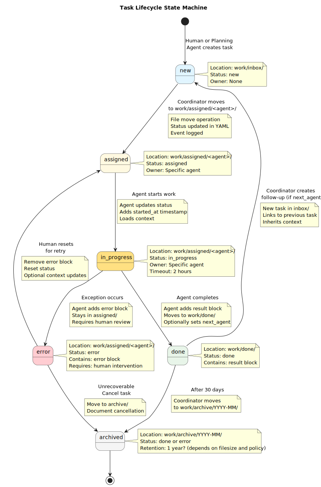
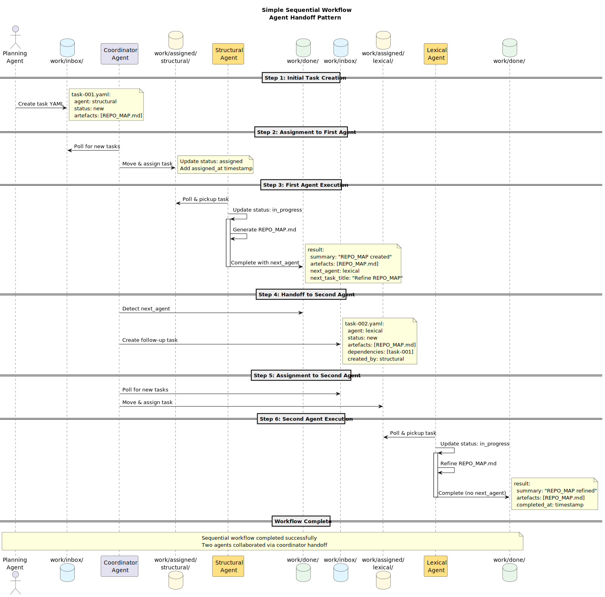
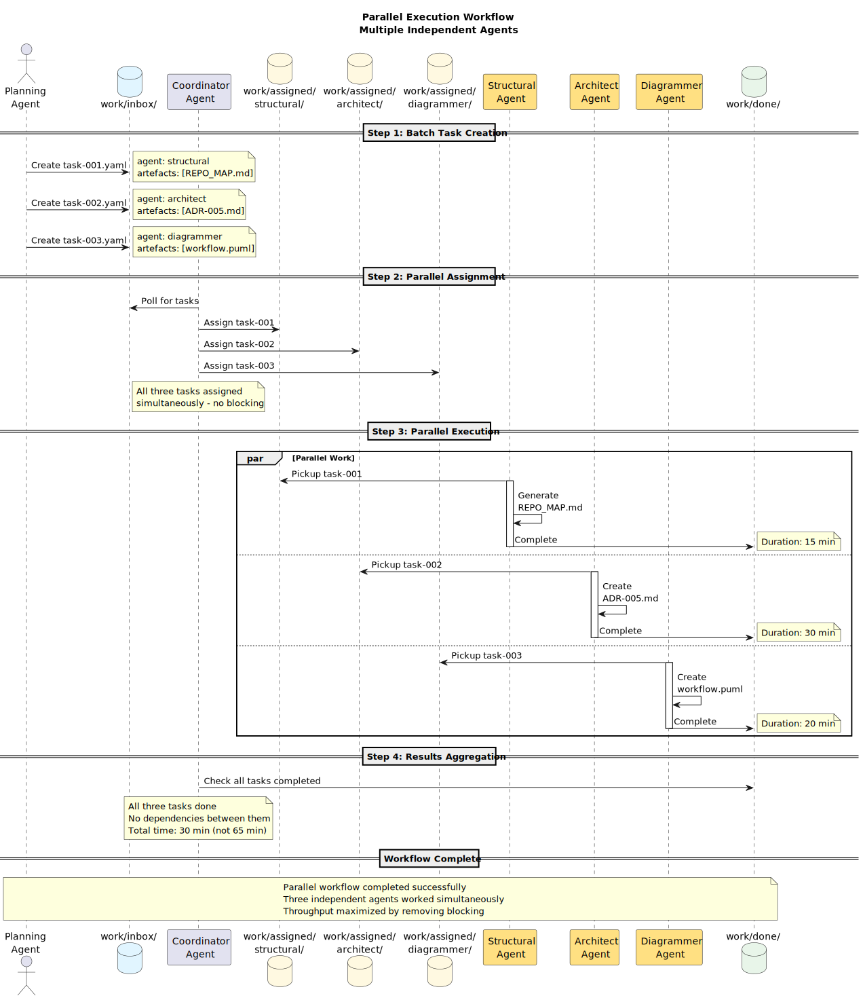
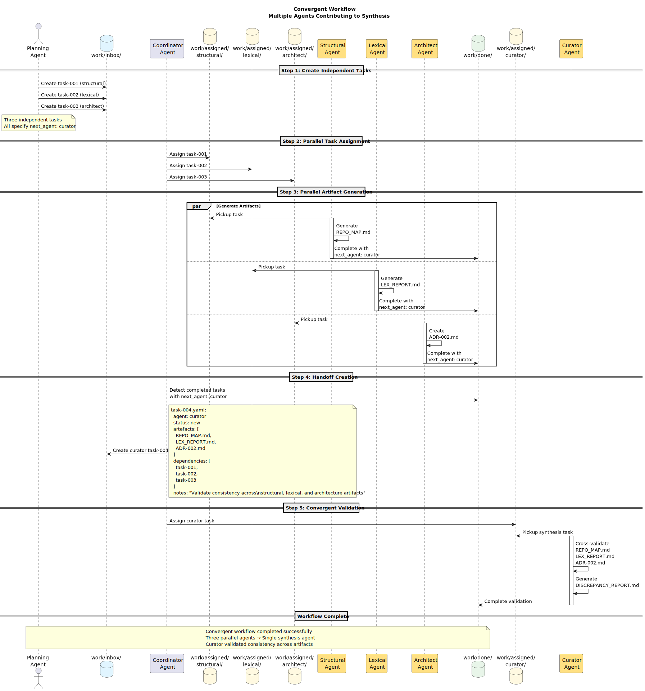

# Asynchronous Multi-Agent Orchestration Architecture

_Version: 1.0.0_  
_Last updated: 2025-11-20_  
_Status: Accepted_

## Overview

This document describes the **asynchronous, file-driven orchestration model
** for coordinating multiple specialized agents within the repository. The design enables safe, transparent, and predictable multi-agent collaboration without requiring real-time communication, RPC frameworks, or hidden state management.

## Core Principles

### Simplicity

All workflows derive from file movements. No frameworks, no servers, no complex protocols—just files moving through directories.

### Transparency

Every state transition is visible in Git. Every task has a readable YAML representation. Every agent action leaves an audit trail.

### Determinism

No hidden API calls or opaque queues. Task execution is predictable and repeatable.

### Composability

Each agent handles one domain. Complex workflows emerge naturally from simple handoffs via `next_agent` metadata.

### Traceability

Every task leaves a complete audit trail from creation through completion or failure.

## System Architecture

### Directory Structure

The orchestration system uses a file-based workflow under the `work/` directory:

```
work/
  inbox/              # New tasks awaiting assignment
  assigned/           # Tasks assigned to specific agents
    structural/       # Tasks for Structural agent
    lexical/          # Tasks for Lexical agent
    curator/          # Tasks for Curator agent
    diagrammer/       # Tasks for Diagrammer agent
    planning/         # Tasks for Planning agent
    coordinator/      # Meta-orchestration tasks
    translator/       # Tasks for Translator agent
    architect/        # Tasks for Architect agent
    build-automation/ # Tasks for Build/CI agents
  done/               # Completed tasks with results
  archive/            # Long-term task retention (optional)
  logs/               # Agent execution logs (optional)
  collaboration/      # Cross-agent coordination artifacts
```

### Task Representation

Every task is represented by a **single YAML file** that contains:

- Unique identifier
- Target agent
- Current status
- Required artifacts
- Contextual information
- Execution results (when complete)

Example task file (`work/inbox/2025-11-20T1430-structural-repomap.yaml`):

```yaml
id: 2025-11-20T1430-structural-repomap
agent: structural
status: new
mode: /analysis-mode
priority: normal

title: "Generate REPO_MAP and SURFACES for current repository"

artefacts:
  - docs/REPO_MAP.md
  - docs/SURFACES.md

context:
  repo: "sddevelopment-be/quickstart_agent-augmented-development"
  branch: "main"
  notes:
    - "Initial structural pass"
    - "Focus on src/, docs/, agents/, work/ directories"

created_at: "2025-11-20T14:30:00Z"
created_by: "stijn"
```

### Task Lifecycle

Tasks progress through a well-defined lifecycle:



See also: [Task Lifecycle State Machine Diagram](../diagrams/task-lifecycle-state-machine.puml)

#### 1. Creation (new)

- Human or Planning agent creates YAML file in `work/inbox/`
- Status: `new`
- Contains all necessary context and requirements

#### 2. Assignment (assigned)

- Coordinator or automated watcher moves file to `work/assigned/<agent>/`
- Status updated to: `assigned`
- Agent notified or discovers task through directory polling

#### 3. Execution (in_progress)

- Agent updates status to: `in_progress`
- Loads context from AGENTS.md and relevant directives
- Performs specialized work
- Updates or creates specified artifacts
- Logs results to task YAML

#### 4. Completion (done)

- Agent adds `result:` block to YAML
- Status updated to: `done`
- File moved to `work/done/`
- If `next_agent` specified, Coordinator creates follow-up task

#### 5. Archival (archive)

- Periodic cleanup moves old completed tasks to `work/archive/`
- Maintains audit trail while keeping active directories lean

### Agent Roles

#### Specialized Domain Agents

Each specialized agent watches its own subdirectory under `work/assigned/` and operates independently:

- **Structural Agent**: Generates REPO_MAP, SURFACES, topology documentation
- **Lexical Agent**: Performs voice/style analysis, produces LEX_REPORT and LEX_DELTAS
- **Curator Agent**: Validates consistency, reconciles glossaries, ensures template compliance
- **Diagrammer Agent**: Creates PlantUML diagrams, architecture visualizations
- **Planning Agent**: Translates strategic intent into executable task batches
- **Architect Agent**: Creates ADRs, technical designs, architecture documentation
- **Translator Agent**: Handles cross-language documentation needs
- **Build Automation Agent**: Manages CI/CD, validation, and build processes

**Operating Protocol:**

1. Poll `work/assigned/<agent-name>/` for new tasks
2. Mark task `in_progress`
3. Load global context (AGENTS.md, directives, profiles)
4. Execute specialized work
5. Update artifacts
6. Add result block to task YAML
7. Mark task `done`
8. Move file to `work/done/`

#### Coordinator Agent

The Coordinator is a **meta-agent** responsible for orchestration but not artifact generation:

**Responsibilities:**

- Monitor `work/inbox/`, `work/assigned/`, and `work/done/` directories
- Assign tasks to appropriate agents by moving YAML files
- Create follow-up tasks based on `next_agent` metadata
- Maintain coordination artifacts:
    - `work/collaboration/AGENT_STATUS.md`: Current agent states and capacities
    - `work/collaboration/HANDOFFS.md`: Agent-to-agent transition log
    - `work/collaboration/WORKFLOW_LOG.md`: System-wide orchestration events
- Detect and resolve conflicts (e.g., multiple agents targeting same artifact)
- Run `/validate-alignment` checks when needed
- Escalate blocked or error states to humans

**Handoff Example:**

```markdown
## 2025-11-20 14:45 - Structural → Lexical

**Artefacts:** REPO_MAP.md, SURFACES.md  
**Reason:** Voice/style pass required after structural generation  
**Status:** Assigned to lexical agent
```

## Workflow Patterns

### Orchestration Flow Overview


See also: [diagrams/orchestration-workflow.puml](../diagrams/orchestration-workflow.puml)

### Simple Sequential Flow



See also: [Simple Sequential Workflow Diagram](../diagrams/workflow-sequential-flow.puml)

### Parallel Execution Flow

Multiple agents can work simultaneously on independent tasks:



See also: [Parallel Execution Workflow Diagram](../diagrams/workflow-parallel-flow.puml)

### Convergent Flow

Multiple agents contribute to a synthesis task:



**See also:** [Convergent Workflow Diagram](../diagrams/workflow-convergent-flow.puml)

## Integration Points

### GitHub Actions (Optional)

Agents can be triggered via GitHub Actions by watching specific paths:

```yaml
name: Structural Agent Workflow

on:
  push:
    paths:
      - "work/inbox/**"
      - "work/assigned/structural/**"

jobs:
  structural-agent:
    runs-on: ubuntu-latest
    steps:
      - name: Checkout repository
        uses: actions/checkout@v3

      - name: Load context
        run: cat AGENTS.md

      - name: Detect structural tasks
        run: |
          for task in work/assigned/structural/*.yaml; do
            echo "Processing: $task"
          done

      - name: Execute agent logic
        run: ./agents/structural/run.sh

      - name: Commit results
        run: |
          git config user.name "Structural Agent"
          git config user.email "bot@sddevelopment.be"
          git add .
          git commit -m "Structural agent: completed task"
          git push

      - name: Move to done
        run: mv work/assigned/structural/*.yaml work/done/
```

### Local Execution

Agents can also be run locally via scripts that:

1. Poll assigned directory
2. Load context
3. Execute specialized logic
4. Commit and push results
5. Move task file to done

### Hybrid Model

- Critical agents run in CI for automation
- Human-supervised agents run locally with approval gates
- Coordinator runs periodically (cron, manual trigger, or event-driven)

## Quality Attributes

| Attribute         | Target                  | Measurement                           |
|-------------------|-------------------------|---------------------------------------|
| **Transparency**  | 100% git-visible state  | All task files tracked in repo        |
| **Safety**        | Zero silent failures    | All errors logged in task YAML        |
| **Traceability**  | Complete audit trail    | Task history from creation to archive |
| **Composability** | <5 min to add new agent | Create directory + profile            |
| **Recovery**      | <1 min to revert task   | Git revert task file                  |

## Security Considerations

### Access Control

- Task files must be validated before execution
- Agent execution context is sandboxed to repository
- Sensitive data should not be stored in task YAML
- Use secrets management for credentials (GitHub Secrets, etc.)

### Validation

- Task YAML schema validation before processing
- Agent identity verification (signature, commit author)
- Artifact integrity checks before handoff

### Audit

- All agent actions logged with timestamps
- Human approval required for production changes
- Periodic review of coordination logs

## Advantages

### ✔ Git-Native

- Every state change is a commit
- Full history and diff capability
- Easy rollback and recovery
- Works with existing Git workflows (PRs, reviews, branches)

### ✔ No Vendor Lock-In

- Pure markdown + YAML + directory structure
- No proprietary APIs or services
- Portable across CI systems
- Human-readable and editable

### ✔ Async by Design

- No agent blocks another
- Work proceeds independently
- Natural parallelism
- Resilient to agent failures

### ✔ Extensible

- Add new agent: create directory and profile
- Modify workflow: adjust `next_agent` chains
- Integrate tools: agents use any tooling they need

### ✔ Observable

- Human-inspectable at any point
- Clear visibility into bottlenecks
- Simple debugging (read YAML files)
- No hidden queues or state

## Limitations

### Known Constraints

- **Not Real-Time**: File-based coordination has inherent latency (seconds to minutes)
- **Git Overhead**: Many small commits can clutter history (mitigated by squashing, archive cleanup)
- **No Transactional Guarantees**: Race conditions possible if multiple agents target same artifact
- **Manual Conflict Resolution**: Merge conflicts require human intervention
- **Storage Growth**: Task archive can grow large over time (requires periodic cleanup)

### Mitigation Strategies

- Use Coordinator to serialize conflicting tasks
- Implement file locking via task status
- Periodic archive compression or pruning
- Clear artifact ownership in task YAML
- Atomic file operations (write to temp, then move)

## Future Enhancements

### Phase 1: Core Stability (Critical)

- Task YAML schema validation
- Automated Coordinator polling script
- Basic conflict detection in Coordinator
- Logging standardization

### Phase 2: Developer Experience (High)

- Task creation CLI tool
- Status dashboard (work/collaboration/STATUS.md generator)
- Agent health monitoring
- Retry mechanisms for failed tasks

### Phase 3: Advanced Orchestration (Medium)

- Conditional workflows (if/then logic in tasks)
- Task dependencies and DAG visualization
- Priority-based scheduling
- Parallel batch execution

### Phase 4: Integration (Low)

- Slack/Discord notifications
- GitHub Issues/Projects integration
- Metrics and analytics
- Agent performance profiling

## Related Documentation

- [ADR-002: File-Based Asynchronous Agent Coordination](ADR-002-file-based-async-coordination.md)
- [ADR-003: Task Lifecycle and State Management](ADR-003-task-lifecycle-state-management.md)
- [ADR-004: Work Directory Structure](ADR-004-work-directory-structure.md)
- [ADR-005: Coordinator Agent Pattern](ADR-005-coordinator-agent-pattern.md)
- [Technical Design: Async Orchestration Implementation](async_orchestration_technical_design.md)
- [Agent Specialization Patterns](agent_specialization_patterns.md)
- [Work Directory README](../../work/README.md)

## References

- Issue #8: Asynchronous Multi-Agent Orchestration (File-Driven Model)
- Attached: SAD_orchestration.md (Software Architecture Description)
- Attached: ORCH_github_automation.md (GitHub automation patterns)
- Attached: task-schema.yml (Task data model)
- Attached: AGENT_STATUS.md (Status tracking template)

## Implementation Notes

### Agent Orchestrator vs. Coordinator

The Coordinator pattern described in this architecture is implemented as
`agent_orchestrator.py` to provide clearer naming that explicitly conveys its role in orchestrating multiple agents. The term "Coordinator" remains valid as an architectural pattern name.

### Agent Validation Tools

Note that any `agent.py` scripts encountered in the codebase are **validation proxies
** used to test and validate the orchestration approach. They are not production agents. Real agents are defined as profiles in the
`agents/*.agent.md` directory and executed through the orchestration system.

---

_Maintained by: Architect Alphonso_  
_Version: 1.0.1_  
_Status: Proposed - Awaiting review and approval_  
_Last updated: 2025-11-23_
