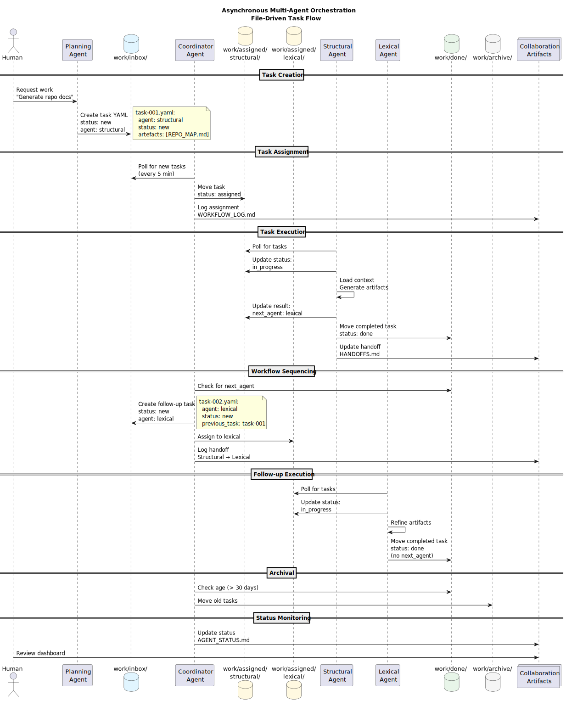

# Technical Design: Asynchronous Multi-Agent Orchestration Implementation

_Version: 1.0.0_  
_Last updated: 2025-11-20_  
_Status: Proposed_

## Context

This technical design details the implementation of the asynchronous, file-driven multi-agent orchestration system described in [async_multiagent_orchestration.md](async_multiagent_orchestration.md).

The design addresses:

- Task YAML schema and validation
- Directory structure initialization
- Coordinator agent implementation
- Agent execution protocols
- GitHub Actions integration
- Validation and monitoring tooling

References:

- [ADR-002: File-Based Asynchronous Agent Coordination](ADR-002-file-based-async-coordination.md)
- [ADR-003: Task Lifecycle and State Management](ADR-003-task-lifecycle-state-management.md)
- [ADR-004: Work Directory Structure](ADR-004-work-directory-structure.md)
- [ADR-005: Coordinator Agent Pattern](ADR-005-coordinator-agent-pattern.md)

## Acceptance Criteria

### Functional Requirements

- ✅ F1: Tasks can be created as YAML files in `work/inbox/`
- ✅ F2: Coordinator assigns tasks to agents by moving files to `work/assigned/<agent>/`
- ✅ F3: Agents process tasks and move completed tasks to `work/done/`
- ✅ F4: Multi-step workflows supported via `next_agent` metadata
- ✅ F5: Conflict detection warns when multiple agents target same artifact
- ✅ F6: Status dashboard shows current state of all agents
- ✅ F7: Handoff log tracks agent-to-agent transitions
- ✅ F8: Workflow log records all orchestration events
- ✅ F9: Validation tools enforce task schema and directory structure
- ✅ F10: Archive strategy moves old tasks from `work/done/` to `work/archive/`

### Non-Functional Requirements

- ✅ NFR1: System operates without running services (polling-based)
- ✅ NFR2: All state visible in Git (transparency)
- ✅ NFR3: Human can intervene at any point (manual override)
- ✅ NFR4: Coordinator completes cycle in <30 seconds (performance)
- ✅ NFR5: Task schema validation completes in <1 second per task (validation speed)
- ✅ NFR6: Directory structure supports 1000+ tasks without performance degradation (scalability)
- ✅ NFR7: Complete audit trail maintained in Git log (traceability)

### Definition of Done

- [X] Task YAML schema defined and validated
- [X] Work directory structure created with `.gitkeep` files
- [ ] Proof-of-concept Executions to validate assumptions
- [ ] Coordinator agent script implemented
- [ ] Agent execution template provided
- [ ] Validation scripts created (structure, schema, naming)
- [ ] GitHub Actions workflow for Coordinator (optional)
- [ ] Documentation updated (README, architecture docs, ADRs)
- [ ] Initial collaboration artifacts created (STATUS, HANDOFFS, WORKFLOW_LOG)

## Design



See also: [diagrams/orchestration-workflow.puml](../diagrams/orchestration-workflow.puml)

### Overview

The implementation consists of:

1. **Task Schema**: YAML structure defining task format
2. **Directory Setup**: Script to initialize `work/` structure
3. **Agent Orchestrator**: Python script for task routing and monitoring
4. **Agent Protocol**: Guidelines for agent implementation
5. **Validation Tools**: Scripts to enforce consistency
6. **GitHub Actions**: Optional CI integration
7. **Collaboration Artifacts**: Templates for status tracking

### Task YAML Schema

**File: `docs/templates/agent-tasks/task-schema.yaml`**

```yaml
# Task Schema Definition
# Version: 1.0.0

# Required fields
id: string               # Unique identifier (YYYY-MM-DDTHHMM-agent-slug)
agent: string            # Target agent name (must match directory under work/assigned/)
status: enum             # Current state: new | assigned | in_progress | done | error
artefacts: list[string]  # Paths to artifacts this task will create/modify

# Optional fields
title: string            # Human-readable task description
mode: string             # Reasoning mode: /analysis-mode | /creative-mode | /meta-mode
priority: enum           # Priority level: critical | high | normal | low

# Context object
context:
  repo: string           # Repository name
  branch: string         # Target branch
  notes: list[string]    # Additional context notes
  dependencies: list[string]  # Task IDs this task depends on (optional)

# Timestamps
created_at: string       # ISO 8601 timestamp of task creation
created_by: string       # Human or agent that created task
assigned_at: string      # ISO 8601 timestamp of assignment (optional)
started_at: string       # ISO 8601 timestamp when agent started (optional)
completed_at: string     # ISO 8601 timestamp of completion (optional)

# Result object (added by agent on completion)
result:
  summary: string        # Brief description of work completed
  artefacts: list[string]  # Actual artifacts created/modified
  next_agent: string     # Agent to hand off to (optional)
  next_task_title: string  # Title for follow-up task (optional)
  next_artefacts: list[string]  # Artifacts for follow-up (optional)
  next_task_notes: list[string]  # Context for follow-up (optional)
  completed_at: string   # ISO 8601 timestamp

# Error object (added by agent on failure)
error:
  message: string        # Error description
  timestamp: string      # ISO 8601 timestamp
  agent: string          # Agent that encountered error
  retry_count: int       # Number of retry attempts
  stacktrace: string     # Detailed error trace (optional)
```

**Example Task:**

```yaml
id: 2025-11-20T1430-structural-repomap
agent: structural
status: new
mode: /analysis-mode
priority: normal

title: "Generate REPO_MAP and SURFACES for repository"

artefacts:
  - docs/REPO_MAP.md
  - docs/SURFACES.md

context:
  repo: "sddevelopment-be/quickstart_agent-augmented-development"
  branch: "main"
  notes:
    - "Initial structural pass"
    - "Focus on docs/, agents/, work/ directories"

created_at: "2025-11-20T14:30:00Z"
created_by: "stijn"
```

### Directory Setup Script

**File: `work/scripts/init-work-structure.sh`**

```bash
#!/bin/bash
# Initialize work directory structure for multi-agent orchestration

set -e

echo "Initializing work directory structure..."

# Create lifecycle directories
mkdir -p work/inbox
mkdir -p work/done
mkdir -p work/archive
mkdir -p work/logs
mkdir -p work/collaboration
mkdir -p work/scripts
mkdir -p work/schemas

# Create agent directories
agents=(
  "structural"
  "lexical"
  "curator"
  "diagrammer"
  "planning"
  "coordinator"
  "architect"
  "translator"
  "build-automation"
)

for agent in "${agents[@]}"; do
  mkdir -p "work/assigned/$agent"
done

# Add .gitkeep to track empty directories
find work -type d -exec touch {}/.gitkeep \;

# Create initial collaboration artifacts
cat > work/collaboration/AGENT_STATUS.md <<'EOF'
# Agent Status Dashboard

_Last updated: Never_

No agent activity recorded yet.

## How to Read This Dashboard

- **Status**: Current agent state (Idle, In Progress, Error)
- **Current task**: Task ID if agent is working
- **Last seen**: Timestamp of most recent activity
- **Tasks completed today**: Count of completed tasks since midnight

EOF

cat > work/collaboration/HANDOFFS.md <<'EOF'
# Agent Handoff Log

This log records agent-to-agent transitions for traceability.

## Format

Each handoff entry includes:
- Date and time
- Source agent → Destination agent
- Artifacts passed
- Reason for handoff
- Task ID
- Status

## Handoff History

_No handoffs recorded yet._

EOF

cat > work/collaboration/WORKFLOW_LOG.md <<'EOF'
# Workflow Orchestration Log

This log records system-wide orchestration events.

## Log Entries

_No workflow events recorded yet._

EOF

# Create README
cat > work/README.md <<'EOF'
# Work Directory - Multi-Agent Orchestration

This directory contains the file-based orchestration system for coordinating
multiple specialized agents.

## Structure

- `inbox/`: New tasks awaiting assignment
- `assigned/`: Tasks assigned to specific agents (one subdirectory per agent)
- `done/`: Completed tasks with results
- `archive/`: Long-term task retention
- `logs/`: Agent execution logs (optional)
- `collaboration/`: Cross-agent coordination artifacts
- `scripts/`: Utility scripts for orchestration
- `schemas/`: Task YAML schema definitions

## Usage

See [docs/architecture/async_multiagent_orchestration.md](../docs/architecture/async_multiagent_orchestration.md) for complete documentation.

## Quick Start

1. Create task YAML in `inbox/`
2. Run Coordinator to assign tasks
3. Agents process their assigned tasks
4. Completed tasks move to `done/`
5. Archive old tasks periodically

EOF

echo "✅ Work directory structure initialized successfully"
echo ""
echo "Next steps:"
echo "1. Review work/README.md"
echo "2. Create task YAML schema in docs/templates/agent-tasks/"
echo "3. Implement Coordinator script in work/scripts/"
echo "4. Review docs/architecture/async_multiagent_orchestration.md"
```

### Coordinator Implementation

**File: `work/scripts/agent_orchestrator.py`**

```python
#!/usr/bin/env python3
"""
Agent Orchestrator - Multi-Agent Orchestration

Responsibilities:
- Assign tasks from inbox to agents
- Create follow-up tasks based on next_agent
- Monitor active tasks for timeouts
- Detect artifact conflicts
- Update status dashboard
- Archive old completed tasks
"""

import os
import glob
import yaml
import shutil
from datetime import datetime, timedelta
from pathlib import Path
from collections import defaultdict

# Configuration
WORK_DIR = Path("work")
INBOX_DIR = WORK_DIR / "inbox"
ASSIGNED_DIR = WORK_DIR / "assigned"
DONE_DIR = WORK_DIR / "done"
ARCHIVE_DIR = WORK_DIR / "archive"
COLLAB_DIR = WORK_DIR / "collaboration"

TIMEOUT_HOURS = 2  # Flag tasks in_progress for > 2 hours
ARCHIVE_RETENTION_DAYS = 30  # Archive tasks older than 30 days

def log_event(message):
    """Append event to workflow log"""
    timestamp = datetime.utcnow().strftime("%Y-%m-%d %H:%M:%S UTC")
    log_file = COLLAB_DIR / "WORKFLOW_LOG.md"
    
    with open(log_file, "a") as f:
        f.write(f"\n**{timestamp}** - {message}")

def read_task(task_file):
    """Load task YAML"""
    with open(task_file, "r") as f:
        return yaml.safe_load(f)

def write_task(task_file, task):
    """Save task YAML"""
    with open(task_file, "w") as f:
        yaml.dump(task, f, default_flow_style=False, sort_keys=False)

def assign_tasks():
    """Process inbox and assign tasks to agents"""
    tasks_assigned = 0
    
    for task_file in INBOX_DIR.glob("*.yaml"):
        try:
            task = read_task(task_file)
            agent = task.get("agent")
            
            if not agent:
                log_event(f"⚠️ Task {task_file.name} missing 'agent' field")
                continue
            
            agent_dir = ASSIGNED_DIR / agent
            if not agent_dir.exists():
                log_event(f"❗️ Unknown agent: {agent}")
                continue
            
            # Move to assigned directory
            dest = agent_dir / task_file.name
            shutil.move(str(task_file), str(dest))
            
            # Update status
            task["status"] = "assigned"
            task["assigned_at"] = datetime.utcnow().isoformat() + "Z"
            write_task(dest, task)
            
            log_event(f"Assigned task {task['id']} to {agent}")
            tasks_assigned += 1
            
        except Exception as e:
            log_event(f"❗️ Error assigning {task_file.name}: {e}")
    
    return tasks_assigned

def process_completed_tasks():
    """Create follow-up tasks based on next_agent"""
    followups_created = 0
    
    for task_file in DONE_DIR.glob("*.yaml"):
        try:
            task = read_task(task_file)
            result = task.get("result", {})
            next_agent = result.get("next_agent")
            
            if next_agent:
                # Check if follow-up already created
                followup_id = f"{datetime.utcnow().strftime('%Y-%m-%dT%H%M')}-{next_agent}-{task['id'].split('-')[-1]}"
                followup_file = INBOX_DIR / f"{followup_id}.yaml"
                
                if followup_file.exists():
                    continue  # Already created
                
                # Create follow-up task
                followup = {
                    "id": followup_id,
                    "agent": next_agent,
                    "status": "new",
                    "title": result.get("next_task_title", f"Follow-up to {task['id']}"),
                    "artefacts": result.get("next_artefacts", task["artefacts"]),
                    "context": {
                        "previous_task": task["id"],
                        "previous_agent": task["agent"],
                        "notes": result.get("next_task_notes", [])
                    },
                    "created_at": datetime.utcnow().isoformat() + "Z",
                    "created_by": "coordinator"
                }
                
                write_task(followup_file, followup)
                log_handoff(task["agent"], next_agent, task["artefacts"], followup_id)
                followups_created += 1
        
        except Exception as e:
            log_event(f"❗️ Error processing {task_file.name}: {e}")
    
    return followups_created

def log_handoff(from_agent, to_agent, artefacts, task_id):
    """Log agent handoff"""
    timestamp = datetime.utcnow().strftime("%Y-%m-%d %H:%M")
    handoff_log = COLLAB_DIR / "HANDOFFS.md"
    
    with open(handoff_log, "a") as f:
        f.write(f"\n## {timestamp} - {from_agent} → {to_agent}\n\n")
        f.write(f"**Artefacts:** {', '.join(artefacts)}\n")
        f.write(f"**Task ID:** {task_id}\n")
        f.write(f"**Status:** Created\n\n")

def check_timeouts():
    """Flag tasks stuck in in_progress"""
    timeout_cutoff = datetime.utcnow() - timedelta(hours=TIMEOUT_HOURS)
    flagged = 0
    
    for agent_dir in ASSIGNED_DIR.iterdir():
        if not agent_dir.is_dir():
            continue
        
        for task_file in agent_dir.glob("*.yaml"):
            try:
                task = read_task(task_file)
                
                if task.get("status") == "in_progress":
                    started_at = datetime.fromisoformat(task["started_at"].replace("Z", ""))
                    
                    if started_at < timeout_cutoff:
                        log_event(f"⚠️ Task {task['id']} stalled (>{TIMEOUT_HOURS}h)")
                        flagged += 1
            
            except Exception as e:
                log_event(f"❗️ Error checking timeout for {task_file.name}: {e}")
    
    return flagged

def detect_conflicts():
    """Warn when multiple tasks target same artifact"""
    artifact_map = defaultdict(list)
    
    for agent_dir in ASSIGNED_DIR.iterdir():
        if not agent_dir.is_dir():
            continue
        
        for task_file in agent_dir.glob("*.yaml"):
            try:
                task = read_task(task_file)
                
                if task.get("status") == "in_progress":
                    for artifact in task.get("artefacts", []):
                        artifact_map[artifact].append(task["id"])
            
            except Exception as e:
                log_event(f"❗️ Error checking conflicts for {task_file.name}: {e}")
    
    conflicts = 0
    for artifact, task_ids in artifact_map.items():
        if len(task_ids) > 1:
            log_event(f"⚠️ Conflict: {artifact} targeted by {task_ids}")
            conflicts += 1
    
    return conflicts

def update_agent_status():
    """Update agent status dashboard"""
    status = {}
    
    for agent_dir in ASSIGNED_DIR.iterdir():
        if not agent_dir.is_dir():
            continue
        
        agent = agent_dir.name
        tasks = list(agent_dir.glob("*.yaml"))
        
        in_progress = []
        assigned = []
        
        for task_file in tasks:
            try:
                task = read_task(task_file)
                if task.get("status") == "in_progress":
                    in_progress.append(task)
                elif task.get("status") == "assigned":
                    assigned.append(task)
            except:
                pass
        
        status[agent] = {
            "assigned": len(assigned),
            "in_progress": len(in_progress),
            "current_task": in_progress[0]["id"] if in_progress else "Idle",
            "last_seen": max([t.stat().st_mtime for t in tasks]) if tasks else None
        }
    
    # Write status dashboard
    status_file = COLLAB_DIR / "AGENT_STATUS.md"
    with open(status_file, "w") as f:
        f.write("# Agent Status Dashboard\n\n")
        f.write(f"_Last updated: {datetime.utcnow().strftime('%Y-%m-%d %H:%M:%S UTC')}_\n\n")
        
        for agent, info in sorted(status.items()):
            f.write(f"## {agent}\n\n")
            f.write(f"- **Status**: {info['current_task']}\n")
            f.write(f"- **Assigned**: {info['assigned']} tasks\n")
            f.write(f"- **In Progress**: {info['in_progress']} tasks\n")
            
            if info['last_seen']:
                last_seen = datetime.fromtimestamp(info['last_seen'])
                f.write(f"- **Last seen**: {last_seen.strftime('%Y-%m-%d %H:%M:%S')}\n")
            
            f.write("\n")

def archive_old_tasks():
    """Move completed tasks to archive"""
    cutoff = datetime.utcnow() - timedelta(days=ARCHIVE_RETENTION_DAYS)
    archived = 0
    
    for task_file in DONE_DIR.glob("*.yaml"):
        try:
            # Extract date from filename (YYYY-MM-DD prefix)
            task_date_str = task_file.name[:10]
            task_date = datetime.strptime(task_date_str, "%Y-%m-%d")
            
            if task_date < cutoff:
                # Create archive directory for month
                year_month = task_date.strftime("%Y-%m")
                archive_month = ARCHIVE_DIR / year_month
                archive_month.mkdir(parents=True, exist_ok=True)
                
                # Move to archive
                dest = archive_month / task_file.name
                shutil.move(str(task_file), str(dest))
                archived += 1
        
        except Exception as e:
            log_event(f"❗️ Error archiving {task_file.name}: {e}")
    
    return archived

def main():
    """Main coordinator loop"""
    print("🤖 Coordinator Agent - Starting cycle")
    
    # Ensure directories exist
    for dir in [INBOX_DIR, ASSIGNED_DIR, DONE_DIR, ARCHIVE_DIR, COLLAB_DIR]:
        dir.mkdir(parents=True, exist_ok=True)
    
    # Execute coordination tasks
    assigned = assign_tasks()
    followups = process_completed_tasks()
    timeouts = check_timeouts()
    conflicts = detect_conflicts()
    archived = archive_old_tasks()
    update_agent_status()
    
    # Summary
    print(f"✅ Cycle complete:")
    print(f"   - Assigned: {assigned} tasks")
    print(f"   - Follow-ups created: {followups}")
    print(f"   - Timeouts flagged: {timeouts}")
    print(f"   - Conflicts detected: {conflicts}")
    print(f"   - Archived: {archived} tasks")
    
    log_event(f"Coordinator cycle: {assigned} assigned, {followups} follow-ups, {timeouts} timeouts, {conflicts} conflicts, {archived} archived")

if __name__ == "__main__":
    main()
```

### Agent Execution Protocol

**Template for agent implementation:**

```python
#!/usr/bin/env python3
"""
<Agent Name> - Specialized Agent

Responsibilities:
- <List agent-specific responsibilities>
"""

import os
import yaml
from datetime import datetime
from pathlib import Path

WORK_DIR = Path("work")
ASSIGNED_DIR = WORK_DIR / "assigned" / "<agent-name>"
DONE_DIR = WORK_DIR / "done"

def process_task(task_file):
    """Process a single task"""
    # Load task
    with open(task_file, "r") as f:
        task = yaml.safe_load(f)
    
    # Update status to in_progress
    task["status"] = "in_progress"
    task["started_at"] = datetime.utcnow().isoformat() + "Z"
    with open(task_file, "w") as f:
        yaml.dump(task, f)
    
    try:
        # Load context from AGENTS.md and directives
        # ... context loading logic ...
        
        # Execute agent-specific work
        # ... specialized logic ...
        
        # Update artifacts
        # ... artifact generation ...
        
        # Mark complete
        task["status"] = "done"
        task["result"] = {
            "summary": "Task completed successfully",
            "artefacts": task["artefacts"],
            "completed_at": datetime.utcnow().isoformat() + "Z"
            # Optionally: "next_agent": "next-agent-name"
        }
        
        # Move to done
        with open(task_file, "w") as f:
            yaml.dump(task, f)
        
        dest = DONE_DIR / task_file.name
        task_file.rename(dest)
        
        print(f"✅ Completed task: {task['id']}")
    
    except Exception as e:
        # Mark error
        task["status"] = "error"
        task["error"] = {
            "message": str(e),
            "timestamp": datetime.utcnow().isoformat() + "Z",
            "agent": "<agent-name>",
            "retry_count": 0
        }
        
        with open(task_file, "w") as f:
            yaml.dump(task, f)
        
        print(f"❗️ Task failed: {task['id']} - {e}")

def main():
    """Main agent loop"""
    print(f"🤖 <Agent Name> - Checking for tasks")
    
    for task_file in ASSIGNED_DIR.glob("*.yaml"):
        with open(task_file, "r") as f:
            task = yaml.safe_load(f)
        
        # Skip if already in progress by another instance
        if task.get("status") == "in_progress":
            continue
        
        # Skip if not assigned
        if task.get("status") != "assigned":
            continue
        
        process_task(task_file)

if __name__ == "__main__":
    main()
```

### Implementation Considerations

**Agent Orchestrator Scheduling:**

- Run every 5 minutes via cron or GitHub Actions
- Or run manually when needed
- Idempotent: safe to run multiple times
- Fast: completes in <30 seconds typically

**Agent Execution:**

- Run on-demand (manual) or via GitHub Actions
- Poll assigned directory for new tasks
- Load full context before executing
- Update task YAML incrementally
- Commit and push results

**File Locking:**

- Not strictly required due to status field
- Task with `status: in_progress` won't be claimed by another agent
- Atomic file moves (rename) prevent partial reads

**Error Recovery:**

- Coordinator flags timeouts and errors
- Human reviews error state and decides: retry, fix, or cancel
- Reset task to `assigned` status to retry
- Or move to archive if unrecoverable

### Cross-cutting Concerns

#### Security

- Validate task YAML schema before execution (prevent code injection)
- Sanitize artifact paths (prevent directory traversal)
- Verify agent identity (commit signature in CI)
- Use secrets management for credentials (GitHub Secrets)
- Audit all coordinator actions in WORKFLOW_LOG

#### Performance

- Keep active directories lean (<100 tasks) via archival
- Use efficient file operations (glob patterns, atomic moves)
- Avoid reading large files unnecessarily
- Batch operations when possible

#### Deployment

- Coordinator can run locally (cron) or in CI (GitHub Actions)
- Agents can run locally (manual) or in CI (per-agent workflows)
- No deployment dependencies (pure Python + YAML)
- Git is the deployment mechanism (push to deploy)

#### Auditing and Logging

- WORKFLOW_LOG captures all coordinator actions
- HANDOFFS log tracks agent transitions
- AGENT_STATUS provides real-time snapshot
- Git log provides complete history of all task changes

## Planning

### Implementation Phases

**Phase 1: Core Infrastructure (Critical)**

- Estimated development time: 2-3 workdays
- Urgency: High
- Estimated added value: High
- Tasks:
  - Create work directory structure (`init-work-structure.sh`)
  - Define task YAML schema
  - Create validation scripts
  - Document agent protocol
  - Update architecture README

**Phase 2: Coordinator Implementation (Critical)**

- Estimated development time: 3-4 workdays
- Urgency: High
- Estimated added value: High
- Depends on: Phase 1
- Tasks:
  - Implement `coordinator.py` script
  - Add task assignment logic
  - Add workflow sequencing (next_agent)
  - Add timeout detection
  - Add conflict detection
  - Add status dashboard updates
  - Add archive logic
  - Test manually with sample tasks

**Phase 3: Agent Integration (High)**

- Estimated development time: 5-7 workdays
- Urgency: Medium
- Estimated added value: High
- Depends on: Phase 2
- Tasks:
  - Update existing agent profiles with work directory support
  - Create agent execution templates
  - Test each agent with task files
  - Validate handoffs between agents
  - Document agent-specific quirks

**Phase 4: GitHub Actions Integration (Medium)**

- Estimated development time: 2-3 workdays
- Urgency: Low
- Estimated added value: Medium
- Depends on: Phase 3
- Tasks:
  - Create Coordinator workflow (`.github/workflows/coordinator.yml`)
  - Create per-agent workflows (optional)
  - Configure secrets and permissions
  - Test in CI environment
  - Document CI setup

**Phase 5: Validation and Monitoring (Medium)**

- Estimated development time: 2-3 workdays
- Urgency: Low
- Estimated added value: Medium
- Depends on: Phase 2
- Tasks:
  - Create schema validation tool
  - Create structure validation tool
  - Create naming validation tool
  - Create monitoring dashboard (optional web UI)
  - Document validation procedures

### Total Estimated Effort

- **Development**: 14-20 workdays
- **Testing**: 3-5 workdays
- **Documentation**: 2-3 workdays
- **Total**: 19-28 workdays (approximately 4-6 weeks calendar time)

### Rollout Strategy

1. **Phase 1 + 2**: Core infrastructure and Coordinator
   - Manual testing with sample tasks
   - Validation in single repository
   
2. **Phase 3**: Agent integration
   - Start with one agent (e.g., Structural)
   - Validate end-to-end workflow
   - Add remaining agents incrementally

3. **Phase 4**: CI automation (optional)
   - Start with Coordinator only
   - Add agent workflows as needed
   - Monitor for rate limits and errors

4. **Phase 5**: Production hardening
   - Add validation and monitoring
   - Tune timeouts and policies
   - Document operational procedures

---

_Maintained by: Architect Alphonso_  
_Version: 1.0.0_  
_Status: Proposed - Awaiting review and implementation_
