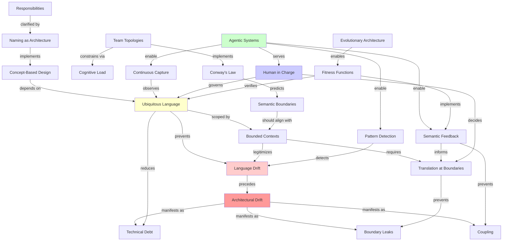
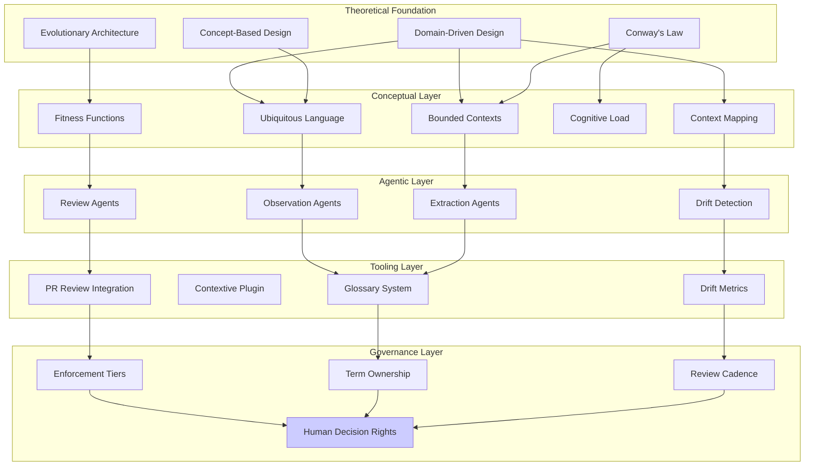
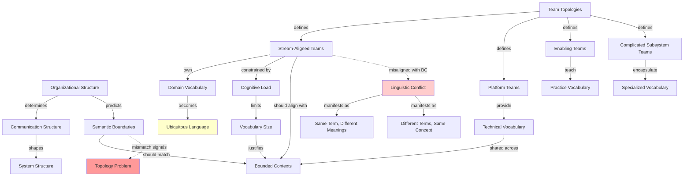
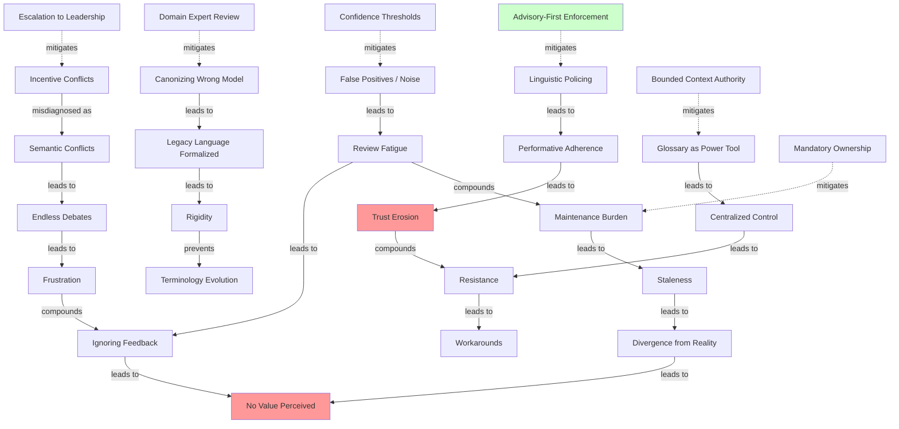

# Concept Map: Ubiquitous Language Experiment

**Version:** 1.0.0  
**Date:** 2026-02-09  
**Purpose:** Visual and textual representation of relationships between key concepts  
**Audience:** Architects, agents, and experiment participants  
**Format:** Mermaid diagrams + explanatory text

---

## Overview

This document maps the conceptual landscape underlying the agentic ubiquitous language experiment. It shows how ideas from Domain-Driven Design, organizational theory, software linguistics, and agentic systems converge to support the experiment's hypothesis.

**Central Thesis:** Language drift precedes architectural drift. Agentic systems can detect linguistic patterns that serve as early signals for architectural interventions.

---

## 1. Core Concept Network



---

## 2. Layered View: Theory to Practice

This view shows how theoretical foundations translate into practical implementation.



---

## 3. Workflow View: Agent Roles and Artifacts

This diagram shows how agents participate in the 8-stage experiment pipeline.

```mermaid
graph LR
    subgraph "Stage 1: Research"
        SOURCES[Source Materials] -->|read by| RA[Research Agent]
        RA -->|produces| SRCPACK[Source Pack]
        RA -->|produces| CLAIMS[Claim Inventory]
    end
    
    subgraph "Stage 2: Synthesis"
        SRCPACK -->|input to| PA[Primer Agent]
        CLAIMS -->|input to| PA
        PA -->|produces| PRIMERS[Primers]
        PA -->|produces| GLOSSEED[Glossary Seed]
    end
    
    subgraph "Stage 3: Analysis"
        PRIMERS -->|input to| AA[Architecture Agent]
        GLOSSEED -->|input to| AA
        AA -->|produces| BCMAP[BC Map]
        AA -->|produces| CLASHES[Clash Inventory]
    end
    
    subgraph "Stage 4: Specification"
        BCMAP -->|input to| DA[Domain Drift Agent]
        DA -->|produces| GLOSSARY[Glossary v1]
        GLOSSARY -->|input to| SA[Spec Assistant]
        SA -->|produces| SCENARIOS[Scenarios]
    end
    
    subgraph "Stage 5: Design"
        BCMAP -->|input to| AA2[Architecture Agent]
        GLOSSARY -->|input to| AA2
        AA2 -->|produces| TECHDESIGN[Technical Design]
        AA2 -->|produces| RULES[Review Rules]
    end
    
    subgraph "Stage 6: Execution"
        RULES -->|configures| PRREV[PR Review Agent]
        GLOSSARY -->|used by| PRREV
        PRREV -->|provides| FEEDBACK[Terminology Feedback]
        FEEDBACK -->|updates| GLOSSARY
    end
    
    subgraph "Stage 7: Evaluation"
        FEEDBACK -->|analyzed by| EA[Evaluation Agent]
        EA -->|produces| TRENDS[Drift Trends]
        EA -->|produces| SURPRISES[Surprises Log]
    end
    
    subgraph "Stage 8: Capture"
        TRENDS -->|input to| CA[Capture Agent]
        SURPRISES -->|input to| CA
        CA -->|produces| OUTCOMES[Outcome Report]
        CA -->|produces| PATTERNS[Reusable Patterns]
    end
    
    style GLOSSARY fill:#ffffcc
    style PRREV fill:#ccffcc
    style OUTCOMES fill:#ccccff
```



---

## 4. Concept Relationships: DDD Core

Detailed view of Domain-Driven Design concepts and their relationships.

```mermaid
graph TB
    %% Core DDD Concepts
    UL[Ubiquitous Language]
    BC[Bounded Context]
    SD[Strategic Design]
    TD[Tactical Design]
    
    %% Ubiquitous Language aspects
    UL -->|shared between| EXPERTS[Domain Experts]
    UL -->|shared between| DEVS[Developers]
    UL -->|evolves through| COLLAB[Continuous Collaboration]
    UL -->|documented in| CODE[Code]
    UL -->|documented in| TESTS[Tests]
    UL -->|documented in| DOCS[Documentation]
    
    %% Bounded Context aspects
    BC -->|defines scope of| UL
    BC -->|has explicit| BOUND[Boundaries]
    BC -->|owns| MODEL[Domain Model]
    BC -->|mapped via| CTXMAP[Context Map]
    
    %% Context Mapping patterns
    CTXMAP -->|shows| UPSTREAM[Upstream/Downstream]
    CTXMAP -->|shows| SHARED[Shared Kernel]
    CTXMAP -->|shows| ACL[Anti-Corruption Layer]
    CTXMAP -->|shows| OHS[Open Host Service]
    
    %% Translation at boundaries
    BC -->|requires at boundary| TRANS[Translation]
    TRANS -->|implemented via| ACL
    TRANS -->|implemented via| OHS
    TRANS -->|implemented via| PL[Published Language]
    
    %% Strategic vs Tactical
    SD -->|includes| BC
    SD -->|includes| CTXMAP
    SD -->|includes| TRANS
    TD -->|includes| ENTITIES[Entities]
    TD -->|includes| VO[Value Objects]
    TD -->|includes| AGG[Aggregates]
    
    %% Strategic more important than tactical
    SD -->|more impactful than| TD
    SD -->|depends on| UL
    TD -->|implements| UL
    
    %% Linguistic signals
    UL -->|conflict signals| HIDDBC[Hidden BC Boundary]
    TRANS -->|absence signals| COUPLING[Accidental Coupling]
    BOUND -->|violation signals| LEAK[Boundary Leak]
    
    style UL fill:#ffffcc
    style BC fill:#ccffcc
    style TRANS fill:#ffcccc
```



---

## 5. Concept Relationships: Conway's Law and Team Topologies

How organizational structure predicts linguistic boundaries.



---

## 6. Concept Relationships: Agentic Feasibility Shift

What changed to make continuous linguistic monitoring feasible.

```mermaid
graph TB
    %% Historical Infeasibility
    HISTORICAL[Historical Approach] -->|required| MANUAL[Manual Curation]
    MANUAL -->|high cost| POINTTIME[Point-in-Time Glossaries]
    POINTTIME -->|result| STALE[Staleness]
    POINTTIME -->|result| LOWADOPT[Low Adoption]
    
    %% Agentic Enablement
    AGENTIC[Agentic Approach] -->|enables| CONTINUOUS[Continuous Capture]
    AGENTIC -->|enables| MULTISOURCE[Multi-Source Analysis]
    AGENTIC -->|enables| INCREMENTAL[Incremental Maintenance]
    
    %% LLM Strengths
    LLM[Large Language Models] -->|good at| PATTERN[Pattern Detection]
    LLM -->|good at| INCONSIS[Inconsistency Detection]
    LLM -->|good at| SEMANTIC[Semantic Similarity]
    LLM -->|good at| SCALE[Operating at Scale]
    
    %% LLM Weaknesses
    LLM -.->|weak at| CORRECT[Determining "Correct" Terminology]
    LLM -.->|weak at| CONTEXT[Understanding Context Politics]
    LLM -.->|weak at| REGISTER[Sociolinguistic Register]
    LLM -.->|weak at| INCENTIVE[Incentive Conflicts]
    
    %% Design Implications
    PATTERN -->|used for| OBSERVE[Observation]
    INCONSIS -->|used for| DETECT[Drift Detection]
    SEMANTIC -->|used for| CLUSTER[Concept Clustering]
    SCALE -->|used for| FEEDBACK[Continuous Feedback]
    
    CORRECT -.->|requires| HUMANREVIEW[Human Review]
    CONTEXT -.->|requires| HUMANREVIEW
    REGISTER -.->|requires| HUMANREVIEW
    INCENTIVE -.->|requires| HUMANREVIEW
    
    %% New Feasibility
    CONTINUOUS -->|feeds| PRREVIEW[PR-Level Review]
    MULTISOURCE -->|feeds| GLOSSARY[Living Glossary]
    INCREMENTAL -->|feeds| METRICS[Drift Metrics]
    HUMANREVIEW -->|governs| GLOSSARY
    
    %% Outcomes
    PRREVIEW -->|provides| EARLYDETECT[Early Detection]
    GLOSSARY -->|enables| SHAREDUSTAND[Shared Understanding]
    METRICS -->|reveal| TRENDS[Trend Analysis]
    
    style AGENTIC fill:#ccffcc
    style HUMANREVIEW fill:#ccccff
    style EARLYDETECT fill:#ffffcc
```

---

## 7. Concept Relationships: Governance and Enforcement

How "human in charge" translates into concrete practices.

```mermaid
graph TB
    %% Core Principle
    HIC[Human in Charge] -->|not| HITL[Human in the Loop]
    HIC -->|means| ACCOUNT[Accountability]
    HIC -->|means| AUTHORITY[Decision Authority]
    HIC -->|means| VETO[Veto Rights]
    
    %% Ownership Model
    ACCOUNT -->|requires| OWNER[Term Ownership]
    OWNER -->|per| BC[Bounded Context]
    OWNER -->|records| HISTORY[Decision History]
    OWNER -->|maintains| GLOSS[Glossary Entry]
    
    %% Decision Rights
    AUTHORITY -->|over| LOCAL[Local Terminology]
    AUTHORITY -->|over| TRANS[Translation Rules]
    AUTHORITY -->|over| STATUS[Term Status]
    
    LOCAL -->|within| BC
    TRANS -->|at boundaries between| BC
    STATUS -->|lifecycle| CANONICAL[Canonical]
    STATUS -->|lifecycle| DEPRECATED[Deprecated]
    STATUS -->|lifecycle| CANDIDATE[Candidate]
    STATUS -->|lifecycle| REVIEW[Under Review]
    
    %% Enforcement Tiers
    VETO -->|implements| TIERS[Enforcement Tiers]
    TIERS -->|tier 1| ADVISORY[Advisory]
    TIERS -->|tier 2| ACK[Acknowledgment Required]
    TIERS -->|tier 3| HARD[Hard Failure]
    
    ADVISORY -->|default for| NEWTERM[New Terms]
    ADVISORY -->|default for| STYLE[Style Preferences]
    ACK -->|for| DEPRECATED
    ACK -->|for| CROSSCTX[Cross-Context Usage]
    HARD -->|only for| BANNED[Banned Terms]
    HARD -->|only for| CRITICAL[Critical Violations]
    
    %% Review Cadence
    HIC -->|through| CADENCE[Review Cadence]
    CADENCE -->|continuous| PRFEED[PR Feedback]
    CADENCE -->|weekly| TRIAGE[Candidate Triage]
    CADENCE -->|quarterly| HEALTH[Glossary Health Check]
    CADENCE -->|annual| RETRO[Governance Retrospective]
    
    %% Checks and Balances
    HARD -->|requires| JUSTIF[Written Justification]
    JUSTIF -->|reviewed in| RETRO
    TIERS -->|can escalate| FALSE[False Positive Reports]
    FALSE -->|feed| TUNING[Model Tuning]
    
    style HIC fill:#ccccff
    style ADVISORY fill:#ccffcc
    style HARD fill:#ffcccc
```



---

## 8. Failure Mode Network

How different failure modes relate and compound.



---

## 9. Success Metrics Network

How to measure if the experiment is working.

```mermaid
graph TB
    %% Primary Success Metrics
    EARLY[Early Detection] -->|measure| LEADTIME[Conflict Lead Time]
    LEADTIME -->|baseline| 4WEEKS[4+ weeks historical]
    LEADTIME -->|target| 2WEEKS[<2 weeks with agents]
    
    CONVO[Improved Conversations] -->|measure| VOCAB[Vocabulary Convergence]
    VOCAB -->|metric| GLOSSUSAGE[Glossary Term Usage in Docs]
    VOCAB -->|metric| CCREUSE[Code Comment Term Reuse]
    
    COUPLING[Reduced Coupling] -->|measure| COLLISIONS[Cross-Context Collisions]
    COLLISIONS -->|metric| SAMETERM[Same Term, Diff Meaning Count]
    COLLISIONS -->|metric| TRANSMAP[Translation Mappings Required]
    
    INSIGHT[Reusable Insight] -->|captured in| PATTERNS[Pattern Library]
    PATTERNS -->|includes| SUCCESS[Success Patterns]
    PATTERNS -->|includes| ANTIPATTERN[Anti-Patterns]
    
    %% Secondary Metrics
    HEALTH[Glossary Health] -->|measure| STALE[Staleness Rate]
    HEALTH -->|measure| COVERAGE[Term Coverage]
    HEALTH -->|measure| CONFLICT[Conflict Resolution Time]
    
    SENTIMENT[Developer Sentiment] -->|measure| SURVEY[Quarterly Survey]
    SENTIMENT -->|measure| SUPPRESS[Suppression Patterns]
    SENTIMENT -->|measure| CONTRIB[Contribution Rate]
    
    %% Leading Indicators
    LEADTIME -->|leading indicator for| ARCHQUAL[Architecture Quality]
    VOCAB -->|leading indicator for| TEAMALIGN[Team Alignment]
    COLLISIONS -->|leading indicator for| INTEGRATION[Integration Issues]
    
    %% Lagging Indicators
    ARCHQUAL -->|lagging indicator| DEFECTS[Defect Rate]
    TEAMALIGN -->|lagging indicator| VELOCITY[Team Velocity]
    INTEGRATION -->|lagging indicator| INCIDENTRATE[Incident Rate]
    
    style LEADTIME fill:#ffffcc
    style VOCAB fill:#ffffcc
    style COLLISIONS fill:#ffffcc
```



---

## 10. Cross-Cutting Concerns

Themes that span multiple concept areas.

```mermaid
graph TB
    %% Cross-Cutting Themes
    LANG[Language as Infrastructure] -->|applies to| DDD[DDD]
    LANG -->|applies to| CONWAY[Conway's Law]
    LANG -->|applies to| CBD[Concept-Based Design]
    
    EVID[Evidence Over Authority] -->|guides| AGENTS[Agent Design]
    EVID -->|guides| GOV[Governance]
    EVID -->|guides| REVIEW[Review Process]
    
    CONT[Continuous Over Periodic] -->|enables| EARLY[Early Detection]
    CONT -->|enables| INCREMENTAL[Incremental Maintenance]
    CONT -->|enables| FEEDBACK[Fast Feedback]
    
    CONTEXT[Context Over Global] -->|implements| BC[Bounded Contexts]
    CONTEXT -->|implements| LOCALOWN[Local Ownership]
    CONTEXT -->|implements| TRANS[Translation]
    
    EVOL[Evolutionary Over Big-Bang] -->|guides| ROLLOUT[Phased Rollout]
    EVOL -->|guides| GLOSSMAINT[Glossary Evolution]
    EVOL -->|guides| RULEFINE[Rule Refinement]
    
    %% Tensions
    GUIDE[Guidance] -.tension with.- AUTONO[Autonomy]
    CONSIST[Consistency] -.tension with.- FLEXIB[Flexibility]
    AUTOMATE[Automation] -.tension with.- HUMAN[Human Judgment]
    
    %% Resolution
    TIERS[Tiered Enforcement] -.resolves.- GUIDE
    TIERS -.resolves.- AUTONO
    BC -.resolves.- CONSIST
    BC -.resolves.- FLEXIB
    EVID -.resolves.- AUTOMATE
    EVID -.resolves.- HUMAN
    
    style LANG fill:#ffffcc
    style EVID fill:#ccffcc
    style CONT fill:#ccffff
```



---

## Concept Inventory

### Primary Concepts (Core to Experiment)

1. **Ubiquitous Language** - Shared vocabulary between domain experts and developers
2. **Bounded Context** - Explicit boundary within which terms have consistent meaning
3. **Language Drift** - Gradual divergence of terminology over time
4. **Architectural Drift** - Decay of intended system structure
5. **Human in Charge** - Accountability principle (not just oversight)
6. **Agent as Sensor** - Agents observe and evidence, don't decide
7. **Translation at Boundaries** - Deliberate term transformation across contexts
8. **Tiered Enforcement** - Advisory → Acknowledgment → Hard Failure

### Secondary Concepts (Supporting)

9. **Semantic Boundaries** - Divisions based on meaning, not just technology
10. **Cognitive Load** - Mental capacity limits terminology complexity
11. **Context Mapping** - Visual notation for relationships between contexts
12. **Fitness Functions** - Automated checks for architectural properties
13. **Concept-Based Design** - Software design centered on domain concepts
14. **Continuous Capture** - Ongoing linguistic observation, not point-in-time
15. **Glossary Ownership** - Accountability for term definitions
16. **False Positive Management** - Handling incorrect agent detections

### Tertiary Concepts (Background Knowledge)

17. **Conway's Law** - System structure mirrors organizational structure
18. **Team Topologies** - Four fundamental team interaction patterns
19. **Strategic vs Tactical Design** - High-level patterns vs implementation details
20. **Sociolinguistic Register** - Context-specific language formality
21. **Evolutionary Architecture** - Systems designed for continuous change
22. **Privacy in Context** - Contextual integrity for information flow

---

## Relationships Summary

### Causal Relationships
- Language Drift → Architectural Drift
- Organizational Structure → Semantic Boundaries
- Terminology Clarity → Design Quality
- Continuous Monitoring → Early Detection

### Enabling Relationships
- Agentic Systems → Continuous Capture
- Bounded Contexts → Local Autonomy
- Fitness Functions → Automated Governance
- Glossary Ownership → Accountability

### Constraining Relationships
- Cognitive Load → Vocabulary Size
- Privacy Requirements → Capture Scope
- Human Judgment → Enforcement Limits
- Sociolinguistic Variation → Detection Accuracy

### Tension Relationships
- Guidance ↔ Autonomy
- Consistency ↔ Flexibility
- Automation ↔ Human Judgment
- Global Standards ↔ Local Differences

---

## Usage Guide

### For Agents

When working on experiment tasks:
1. **Reference this map** to understand how your work relates to broader concepts
2. **Use consistent terminology** from the concept inventory
3. **Trace dependencies** when making recommendations
4. **Flag conflicts** when encountering tension relationships

### For Humans

When designing experiment phases:
1. **Check concept coverage** - ensure deliverables address relevant concepts
2. **Validate relationships** - verify that dependencies are satisfied
3. **Anticipate tensions** - design for known trade-offs
4. **Track concept evolution** - update map as understanding deepens

### For Quality Gates

At each stage, verify:
- **Concept completeness** - all required concepts addressed
- **Relationship integrity** - dependencies satisfied
- **Tension resolution** - trade-offs explicitly documented
- **Terminology consistency** - concepts used correctly

---

## Maintenance

**Review Cycle:** After each experiment stage completion  
**Update Trigger:** New concepts identified, relationships discovered, tensions encountered  
**Ownership:** Researcher Ralph (Stage 1), Curator Claire (ongoing)  
**Format Evolution:** May add more diagram types (sequence, state machine) as experiment progresses

**Version History:**
- 1.0.0 (2026-02-09): Initial concept map with 10 diagram views

---

## Related Documentation

- [Experiment Primer](./experiment-primer.md) - Textual explanation of core concepts
- [Reading List](./reading-list.md) - Sources for each concept
- [Research Guidance](./research-guidance.md) - How to use this map
- [Experiment README](./README.md) - Full experiment structure

