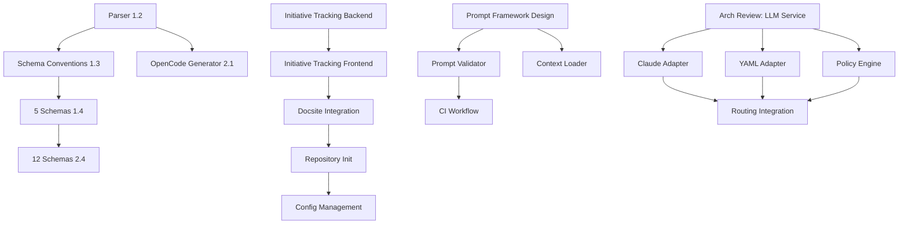

# Task Dependencies Map

**Last Updated:** 2026-02-08  
**Context:** Post-PR #135 refactor dependency analysis  
**Purpose:** Track what needs to happen before what

---

## Critical Path Analysis

### Path 1: Dashboard Initiative (M4 Batch 4.3) - ACTIVE

```
├─ Phase 1: Markdown Rendering ✅ COMPLETE (2026-02-06)
├─ Phase 2: Priority Editing ✅ COMPLETE (2026-02-06)
├─ Phase 3: Initiative Tracking (IN PROGRESS)
│   ├─ Backend API (python-pedro, 6-8h) → Frontend UI (frontend, 5-7h)
│   └─ Specification parsing + Task linking + Progress rollup
├─ Phase 4: Docsite Integration (BACKLOG)
│   └─ Depends on: Initiative tracking ✅
├─ Phase 5: Repository Initialization (BACKLOG)
│   └─ Depends on: Initiative tracking ✅
└─ Phase 6: Configuration Management (BACKLOG)
    └─ Depends on: Repository initialization

**Status:** 2/6 complete (47% of Batch 4.3)  
**Next:** Python-pedro starts backend, frontend waits for API contract
```

---

### Path 2: Multi-Format Distribution (MFD) - BLOCKED

```
Milestone 1: Schema Complete
├─ Task 1.1: Design IR Structure ✅ ASSUMED COMPLETE
├─ Task 1.2: Implement Parser (backend-dev, 6h) ⚠️ PATH UPDATE NEEDED
│   └─ Artifact: tools/exporters/parser.js (was ops/exporters/parser.js)
├─ Task 1.3: Schema Conventions (architect-alphonso, 3h) ⏳ WAITING ON 1.2
│   └─ Blocks: 1.4, 2.4 (all schema creation tasks)
├─ Task 1.4: Create 5 Schemas (backend-dev, 4h) ⏳ WAITING ON 1.3
└─ Task 1.5: Base Validator ✅ COMPLETE

Milestone 2: Generators Complete
├─ Task 2.1: OpenCode Generator (backend-dev, 6h) ⏳ WAITING ON 1.2
├─ Task 2.2: Copilot Generator ❓ NOT ASSIGNED
├─ Task 2.3: Claude-Code Generator ❓ NOT ASSIGNED
└─ Task 2.4: Complete 12 Schemas (backend-dev) ⏳ WAITING ON 1.4

**Status:** 1/5 complete in Milestone 1, 0/4 in Milestone 2  
**Critical Blocker:** Parser implementation (1.2) with path updates  
**Next:** Backend-dev updates task artifact paths, then implements parser
```

---

### Path 3: ADR-023 Prompt Optimization - READY

```
Phase 1: Design
└─ 2026-01-30T1120: Design Prompt Optimization Framework (architect, 6-8h) ✅ READY
    └─ Depends on: Analysis complete ✅ (work-log-analysis-suboptimal-patterns.md)

Phase 2: Validation
├─ 2026-01-30T1642: Prompt Validator (backend-dev) ⏳ WAITING ON DESIGN
└─ 2026-01-30T1644: CI Workflow (build-automation) ⏳ WAITING ON VALIDATOR

Phase 3: Context Loading
└─ 2026-01-30T1643: Progressive Context Loader (backend-dev) ⏳ WAITING ON DESIGN

**Status:** Design ready to start, implementation waiting  
**Next:** Architect Alphonso designs framework, backend-dev implements
```

---

### Path 4: LLM Service Layer - ON HOLD

```
Foundation
├─ Architecture Review ❗ NEEDS VALIDATION post-refactor
│   └─ Verify alignment with src/ structure
└─ Config/Tools YAML Schema ⚠️ IN PROGRESS

Adapters
├─ 2026-02-04T1705: Claude-Code Adapter (backend-dev) ⏳ WAITING ON ARCH REVIEW
├─ Generic YAML Adapter (python-pedro) ⏳ WAITING ON ARCH REVIEW
└─ Policy Engine (backend-dev) ⏳ WAITING ON ARCH REVIEW

Integration
└─ 2026-02-05T1002: Routing Integration ⏳ WAITING ON ADAPTERS

**Status:** All blocked pending architecture validation  
**Critical Action:** Architect Alphonso reviews LLM service design doc  
**Risk:** May need significant rework after refactor
```

---

## Dependency Relationships

### Dependency Graph



---

## Task Dependency Details

### Dashboard Initiative Dependencies

#### 2026-02-06T1150: Initiative Tracking Backend (python-pedro)
- **Prerequisites:**
  - ✅ Markdown rendering complete (2026-02-06T1148)
  - ✅ Priority editing complete (2026-02-06T1149)
  - ✅ Specification SPEC-DASH-003 complete
  - ✅ ADR-037 accepted
- **Provides:** GET /api/portfolio endpoint, WebSocket portfolio updates
- **Blocks:** Initiative tracking frontend

#### 2026-02-06T1150: Initiative Tracking Frontend (frontend)
- **Prerequisites:**
  - ⏳ Initiative tracking backend API complete
  - ⏳ API contract agreed (portfol io structure, WebSocket events)
- **Provides:** Portfolio UI, progress visualization
- **Blocks:** None (user-facing feature)

#### 2026-02-06T1220: Docsite Integration (frontend)
- **Prerequisites:**
  - ✅ Initiative tracking complete (context: user navigates from portfolio to docs)
- **Provides:** Embedded docs-site in dashboard
- **Blocks:** None

#### 2026-02-06T1221: Repository Initialization (python-pedro)
- **Prerequisites:**
  - ✅ Initiative tracking complete (shows initiative setup progress)
- **Provides:** Web-based repo setup wizard
- **Blocks:** Configuration management

#### 2026-02-06T1222: Configuration Management (python-pedro)
- **Prerequisites:**
  - ⏳ Repository initialization complete (config editor uses repo metadata)
- **Provides:** Web-based config editor
- **Blocks:** None

---

### Multi-Format Distribution Dependencies

#### 2026-01-29T0730-mfd-task-1.2: Parser (backend-dev)
- **Prerequisites:**
  - ✅ IR structure defined (task 1.1)
  - ⚠️ Path update: `tools/exporters/parser.js`
- **Provides:** Agent markdown → IR conversion
- **Blocks:** Schema conventions (1.3), OpenCode generator (2.1), all downstream tasks

#### 2026-01-29T0730-mfd-task-1.3: Schema Conventions (architect)
- **Prerequisites:**
  - ⏳ Parser available for testing extraction heuristics
- **Provides:** JSON Schema standards, migration checklist
- **Blocks:** All schema creation tasks (1.4, 2.4)

#### 2026-01-29T0730-mfd-task-1.4: 5 Schemas (backend-dev)
- **Prerequisites:**
  - ⏳ Schema conventions documented
- **Provides:** Input/output schemas for 5 representative agents
- **Blocks:** Remaining 12 schemas (2.4)

#### 2026-01-29T0730-mfd-task-2.1: OpenCode Generator (backend-dev)
- **Prerequisites:**
  - ⏳ Parser complete (consumes IR output)
- **Provides:** OpenCode agent definition generation
- **Blocks:** None (standalone generator)

---

### ADR-023 Prompt Optimization Dependencies

#### 2026-01-30T1120: Design Framework (architect)
- **Prerequisites:**
  - ✅ Work log analysis complete
  - ✅ 12 suboptimal patterns identified
- **Provides:** ADR with architecture, migration plan, schemas
- **Blocks:** Prompt validator, context loader

#### 2026-01-30T1642: Prompt Validator (backend-dev)
- **Prerequisites:**
  - ⏳ Framework design complete (defines validation schema)
- **Provides:** Prompt structure validation tool
- **Blocks:** CI workflow

#### 2026-01-30T1643: Context Loader (backend-dev)
- **Prerequisites:**
  - ⏳ Framework design complete (defines progressive loading strategy)
- **Provides:** Token-aware context loading
- **Blocks:** None (standalone utility)

#### 2026-01-30T1644: CI Workflow (build-automation)
- **Prerequisites:**
  - ⏳ Prompt validator implemented
- **Provides:** Automated prompt validation in CI/CD
- **Blocks:** None

---

### LLM Service Dependencies (ON HOLD)

#### Architecture Review (architect) - NOT YET SCHEDULED
- **Prerequisites:**
  - ⚠️ Post-refactor structure validation
  - ⚠️ LLM service design doc review
- **Provides:** Validation of src/ compatibility, adaptation recommendations
- **Blocks:** ALL LLM service tasks

#### 2026-02-04T1705: Claude-Code Adapter (backend-dev)
- **Prerequisites:**
  - ⏳ Architecture review complete
  - ⚠️ Config schema defined (tools.yaml structure)
- **Provides:** Claude CLI adapter with template execution
- **Blocks:** Routing integration

#### 2026-02-05T1000: Generic YAML Adapter (python-pedro)
- **Prerequisites:**
  - ⏳ Architecture review complete
  - ⚠️ Adapter base interface defined
- **Provides:** YAML-driven LLM adapter
- **Blocks:** Routing integration

#### 2026-02-04T1709: Policy Engine (backend-dev)
- **Prerequisites:**
  - ⏳ Architecture review complete
- **Provides:** Budget enforcement, cost optimization
- **Blocks:** Routing integration

#### 2026-02-05T1002: Routing Integration (backend-dev)
- **Prerequisites:**
  - ⏳ Claude adapter complete
  - ⏳ YAML adapter complete
  - ⏳ Policy engine complete
- **Provides:** Unified routing with all adapters + policies
- **Blocks:** None (capstone integration)

---

### Framework Core Dependencies

#### 2025-12-01T0510: Framework Config Loader (python-pedro)
- **Prerequisites:**
  - ⚠️ Path update: `src/framework/config/loader.py`
  - ⚠️ Config schema defined (router config, model routing)
- **Provides:** Runtime config loading for orchestration
- **Blocks:** Router-aware orchestration tasks

#### 2025-12-01T0511: Agent Profile Parser (python-pedro)
- **Prerequisites:**
  - ⚠️ Path update: Reference `doctrine/agents/` paths
- **Provides:** Runtime agent profile parsing
- **Blocks:** Dynamic agent loading features

#### 2025-11-30T1202: Model Client Interface (architect)
- **Prerequisites:**
  - ✅ None (standalone design task)
- **Provides:** Router-agnostic orchestration interface
- **Blocks:** None (interface definition, implementations follow)

---

### CI/CD & Validation Dependencies

#### 2025-11-30T1206: CI Router Schema Validation (build-automation)
- **Prerequisites:**
  - ⚠️ Path update: `tools/validators/router_validator.py`
  - ✅ Router config schema defined
- **Provides:** CI validation of router configurations
- **Blocks:** None

#### 2025-12-01T0513: Framework CI Tests (build-automation)
- **Prerequisites:**
  - ⚠️ Path updates: `tests/framework/`, `tools/validators/`
  - ✅ Test suites exist (post-refactor)
- **Provides:** Full framework test suite in CI
- **Blocks:** None

#### 2025-11-28T0427: Work Items Cleanup Script (build-automation)
- **Prerequisites:**
  - ✅ None (utility script)
- **Provides:** Automated archival of completed tasks
- **Blocks:** None

---

### Documentation & Content Dependencies

#### 2025-12-04T0528: Integrate Feasibility Artifacts (curator)
- **Prerequisites:**
  - ✅ Feasibility study complete
- **Provides:** Docsite metadata separation artifacts integrated
- **Blocks:** Feasibility document polish

#### 2025-12-04T0527: Polish Feasibility Documents (writer-editor)
- **Prerequisites:**
  - ⏳ Curator integration complete
- **Provides:** Polished feasibility documentation
- **Blocks:** None

#### 2026-02-04T1714: Persona Workflows (scribe)
- **Prerequisites:**
  - ✅ Persona definitions (docs/audience/)
- **Provides:** Example workflows for 3 personas
- **Blocks:** None

#### 2025-11-30T1203: Model Selection Template (scribe)
- **Prerequisites:**
  - ❗ Analyst Annie specification (BLOCKED)
- **Provides:** Extended task descriptor template
- **Blocks:** None

---

## Blocked Tasks Summary

### Hard Blockers (Cannot Proceed)

1. **MFD Schema Conventions (1.3)** ← Waiting on Parser (1.2)
2. **MFD 5 Schemas (1.4)** ← Waiting on Schema Conventions (1.3)
3. **MFD OpenCode Generator (2.1)** ← Waiting on Parser (1.2)
4. **Initiative Tracking Frontend** ← Waiting on Backend API
5. **ADR-023 Validator** ← Waiting on Framework Design
6. **ADR-023 Context Loader** ← Waiting on Framework Design
7. **ADR-023 CI Workflow** ← Waiting on Validator
8. **All LLM Service Tasks** ← Waiting on Architecture Review

### Soft Blockers (Needs Specification)

1. **Model Selection Template** ← Analyst Annie spec needed
2. **Parallel Installation** ← Analyst Annie benchmarks needed

### Path Update Needed (Can Proceed After Update)

1. **Parser (1.2)** - `ops/` → `tools/`
2. **Framework Config Loader** - `ops/` → `src/`
3. **Agent Profile Parser** - Reference `doctrine/`
4. **CI Router Validation** - `ops/` → `tools/`
5. **Framework CI Tests** - Multiple path updates

---

## Unblocking Actions

### Immediate (This Week)

1. **Planning Petra:** Create path migration script for 18 tasks
2. **Backend-dev:** Update parser task paths, implement parser (6h)
3. **Python-pedro:** Start initiative tracking backend (6-8h)
4. **Architect:** Begin prompt optimization framework design (6-8h)

### High Priority (Next Week)

1. **Architect:** Complete schema conventions after parser (3h)
2. **Architect:** Review LLM service architecture (2h)
3. **Backend-dev:** Create 5 schemas after conventions (4h)
4. **Frontend:** Implement initiative tracking UI after backend (5-7h)

### Medium Priority (Next 2 Weeks)

1. **Analyst Annie:** Spec for model selection template (2h)
2. **Analyst Annie:** Define parallel installation benchmarks (1h)
3. **Backend-dev:** Implement ADR-023 validator and context loader (12h total)
4. **Build-automation:** Create CI workflows for prompt validation (4h)

---

## Dependency Metrics

**Total Dependencies Tracked:** 35 tasks with explicit dependencies  
**Blocked Tasks:** 8 hard blockers, 2 soft blockers  
**Ready Tasks:** 14 tasks with all prerequisites met  
**Path Updates Needed:** 18 tasks

**Longest Dependency Chain:** 6 levels (Parser → Conventions → 5 Schemas → 12 Schemas → Complete Generators → Distribution)

**Critical Path Duration:** 25-35 hours (Parser → OpenCode generator)  
**Parallel Work Capacity:** 3-4 independent streams (Dashboard, ADR-023, LLM Service, CI/CD)

---

## Risk Assessment

### High Risk Dependencies

1. **LLM Service Architecture Review** (MISSING) ← Blocks 6 tasks, no ETA
   - **Mitigation:** Schedule architect review ASAP, 2h effort

2. **Parser Implementation** ← Blocks entire MFD critical path
   - **Mitigation:** Prioritize path updates, assign backend-dev immediately

3. **Schema Conventions** ← Blocks 12+ schema creation tasks
   - **Mitigation:** Architect Alphonso to start after parser available

### Medium Risk Dependencies

1. **Analyst Annie Specifications** ← Blocks 2 tasks, no ETA
   - **Mitigation:** Define scope for model selection template, assign Annie

2. **Initiative Tracking Backend** ← Blocks frontend UI
   - **Mitigation:** Already prioritized in M4 Batch 4.3b

---

_Dependency map maintained by: Planning Petra_  
_Last updated: 2026-02-08T1250_  
_Next update: After major milestone completion or dependency changes_
