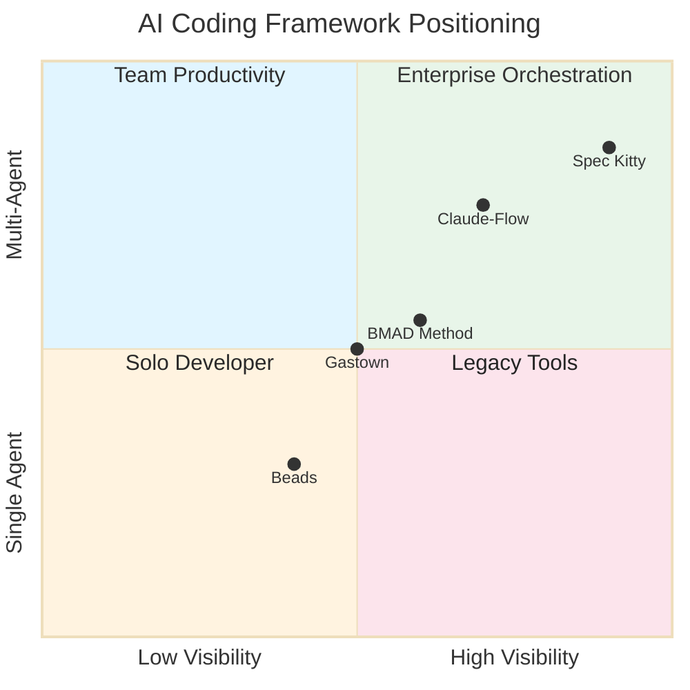
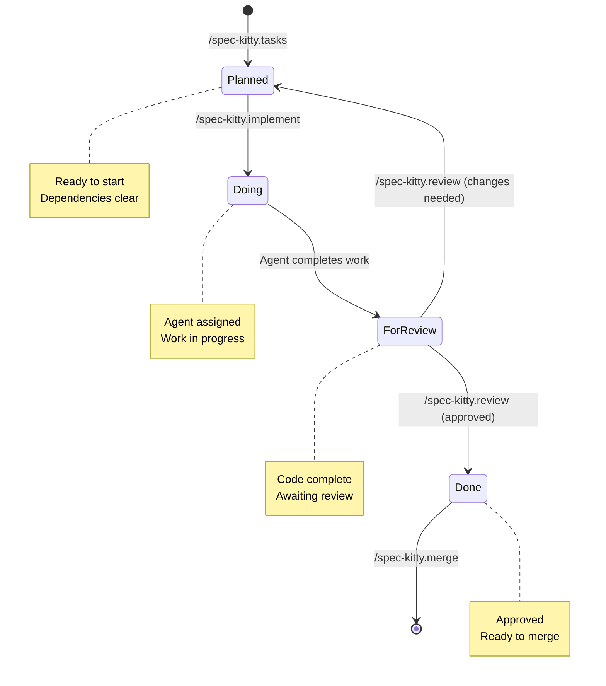

# README.md
**Source:** https://github.com/Priivacy-ai/spec-kitty  
**License:** MIT  
**Purpose:** Reference material for comparative study and inspiration  
**Date Retrieved:** 2026-02-05

---

<div align="center">
    
    <h1>Spec Kitty</h1>
    <h2>Stop wrestling with AI agents. Start shipping features.</h2>
</div>

**The Problem**: AI coding agents lose context, forget requirements, and generate code that doesn't match your specs. Teams waste 40% of development time re-prompting and fixing drift.

**The Solution**: Spec Kitty enforces **spec-driven development (SDD)** with executable specifications, live kanban tracking, and git worktree isolation. Build features **40% faster** with 12 AI agents working in parallel—without context loss or merge conflicts.

**Try it now**: `pip install spec-kitty-cli && spec-kitty init myproject --ai claude`

---

## 🚀 What You Get

| Feature | Spec Kitty | Other SDD Tools | Manual AI Coding |
|---------|------------|-----------------|------------------|
| **12 AI agents supported** | ✅ Claude, Cursor, Gemini, Copilot, + 8 more | ⚠️ Usually 1-2 agents | ⚠️ Agent-specific setup |
| **Live kanban dashboard** | ✅ Real-time progress tracking | ❌ Manual status checks | ❌ No visibility |
| **Parallel development (40% faster)** | ✅ Workspace-per-WP model | ⚠️ Branch-based (conflicts) | ❌ Serial work |
| **Conflict forecasting** | ✅ Pre-flight validation + auto-merge | ❌ Manual resolution | ❌ Merge hell |
| **Constitution framework** | ✅ Project governance built-in | ⚠️ Ad-hoc guidelines | ❌ No standards |
| **Dependency tracking** | ✅ WP frontmatter + smart sequencing | ❌ Manual coordination | ❌ Chaos |

<p align="center">
    <a href="#-getting-started-complete-workflow">Quick Start</a> •
    <a href="docs/claude-code-integration.md"><strong>Claude Code Guide</strong></a> •
    <a href="#-real-time-dashboard">Live Dashboard</a> •
    <a href="#-supported-ai-agents">12 AI Agents</a> •
    <a href="https://github.com/Priivacy-ai/spec-kitty/blob/main/spec-driven.md">Full Docs</a>
</p>

### From Idea to Production in 6 Automated Steps

```mermaid
graph LR
    A[📝 Specify<br/>WHAT to build] --> B[🎯 Plan<br/>HOW to build]
    B --> C[📋 Tasks<br/>Work packages]
    C --> D[⚡ Implement<br/>12 AI agents]
    D --> E[🔍 Review<br/>Quality gates]
    E --> F[🚀 Merge<br/>Ship it]

    style A fill:#e1f5ff
    style B fill:#e1f5ff
    style C fill:#fff3e0
    style D fill:#f3e5f5
    style E fill:#e8f5e9
    style F fill:#fce4ec
```



---

## 📊 By the Numbers

<div align="center">

[](https://github.com/Priivacy-ai/spec-kitty/stargazers)
[](https://pypi.org/project/spec-kitty-cli/)
[](https://pypi.org/project/spec-kitty-cli/)

**Branch Status:**
[](https://github.com/Priivacy-ai/spec-kitty/tree/main)
[](https://github.com/Priivacy-ai/spec-kitty/tree/2.x)
[](https://opensource.org/licenses/MIT)

[](#-supported-ai-agents)
[](#-multi-agent-coordination-for-ai-coding)
[](#-real-time-dashboard)
[](https://www.python.org/downloads/)

</div>

| Metric | Value | Context |
|--------|-------|---------|
| 🤖 **AI Agents Supported** | 12 | Claude, Cursor, Windsurf, Gemini, Copilot, +7 more |
| ⚡ **Development Speed** | 40% faster | Parallel WP model vs. serial branches ([dogfooding](kitty-specs/010-workspace-per-work-package-for-parallel-development/)) |
| 📊 **Live Tracking** | Real-time | Kanban dashboard updates as agents work |
| 🔀 **Conflict Prevention** | Pre-flight validation | Merge-base forecasting + auto-resolution |
| 🎯 **Quality Gates** | Automated | Accept/review workflows with constitution checks |
| 🌳 **Worktree Isolation** | Zero branch switching | `.worktrees/` per WP, main stays clean |

**Jump to:**
[Getting Started](#-getting-started-complete-workflow) •
[Examples](#-examples) •
[12 AI Agents](#-supported-ai-agents) •
[CLI Reference](#-spec-kitty-cli-reference) •
[Worktrees](#-worktree-strategy) •
[Troubleshooting](#-troubleshooting)

---

## 📌 Branch Strategy (Important!)

Spec Kitty uses a **two-branch strategy** for parallel development tracks:

| Branch | Version | Status | Purpose | Install |
|--------|---------|--------|---------|---------|
| **main** → **1.x** | v0.13.x → v1.x | 🟡 Maintenance Only | Stable local-only CLI with YAML activity logs | `pip install spec-kitty-cli` (PyPI) |
| **2.x** | v2.x (pre-release) | 🟢 Active Development | SaaS transformation with event sourcing | `git clone -b 2.x` (development only) |

**For users**: Install from PyPI (`pip install spec-kitty-cli`) - you're on the stable 1.x track.

**For contributors**:
- **New features**: Target `2.x` branch (SaaS platform, event sourcing architecture)
- **Bug fixes for stable**: Target `main` branch (becomes 1.x, maintenance-only)

**Why two branches?**
- 2.x is **greenfield architecture** (event sourcing, no YAML logs) - incompatible with 1.x
- 1.x remains **stable** for existing users (no breaking changes)
- Parallel tracks enable **SaaS transformation** without disrupting stable CLI

See [ADR-12: Two-Branch Strategy](architecture/adrs/2026-01-27-12-two-branch-strategy-for-saas-transformation.md) for details.

---

## 🤝 Multi-Agent Coordination for AI Coding

Orchestrate multiple AI agents on a single feature without conflicts. Each agent works in isolated worktrees while the live dashboard tracks progress across all work packages.

```mermaid
sequenceDiagram
    participant Lead as 👨‍💼 Lead Architect
    participant Claude as 🤖 Claude (Spec)
    participant Cursor as 🤖 Cursor (Impl)
    participant Gemini as 🤖 Gemini (Review)
    participant Dashboard as 📊 Live Kanban

    Lead->>Claude: /spec-kitty.specify
    Claude->>Dashboard: WP01-WP05 (planned)

    par Parallel Work
        Lead->>Cursor: implement WP01
        Lead->>Cursor: implement WP02
    end

    Cursor->>Dashboard: WP01 → doing
    Cursor->>Dashboard: WP01 → for_review
    Lead->>Gemini: /spec-kitty.review WP01
    Gemini->>Dashboard: WP01 → done

    Note over Dashboard: Real-time updates<br/>No branch switching
```



**Key Benefits:**
- 🔀 **Parallel execution** - Multiple WPs simultaneously
- 🚫 **Zero conflicts** - Git worktree isolation per WP
- 👀 **Full visibility** - Dashboard shows who's doing what
- 🔄 **Auto-sequencing** - Dependency tracking in WP frontmatter

### Competitive Landscape



**Why Not...?**
- **Claude-Flow**: Use if you need 60+ agents for enterprise orchestration. Use Spec Kitty for 3-10 agents with hands-on control.
- **BMAD Method**: Use if you prefer collaborative AI (AI assists, you lead). Use Spec Kitty for automated quality gates and kanban tracking.
- **Beads**: Use if you need hash-based context graphs for long-term projects. Use Spec Kitty for dashboard-driven workflows and git worktrees.
- **Manual AI coding**: Use for weekend prototypes. Use Spec Kitty when you need quality gates, progress tracking, or multi-agent teams.

---

## 📊 Real-Time Dashboard

Spec Kitty includes a **live dashboard** that automatically tracks your feature development progress. View your kanban board, monitor work package status, and see which agents are working on what—all updating in real-time as you work.

<div align="center">
  
  <p><em>Kanban board showing work packages across all lanes with agent assignments</em></p>
</div>

<div align="center">
  
  <p><em>Feature overview with completion metrics and available artifacts</em></p>
</div>

The dashboard starts automatically when you run `spec-kitty init` and runs in the background. Access it anytime with the `/spec-kitty.dashboard` command or `spec-kitty dashboard`—the CLI will start the correct project dashboard automatically if it isn't already running, let you request a specific port with `--port`, or stop it cleanly with `--kill`.

**Key Features:**
- 📋 **Kanban Board**: Visual workflow across planned → doing → for review → done lanes
- 📈 **Progress Tracking**: Real-time completion percentages and task counts
- 👥 **Multi-Agent Support**: See which AI agents are working on which tasks
- 📦 **Artifact Status**: Track specification, plan, tasks, and other deliverables
- 🔄 **Live Updates**: Dashboard refreshes automatically as you work

### Kanban Workflow Automation

Work packages flow through automated quality gates. Agents move tasks between lanes, and the dashboard tracks state transitions in real-time.



---

## 🚀 Getting Started: Complete Workflow

**New to Spec Kitty?** Here's the complete lifecycle from zero to shipping features:

### Phase 1: Install & Initialize (Terminal)

```bash
# 1. Install the CLI
pip install spec-kitty-cli
# or
uv tool install spec-kitty-cli

# 2. Initialize your project
spec-kitty init my-project --ai claude

# 3. Verify setup (optional)
cd my-project
spec-kitty verify-setup  # Checks that everything is configured correctly

# 4. View your dashboard
spec-kitty dashboard  # Opens http://localhost:3000-5000
```

**What just happened:**
- ✅ Created `.claude/commands/` (or `.gemini/`, `.cursor/`, etc.) with 13 slash commands
- ✅ Created `.kittify/` directory with scripts, templates, and mission configuration
- ✅ Started real-time kanban dashboard (runs in background)
- ✅ Initialized git repository with proper `.gitignore`

---

<details>
<summary><h2>🔄 Upgrading Existing Projects</h2></summary>

> **Important:** If you've upgraded `spec-kitty-cli` via pip/uv, run `spec-kitty upgrade` in each of your projects to apply structural migrations.

### Quick Upgrade

```bash
cd your-project
spec-kitty upgrade              # Upgrade to current version
```

### What Gets Upgraded

The upgrade command automatically migrates your project structure across versions:

| Version | Migration |
|---------|-----------|
| **0.10.9** | Repair broken templates with bash script references (#62, #63, #64) |
| **0.10.8** | Move memory/ and AGENTS.md to .kittify/ |
| **0.10.6** | Simplify implement/review templates to use workflow commands |
| **0.10.2** | Update slash commands to Python CLI and flat structure |
| **0.10.0** | **Remove bash scripts, migrate to Python CLI** |
| **0.9.1** | Complete lane migration + normalize frontmatter |
| **0.9.0** | Flatten task lanes to frontmatter-only (no directory-based lanes) |
| **0.8.0** | Remove active-mission (missions now per-feature) |
| **0.7.3** | Update scripts for worktree feature numbering |
| **0.6.7** | Ensure software-dev and research missions present |
| **0.6.5** | Rename commands/ → command-templates/ |
| **0.5.0** | Install encoding validation git hooks |
| **0.4.8** | Add all 12 AI agent directories to .gitignore |
| **0.2.0** | Rename .specify/ → .kittify/ and /specs/ → /kitty-specs/ |

> Run `spec-kitty upgrade --verbose` to see which migrations apply to your project.

### Upgrade Options

```bash
# Preview changes without applying
spec-kitty upgrade --dry-run

# Show detailed migration information
spec-kitty upgrade --verbose

# Upgrade to specific version
spec-kitty upgrade --target 0.6.5

# Skip worktree upgrades (main project only)
spec-kitty upgrade --no-worktrees

# JSON output for CI/CD integration
spec-kitty upgrade --json
```

### When to Upgrade

Run `spec-kitty upgrade` after:
- Installing a new version of `spec-kitty-cli`
- Cloning a project that was created with an older version
- Seeing "Unknown mission" or missing slash commands

The upgrade command is **idempotent** - safe to run multiple times. It automatically detects your project's version and applies only the necessary migrations.

</details>

---

### Phase 2: Start Your AI Agent (Terminal)

```bash
# Launch your chosen AI coding agent (12 agents supported)
claude   # Eg. for Claude Code
# or
gemini   # Eg. for Gemini CLI
# or
code     # Eg. for GitHub Copilot / Cursor
```

(You can choose which agents you work with by running `spec-kitty init`, and it is safe to run that command on existing projects, or to run it multiple times) 

**Verify slash commands loaded:**
Type `/spec-kitty` and you should see autocomplete with all 13 commands.

### Phase 3: Establish Project Principles (In Agent)

**Still in main repo** - Start with your project's governing principles:

```text
/spec-kitty.constitution

Create principles focused on code quality, testing standards,
user experience consistency, and performance requirements.
```

**What this creates:**
- `.kittify/memory/constitution.md` - Your project's architectural DNA
- These principles will guide all subsequent development
- Missions do not have separate constitutions; the project constitution is the single source of truth

### Phase 4: Create Your First Feature (In Agent)

Now begin the feature development cycle:

#### 4a. Define WHAT to Build

```text
/spec-kitty.specify

Build a user authentication system with email/password login,
password reset, and session management. Users should be able to
register, login, logout, and recover forgotten passwords.
```

**What this does:**
- Creates `kitty-specs/001-auth-system/spec.md` with user stories
- **Enters discovery interview** - Answer questions before continuing!
- All planning happens in the main repo (worktrees created later during implementation)

**⚠️ Important:** Continue in the same session - no need to change directories!

#### 4b. Define HOW to Build (In Main Repo)

```text
/spec-kitty.plan

Use Python FastAPI for backend, PostgreSQL for database,
JWT tokens for sessions, bcrypt for password hashing,
SendGrid for email delivery.
```

**What this creates:**
- `kitty-specs/001-auth-system/plan.md` - Technical architecture
- `kitty-specs/001-auth-system/data-model.md` - Database schema
- `kitty-specs/001-auth-system/contracts/` - API specifications
- **Enters planning interview** - Answer architecture questions!

#### 4c. Optional: Research Phase

```text
/spec-kitty.research

Investigate best practices for password reset token expiration,
JWT refresh token rotation, and rate limiting for auth endpoints.
```

**What this creates:**
- `kitty-specs/001-auth-system/research.md` - Research findings
- Evidence logs for decisions made

#### 4d. Break Down Into Tasks

```text
/spec-kitty.tasks
```

**What this creates:**
- `kitty-specs/001-auth-system/tasks.md` - Kanban checklist
- `kitty-specs/001-auth-system/tasks/WP01.md` - Work package prompts (flat structure)
- Up to 10 work packages ready for implementation

**Check your dashboard:** You'll now see tasks in the "Planned" lane!

### Phase 5: Implement Features (In Feature Worktree)

#### 5a. Execute Implementation

```text
/spec-kitty.implement
```

**What this does:**
- Auto-detects first WP with `lane: "planned"` (or specify WP ID)
- Automatically moves to `lane: "doing"` and displays the prompt
- Shows clear "WHEN YOU'RE DONE" instructions
- Agent implements, then runs command to move to `lane: "for_review"`

**Repeat** until all work packages are done!

#### 5b. Review Completed Work

```text
/spec-kitty.review
```

**What this does:**
- Auto-detects first WP with `lane: "for_review"` (or specify WP ID)
- Automatically moves to `lane: "doing"` and displays the prompt
- Agent reviews code and provides feedback or approval
- Shows commands to move to `lane: "done"` (passed) or `lane: "planned"` (changes needed)

### Phase 6: Accept & Merge (In Feature Worktree)

#### 6a. Validate Feature Complete

```text
/spec-kitty.accept
```

**What this does:**
- Verifies all WPs have `lane: "done"`
- Checks metadata and activity logs
- Confirms no `NEEDS CLARIFICATION` markers remain
- Records acceptance timestamp

#### 6b. Merge to Main

```text
/spec-kitty.merge --push
```

**What this does:**
- Switches to main branch
- Merges feature branch
- Pushes to remote (if `--push` specified)
- Cleans up worktree
- Deletes feature branch

**🎉 Feature complete!** Return to main repo and start your next feature with `/spec-kitty.specify`

---

## 📋 Quick Reference: Command Order

### Required Workflow (Once per project)
```
1️⃣  /spec-kitty.constitution     → In main repo (sets project principles)
```

### Required Workflow (Each feature)
```
2️⃣  /spec-kitty.specify          → Create spec (in main repo)
3️⃣  /spec-kitty.plan             → Define technical approach (in main repo)
4️⃣  /spec-kitty.tasks            → Generate work packages (in main repo)
5️⃣  spec-kitty implement WP01    → Create workspace for WP01 (first worktree)
    /spec-kitty.implement        → Build the work package
6️⃣  /spec-kitty.review           → Review completed work
7️⃣  /spec-kitty.accept           → Validate feature ready
8️⃣  /spec-kitty.merge            → Merge to main + cleanup
```

### Optional Enhancement Commands
```
/spec-kitty.clarify    → Before /plan: Ask structured questions about spec
/spec-kitty.research   → After /plan: Investigate technical decisions
/spec-kitty.analyze    → After /tasks: Cross-artifact consistency check
/spec-kitty.checklist  → Anytime: Generate custom quality checklists
/spec-kitty.dashboard  → Anytime: Open/restart the kanban dashboard
```

---

## 🔒 Agent Directory Best Practices

**Important**: Agent directories (`.claude/`, `.codex/`, `.gemini/`, etc.) should **NEVER** be committed to git.

### Why?

These directories may contain:
- Authentication tokens and API keys
- User-specific credentials (auth.json)
- Session data and conversation history

### Automatic Protection

Spec Kitty automatically protects you with multiple layers:

**During `spec-kitty init`:**
- ✅ Adds all 12 agent directories to `.gitignore`
- ✅ Installs pre-commit hooks that block commits containing agent files
- ✅ Creates `.claudeignore` to optimize AI scanning (excludes `.kittify/` templates)

**Pre-commit Hook Protection:**
The installed pre-commit hook will block any commit that includes files from:
`.claude/`, `.codex/`, `.gemini/`, `.cursor/`, `.qwen/`, `.opencode/`,
`.windsurf/`, `.kilocode/`, `.augment/`, `.roo/`, `.amazonq/`, `.github/copilot/`

If you need to bypass the hook (not recommended): `git commit --no-verify`

**Worktree Constitution Sharing:**
When creating WP workspaces, Spec Kitty uses symlinks to share the constitution:
```
.worktrees/001-feature-WP01/.kittify/memory -> ../../../../.kittify/memory
```
This ensures all work packages follow the same project principles.

### What Gets Committed?

✅ **DO commit:**
- `.kittify/templates/` - Command templates (source)
- `.kittify/missions/` - Mission workflows
- `.kittify/memory/constitution.md` - Project principles
- `.gitignore` - Protection rules

❌ **NEVER commit:**
- `.claude/`, `.gemini/`, `.cursor/`, etc. - Agent runtime directories
- Any `auth.json` or credentials files

See [AGENTS.md](.kittify/AGENTS.md) for complete guidelines.

---

<details>
<summary><h2>📚 Terminology</h2></summary>

Spec Kitty differentiates between the **project** that holds your entire codebase, the **features** you build within that project, and the **mission** that defines your workflow. Use these definitions whenever you write docs, prompts, or help text.

### Project
**Definition**: The entire codebase (one Git repository) that contains all missions, features, and `.kittify/` automation.

**Examples**:
- "spec-kitty project" (this repository)
- "priivacy_rust project"
- "my-agency-portal project"

**Usage**: Projects are initialized once with `spec-kitty init`. A project contains:
- One active mission at a time
- Multiple features (each with its own spec/plan/tasks)
- Shared automation under `.kittify/`

**Commands**: Initialize with `spec-kitty init my-project` (or `spec-kitty init --here` for the current directory).

---

### Feature
**Definition**: A single unit of work tracked by Spec Kitty. Every feature has its own spec, plan, tasks, and implementation worktree.

**Examples**:
- "001-auth-system feature"
- "005-refactor-mission-system feature" (this document)
- "042-dashboard-refresh feature"

**Structure**:
- Specification: `/kitty-specs/###-feature-name/spec.md`
- Plan: `/kitty-specs/###-feature-name/plan.md`
- Tasks: `/kitty-specs/###-feature-name/tasks.md`
- Implementation: `.worktrees/###-feature-name/`

**Lifecycle**:
1. `/spec-kitty.specify` – Create the feature and its branch
2. `/spec-kitty.plan` – Document the technical design
3. `/spec-kitty.tasks` – Break work into packages
4. `/spec-kitty.implement` – Build the feature inside its worktree
5. `/spec-kitty.review` – Peer review
6. `/spec-kitty.accept` – Validate according to gates
7. `/spec-kitty.merge` – Merge and clean up

**Commands**: Always create features with `/spec-kitty.specify`.

---

### Mission
**Definition**: A domain adapter that configures Spec Kitty (workflows, templates, validation). Missions are project-wide; all features in a project share the same active mission.

**Examples**:
- "software-dev mission" (ship software with TDD)
- "research mission" (conduct systematic investigations)
- "writing mission" (future workflow)

**What missions define**:
- Workflow phases (e.g., design → implement vs. question → gather findings)
- Templates (spec, plan, tasks, prompts)
- Validation rules (tests pass vs. citations documented)
- Path conventions (e.g., `src/` vs. `research/`)

**Scope**: Entire project. Switch missions before starting a new feature if you need a different workflow.

**Commands**:
- Select at init: `spec-kitty init my-project --mission research`
- Switch later: `spec-kitty mission switch research`
- Inspect: `spec-kitty mission current` / `spec-kitty mission list`

---

### Quick Reference

| Term | Scope | Example | Key Command |
|------|-------|---------|-------------|
| **Project** | Entire codebase | "spec-kitty project" | `spec-kitty init my-project` |
| **Feature** | Unit of work | "001-auth-system feature" | `/spec-kitty.specify "auth system"` |
| **Mission** | Workflow adapter | "research mission" | `spec-kitty mission switch research` |

### Common Questions

**Q: What's the difference between a project and a feature?**  
A project is your entire git repository. A feature is one unit of work inside that project with its own spec/plan/tasks.

**Q: Can I have multiple missions in one project?**  
Only one mission is active at a time, but you can switch missions between features with `spec-kitty mission switch`.

**Q: Should I create a new project for every feature?**  
No. Initialize a project once, then create as many features as you need with `/spec-kitty.specify`.

**Q: What's a task?**
Tasks (T001, T002, etc.) are subtasks within a feature's work packages. They are **not** separate features or projects.

</details>

---

## 📦 Examples

Learn from real-world workflows used by teams building production software with AI agents. Each playbook demonstrates specific coordination patterns and best practices:

### Featured Workflows

- **[Multi-Agent Feature Development](https://github.com/Priivacy-ai/spec-kitty/blob/main/examples/multi-agent-feature-development.md)**
  *Orchestrate 3-5 AI agents on a single large feature with parallel work packages*

- **[Parallel Implementation Tracking](https://github.com/Priivacy-ai/spec-kitty/blob/main/examples/parallel-implementation-tracking.md)**
  *Monitor multiple teams/agents delivering features simultaneously with dashboard metrics*

- **[Dashboard-Driven Development](https://github.com/Priivacy-ai/spec-kitty/blob/main/examples/dashboard-driven-development.md)**
  *Product trio workflow: PM + Designer + Engineers using live kanban visibility*

- **[Claude + Cursor Collaboration](https://github.com/Priivacy-ai/spec-kitty/blob/main/examples/claude-cursor-collaboration.md)**
  *Blend different AI agents within a single spec-driven workflow*

### More Examples

Browse our [examples directory](https://github.com/Priivacy-ai/spec-kitty/tree/main/examples) for additional workflows including:
- Agency client transparency workflows
- Solo developer productivity patterns
- Enterprise parallel development
- Research mission templates

## 🤖 Supported AI Agents

| Agent                                                     | Support | Notes                                             |
|-----------------------------------------------------------|---------|---------------------------------------------------|
| [Claude Code](https://www.anthropic.com/claude-code)      | ✅ |                                                   |
| [GitHub Copilot](https://code.visualstudio.com/)          | ✅ |                                                   |
| [Gemini CLI](https://github.com/google-gemini/gemini-cli) | ✅ |                                                   |
| [Cursor](https://cursor.sh/)                              | ✅ |                                                   |
| [Qwen Code](https://github.com/QwenLM/qwen-code)          | ✅ |                                                   |
| [opencode](https://opencode.ai/)                          | ✅ |                                                   |
| [Windsurf](https://windsurf.com/)                         | ✅ |                                                   |
| [Kilo Code](https://github.com/Kilo-Org/kilocode)         | ✅ |                                                   |
| [Auggie CLI](https://docs.augmentcode.com/cli/overview)   | ✅ |                                                   |
| [Roo Code](https://roocode.com/)                          | ✅ |                                                   |
| [Codex CLI](https://github.com/openai/codex)              | ✅ |                                                   |
| [Amazon Q Developer CLI](https://aws.amazon.com/developer/learning/q-developer-cli/) | ⚠️ | Amazon Q Developer CLI [does not support](https://github.com/aws/amazon-q-developer-cli/issues/3064) custom arguments for slash commands. |

<details>
<summary><h2>🔧 Spec Kitty CLI Reference</h2></summary>

The `spec-kitty` command supports the following options. Every run begins with a discovery interview, so be prepared to answer follow-up questions before files are touched.

### Commands

| Command     | Description                                                    |
|-------------|----------------------------------------------------------------|
| `init`      | Initialize a new Spec Kitty project from templates |
| `upgrade`   | **Upgrade project structure to current version** (run after updating spec-kitty-cli) |
| `repair`    | **Repair broken template installations** (fixes bash script references from v0.10.0-0.10.8) |
| `accept`    | Validate feature readiness before merging to main |
| `check`     | Check that required tooling is available |
| `dashboard` | Open or stop the Spec Kitty dashboard |
| `diagnostics` | Show project health and diagnostics information |
| `merge`     | Merge a completed feature branch into main and clean up resources |
| `research`  | Execute Phase 0 research workflow to scaffold artifacts |
| `verify-setup` | Verify that the current environment matches Spec Kitty expectations |

### `spec-kitty init` Arguments & Options

| Argument/Option        | Type     | Description                                                                  |
|------------------------|----------|------------------------------------------------------------------------------|
| `<project-name>`       | Argument | Name for your new project directory (optional if using `--here`, or use `.` for current directory) |
| `--ai`                 | Option   | AI assistant to use: `claude`, `gemini`, `copilot`, `cursor`, `qwen`, `opencode`, `codex`, `windsurf`, `kilocode`, `auggie`, `roo`, or `q` |
| `--script`             | Option   | (Deprecated in v0.10.0) Script variant - all commands now use Python CLI     |
| `--mission`            | Option   | Mission key to seed templates (`software-dev`, `research`, ...)             |
| `--template-root`      | Option   | Override template location (useful for development mode or custom sources)   |
| `--ignore-agent-tools` | Flag     | Skip checks for AI agent tools like Claude Code                             |
| `--no-git`             | Flag     | Skip git repository initialization                                          |
| `--here`               | Flag     | Initialize project in the current directory instead of creating a new one   |
| `--force`              | Flag     | Force merge/overwrite when initializing in current directory (skip confirmation) |
| `--skip-tls`           | Flag     | Skip SSL/TLS verification (not recommended)                                 |
| `--debug`              | Flag     | Enable detailed debug output for troubleshooting                            |
| `--github-token`       | Option   | GitHub token for API requests (or set GH_TOKEN/GITHUB_TOKEN env variable)  |

If you omit `--mission`, the CLI will prompt you to pick one during `spec-kitty init`.

### Examples

```bash
# Basic project initialization
spec-kitty init my-project

# Initialize with specific AI assistant
spec-kitty init my-project --ai claude

# Initialize with the Deep Research mission
spec-kitty init my-project --mission research

# Initialize with Cursor support
spec-kitty init my-project --ai cursor

# Initialize with Windsurf support
spec-kitty init my-project --ai windsurf

# Initialize with PowerShell scripts (Windows/cross-platform)
spec-kitty init my-project --ai copilot --script ps

# Initialize in current directory
spec-kitty init . --ai copilot
# or use the --here flag
spec-kitty init --here --ai copilot

# Force merge into current (non-empty) directory without confirmation
spec-kitty init . --force --ai copilot
# or 
spec-kitty init --here --force --ai copilot

# Skip git initialization
spec-kitty init my-project --ai gemini --no-git

# Enable debug output for troubleshooting
spec-kitty init my-project --ai claude --debug

# Use GitHub token for API requests (helpful for corporate environments)
spec-kitty init my-project --ai claude --github-token ghp_your_token_here

# Use custom template location (development mode)
spec-kitty init my-project --ai claude --template-root=/path/to/local/spec-kitty

# Check system requirements
spec-kitty check
```

### `spec-kitty upgrade` Options

| Option | Description |
|--------|-------------|
| `--dry-run` | Preview changes without applying them |
| `--force` | Skip confirmation prompts |
| `--target <version>` | Target version to upgrade to (defaults to current CLI version) |
| `--json` | Output results as JSON (for CI/CD integration) |
| `--verbose`, `-v` | Show detailed migration information |
| `--no-worktrees` | Skip upgrading worktrees (main project only) |

**Examples:**
```bash
# Upgrade to current version
spec-kitty upgrade

# Preview what would be changed
spec-kitty upgrade --dry-run

# Upgrade with detailed output
spec-kitty upgrade --verbose

# Upgrade to specific version
spec-kitty upgrade --target 0.6.5

# JSON output for scripting
spec-kitty upgrade --json

# Skip worktree upgrades
spec-kitty upgrade --no-worktrees
```

### `spec-kitty agent` Commands

The `spec-kitty agent` namespace provides programmatic access to all workflow automation commands. All commands support `--json` output for agent consumption.

**Feature Management:**
- `spec-kitty agent feature create-feature <name>` – Create new feature with worktree
- `spec-kitty agent feature check-prerequisites` – Validate project setup and feature context
- `spec-kitty agent feature setup-plan` – Initialize plan template for feature
- `spec-kitty agent context update` – Update agent context files
- `spec-kitty agent feature accept` – Run acceptance workflow
- `spec-kitty agent feature merge` – Merge feature branch and cleanup

**Task Workflow:**
- `spec-kitty agent workflow implement <id> --agent __AGENT__` – Move planned → doing → for_review automatically
- `spec-kitty agent workflow review <id> --agent __AGENT__` – Move for_review → doing → planned/done automatically
- `spec-kitty agent tasks list-tasks` – List all tasks grouped by lane
- `spec-kitty agent tasks mark-status <id> --status <status>` – Mark task status
- `spec-kitty agent tasks add-history <id> --note <message>` – Add activity log entry
- `spec-kitty agent tasks validate-workflow <id>` – Validate task metadata

**Workflow Commands:**
- `spec-kitty agent workflow implement [WP_ID] --agent __AGENT__` – Display WP prompt and auto-move to "doing" lane
- `spec-kitty agent workflow review [WP_ID] --agent __AGENT__` – Display WP prompt for review and auto-move to "doing" lane

**Note:** In generated agent command files, `__AGENT__` is replaced at init time with the agent key (e.g., `codex`, `claude`). If you run commands manually, replace `__AGENT__` with your agent name.

**Example Usage:**
```bash
# Create feature (agent-friendly)
spec-kitty agent feature create-feature "Payment Flow" --json

# Display WP prompt and auto-move to doing
spec-kitty agent workflow implement WP01 --agent __AGENT__

# Run workflow to advance lanes
spec-kitty agent workflow implement WP01 --agent __AGENT__

# Validate workflow
spec-kitty agent tasks validate-workflow WP01 --json

# Accept feature
spec-kitty agent feature accept --json
```

### `spec-kitty dashboard` Options

| Option | Description |
|--------|-------------|
| `--port <number>` | Preferred port for the dashboard (falls back to first available port) |
| `--kill` | Stop the running dashboard for this project and clear its metadata |

**Examples:**
```bash
# Open dashboard (auto-detects port)
spec-kitty dashboard

# Open on specific port
spec-kitty dashboard --port 4000

# Stop dashboard
spec-kitty dashboard --kill
```

### `spec-kitty accept` Options

| Option | Description |
|--------|-------------|
| `--feature <slug>` | Feature slug to accept (auto-detected by default) |
| `--mode <mode>` | Acceptance mode: `auto`, `pr`, `local`, or `checklist` (default: `auto`) |
| `--actor <name>` | Name to record as the acceptance actor |
| `--test <command>` | Validation command to execute (repeatable) |
| `--json` | Emit JSON instead of formatted text |
| `--lenient` | Skip strict metadata validation |
| `--no-commit` | Skip auto-commit; report only |
| `--allow-fail` | Return checklist even when issues remain |

**Examples:**
```bash
# Validate feature (auto-detect)
spec-kitty accept

# Validate specific feature
spec-kitty accept --feature 001-auth-system

# Get checklist only (no commit)
spec-kitty accept --mode checklist

# Accept with custom test validation
spec-kitty accept --test "pytest tests/" --test "npm run lint"

# JSON output for CI integration
spec-kitty accept --json
```

### `spec-kitty merge` Options

| Option | Description |
|--------|-------------|
| `--strategy <type>` | Merge strategy: `merge`, `squash`, or `rebase` (default: `merge`) |
| `--delete-branch` / `--keep-branch` | Delete or keep feature branch after merge (default: delete) |
| `--remove-worktree` / `--keep-worktree` | Remove or keep feature worktree after merge (default: remove) |
| `--push` | Push to origin after merge |
| `--target <branch>` | Target branch to merge into (default: `main`) |
| `--dry-run` | Show what would be done without executing |

**Examples:**
```bash
# Standard merge and push
spec-kitty merge --push

# Squash commits into one
spec-kitty merge --strategy squash --push

# Keep branch for reference
spec-kitty merge --keep-branch --push

# Preview merge without executing
spec-kitty merge --dry-run

# Merge to different target
spec-kitty merge --target develop --push
```

### `spec-kitty verify-setup`

Verifies that the current environment matches Spec Kitty expectations:
- Checks for `.kittify/` directory structure
- Validates agent command files exist
- Confirms dashboard can start
- Reports any configuration issues

**Example:**
```bash
cd my-project
spec-kitty verify-setup
```

### `spec-kitty diagnostics`

Shows project health and diagnostics information:
- Active mission
- Available features
- Dashboard status
- Git configuration
- Agent command availability

**Example:**
```bash
spec-kitty diagnostics
```

### Available Slash Commands

After running `spec-kitty init`, your AI coding agent will have access to these slash commands for structured development.

> **📋 Quick Reference:** See the [command order flowchart above](#-quick-reference-command-order) for a visual workflow guide.

#### Core Commands (In Recommended Order)

**Workflow sequence for spec-driven development:**

| # | Command                  | Description                                                           |
|---|--------------------------|-----------------------------------------------------------------------|
| 1 | `/spec-kitty.constitution`  | (**First in main repo**) Create or update project governing principles and development guidelines |
| 2 | `/spec-kitty.specify`       | Define what you want to build (requirements and user stories; creates worktree) |
| 3 | `/spec-kitty.plan`          | Create technical implementation plans with your chosen tech stack     |
| 4 | `/spec-kitty.research`      | Run Phase 0 research scaffolding to populate research.md, data-model.md, and evidence logs |
| 5 | `/spec-kitty.tasks`         | Generate actionable task lists and work package prompts in flat tasks/ directory |
| 6 | `/spec-kitty.implement`     | Display WP prompt, auto-move to "doing" lane, show completion instructions |
| 7 | `/spec-kitty.review`        | Display WP prompt for review, auto-move to "doing" lane, show next steps |
| 8 | `/spec-kitty.accept`        | Run final acceptance checks, record metadata, and verify feature complete |
| 9 | `/spec-kitty.merge`         | Merge feature into main branch and clean up worktree                  |

#### Quality Gates & Development Tools

**Optional commands for enhanced quality and development:**

| Command              | When to Use                                                           |
|----------------------|-----------------------------------------------------------------------|
| `/spec-kitty.clarify`   | **Optional, before `/spec-kitty.plan`**: Clarify underspecified areas in your specification to reduce downstream rework |
| `/spec-kitty.analyze`   | **Optional, after `/spec-kitty.tasks`, before `/spec-kitty.implement`**: Cross-artifact consistency & coverage analysis |
| `/spec-kitty.checklist` | **Optional, anytime after `/spec-kitty.plan`**: Generate custom quality checklists that validate requirements completeness, clarity, and consistency |
| `/spec-kitty.dashboard` | **Anytime (runs in background)**: Open the real-time kanban dashboard in your browser. Automatically starts with `spec-kitty init` and updates as you work. |

</details>

## 🌳 Worktree Strategy

> **📖 Quick Start:** See the [Getting Started guide](#-getting-started-complete-workflow) for practical examples of worktree usage in context.

Spec Kitty uses an **opinionated worktree approach** for parallel feature development:

### Parallel Development Without Branch Switching

```mermaid
graph TD
    Main[main branch<br/>🔒 Clean production code]
    WT1[.worktrees/001-auth-WP01<br/>🔐 Authentication]
    WT2[.worktrees/001-auth-WP02<br/>💾 Database]
    WT3[.worktrees/002-dashboard-WP01<br/>📊 UI Components]

    Main --> WT1
    Main --> WT2
    Main --> WT3

    WT1 -.->|🚀 Parallel work| WT2
    WT2 -.->|✅ No conflicts| WT3

    style Main fill:#e8f5e9
    style WT1 fill:#e1f5ff
    style WT2 fill:#fff3e0
    style WT3 fill:#f3e5f5
```



**Why this works:**
- Each WP gets its own directory + branch
- Work on Feature 001 WP01 while another agent handles Feature 002 WP01
- Main branch stays clean - no `git checkout` juggling
- Merge conflicts detected early with pre-flight validation

### The Pattern
```
my-project/                    # Main repo (main branch)
├── .worktrees/
│   ├── 001-auth-system-WP01/  # Feature 1 WP01 (isolated sandbox)
│   ├── 001-auth-system-WP02/  # Feature 1 WP02 (parallel work)
│   └── 002-dashboard-WP01/    # Feature 2 WP01 (different feature)
├── .kittify/
├── kitty-specs/
└── ... (main branch files)
```

### The Rules
1. **Main branch** stays in the primary repo root
2. **Feature branches** live in `.worktrees/<feature-slug>/`
3. **Work on features** happens in their worktrees (complete isolation)
4. **No branch switching** in main repo - just `cd` between worktrees
5. **Automatic cleanup** - worktrees removed after merge

### The Complete Workflow

```bash
# ========== IN MAIN REPO ==========
/spec-kitty.constitution     # Step 1: Establish project governance (one time per project)

# ========== CREATE FEATURE BRANCH & WORKTREE ==========
/spec-kitty.specify          # Step 2: Creates feature branch + isolated worktree
cd .worktrees/001-my-feature # Enter isolated sandbox for feature development

# ========== IN FEATURE WORKTREE ==========
/spec-kitty.clarify          # Step 3 (optional): Clarify requirements before planning
/spec-kitty.plan             # Step 4: Design technical implementation
/spec-kitty.research         # Step 5 (as needed): Research technologies, patterns, etc.
/spec-kitty.tasks            # Step 6: Break plan into actionable tasks
/spec-kitty.analyze          # Step 7 (optional): Check cross-artifact consistency
/spec-kitty.implement        # Step 8: Execute implementation tasks
/spec-kitty.review           # Step 9: Review and refine completed work
/spec-kitty.accept           # Step 10: Acceptance checks & final metadata
/spec-kitty.merge --push     # Step 11: Merge to main + cleanup worktree

# ========== BACK IN MAIN REPO ==========
# Ready for next feature!
```

## 🧭 Mission System

Spec Kitty supports **missions**: curated bundles of templates, commands, and guardrails for different domains. Two missions ship out of the box:

- **Software Dev Kitty** – the original Spec-Driven Development workflow for shipping application features (default).
- **Deep Research Kitty** – a methodology-focused workflow for evidence gathering, analysis, and synthesis.

Each mission lives under `.kittify/missions/<mission-key>/` and provides:

- Mission-specific templates (`spec-template.md`, `plan-template.md`, `tasks-template.md`, etc.)
- Command guidance tuned to the domain (`specify`, `plan`, `tasks`, `implement`, `review`, `accept`)
- Optional constitutions to bias the agent toward best practices

### Selecting a Mission

Choose your mission during initialization:

```bash
# Select mission interactively
spec-kitty init my-project --ai claude

# Or specify mission directly
spec-kitty init my-project --ai claude --mission software-dev
spec-kitty init research-project --ai claude --mission research
```

### Mission Configuration

After initialization, the active mission is configured via symlink:

```bash
# View active mission
ls -l .kittify/active-mission
# → .kittify/active-mission -> missions/software-dev/

# Mission configuration
cat .kittify/active-mission/mission.yaml
```

**Note:** Mission switching commands (`spec-kitty mission switch`, etc.) are planned for a future release. Currently, missions are selected during `spec-kitty init` and remain active for the project lifecycle.

### Environment Variables

| Variable         | Description                                                                                    |
|------------------|------------------------------------------------------------------------------------------------|
| `SPECIFY_FEATURE` | Override feature detection for non-Git repositories. Set to the feature directory name (e.g., `001-photo-albums`) to work on a specific feature when not using Git branches.<br/>**Must be set in the context of the agent you're working with prior to using `/spec-kitty.plan` or follow-up commands. |
| `SPEC_KITTY_TEMPLATE_ROOT` | Optional. Point to a local checkout whose `templates/`, `scripts/`, and `memory/` directories should seed new projects (handy while developing Spec Kitty itself). |
| `SPECIFY_TEMPLATE_REPO` | Optional. Override the GitHub repository slug (`owner/name`) to fetch templates from when you explicitly want a remote source. |
| `CODEX_HOME` | Required when using the Codex CLI so it loads project-specific prompts. Point it to your project’s `.codex/` directory—set it manually with `export CODEX_HOME=\"$(pwd)/.codex\"` or automate it via [`direnv`](https://github.com/Priivacy-ai/spec-kitty/blob/main/docs/index.md#codex-cli-automatically-load-project-prompts-linux-macos-wsl) on Linux/macOS/WSL. |


## 🔧 Prerequisites

- **Linux/macOS** (or WSL2 on Windows)
- AI coding agent: [Claude Code](https://www.anthropic.com/claude-code), [GitHub Copilot](https://code.visualstudio.com/), [Gemini CLI](https://github.com/google-gemini/gemini-cli), [Cursor](https://cursor.sh/), [Qwen CLI](https://github.com/QwenLM/qwen-code), [opencode](https://opencode.ai/), [Codex CLI](https://github.com/openai/codex), [Windsurf](https://windsurf.com/), or [Amazon Q Developer CLI](https://aws.amazon.com/developer/learning/q-developer-cli/)
- [uv](https://docs.astral.sh/uv/) for package management
- [Python 3.11+](https://www.python.org/downloads/)
- [Git](https://git-scm.com/downloads)

If you encounter issues with an agent, please open an issue so we can refine the integration.

<details>
<summary><h2>🚀 Releasing to PyPI (Maintainers)</h2></summary>

Spec Kitty CLI uses an automated release workflow to publish to PyPI. Releases are triggered by pushing semantic version tags and include automated validation, testing, and quality checks.

### For Users

Install or upgrade from PyPI:
```bash
pip install --upgrade spec-kitty-cli
```

Check your version:
```bash
spec-kitty --version
```

### For Maintainers

Follow these steps to publish a new release:

#### 1. Prepare Release Branch

```bash
# Create feature branch
git checkout -b release/v0.2.4

# Bump version in pyproject.toml
vim pyproject.toml  # Update version = "0.2.4"

# Add changelog entry
# Update CHANGELOG.md with ## [0.2.4] - YYYY-MM-DD section with release notes
```

#### 2. Validate Locally

```bash
# Run validator in branch mode
python scripts/release/validate_release.py --mode branch

# Run tests
python -m pytest

# Test package build
python -m build
twine check dist/*

# Clean up
rm -rf dist/ build/
```

#### 3. Open Pull Request

```bash
# Commit changes
git add pyproject.toml CHANGELOG.md
git commit -m "Prepare release 0.2.4"
git push origin release/v0.2.4

# Open PR targeting main
# Ensure all CI checks pass (tests + release-readiness workflow)
```

#### 4. Merge & Tag

```bash
# After PR approval, merge to main
# Then pull latest main
git checkout main
git pull origin main

# Create annotated tag
git tag v0.2.4 -m "Release 0.2.4"

# Push tag (triggers release workflow)
git push origin v0.2.4
```

#### 5. Monitor Release

1. Go to **Actions** tab in GitHub
2. Watch **"Publish Release"** workflow
3. Workflow will:
   - ✅ Run full test suite
   - ✅ Validate version/changelog alignment
   - ✅ Build distributions (wheel + sdist)
   - ✅ Run twine check
   - ✅ Generate checksums
   - ✅ Create GitHub Release with changelog
   - ✅ Publish to PyPI (via trusted publishing)

> **Note:** The release workflow uses [PyPI Trusted Publishing](https://docs.pypi.org/trusted-publishers/) via GitHub Actions OIDC. This means the workflow obtains a short-lived token automatically without needing stored API keys. However, `PYPI_API_TOKEN` is still required as a fallback. The workflow will show "This environment is not supported for trusted publishing" if running outside of GitHub Actions or if trusted publishing isn't configured for the package.

#### 6. Verify Release

```bash
# Wait a few minutes for PyPI to update
pip install --upgrade spec-kitty-cli==0.2.4

# Verify version
spec-kitty --version  # Should show 0.2.4

# Quick smoke test
spec-kitty --help
```

### Secret Management

The release workflow requires `PYPI_API_TOKEN` to be configured as a GitHub repository secret.

**To create/rotate the token**:

1. Log in to https://pypi.org
2. Go to **Account Settings > API tokens**
3. Click **"Add API token"**
4. Name: "spec-kitty-cli GitHub Actions"
5. Scope: "Project: spec-kitty-cli"
6. Copy the token (starts with `pypi-`)
7. Add to GitHub:
   - Go to repository **Settings > Secrets and variables > Actions**
   - Click **"New repository secret"**
   - Name: `PYPI_API_TOKEN`
   - Value: Paste the PyPI token
   - Click **"Add secret"**

**Rotation schedule**: Every 6 months or after any security incident

Update the rotation date in [docs/releases/readiness-checklist.md](https://github.com/Priivacy-ai/spec-kitty/blob/main/docs/releases/readiness-checklist.md) when rotating.

### Branch Protection

Enable branch protection rules for `main`:

1. Go to **Settings > Branches**
2. Add rule for `main` branch
3. Enable:
   - ✅ "Require pull request reviews before merging"
   - ✅ "Require status checks to pass before merging"
   - ✅ Select required check: `release-readiness / check-readiness`
4. This prevents direct pushes and ensures all changes go through PR review

### Automated Guardrails

Three workflows protect release quality:

1. **release-readiness.yml** - Runs on PRs targeting `main`
   - Validates version bump, changelog, tests
   - Blocks merge if validation fails
   - Provides actionable job summary

2. **protect-main.yml** - Runs on pushes to `main`
   - Detects direct pushes (blocks)
   - Allows PR merges (passes)
   - Provides remediation guidance

3. **release.yml** - Runs on `v*.*.*` tags
   - Full release pipeline
   - Publishes to PyPI
   - Creates GitHub Release

### Troubleshooting

**Validation fails**: "Version does not advance beyond latest tag"
- Check latest tag: `git tag --list 'v*' --sort=-version:refname | head -1`
- Bump version in `pyproject.toml` to be higher

**Validation fails**: "CHANGELOG.md lacks a populated section"
- Add entry with format `## [X.Y.Z]` and release notes below

**Workflow fails**: "PYPI_API_TOKEN secret is not configured"
- Add token to repository secrets (see Secret Management above)

**Tag already exists**:
```bash
# Delete and recreate tag
git tag -d v0.2.4
git push origin :refs/tags/v0.2.4
git tag v0.2.4 -m "Release 0.2.4"
git push origin v0.2.4
```

### Documentation

- 📋 [Release Readiness Checklist](https://github.com/Priivacy-ai/spec-kitty/blob/main/docs/releases/readiness-checklist.md) - Complete step-by-step guide
- 🔧 [Release Scripts Documentation](https://github.com/Priivacy-ai/spec-kitty/blob/main/scripts/release/README.md) - Validator and helper scripts
- 📦 [Feature Specification](https://github.com/Priivacy-ai/spec-kitty/blob/main/kitty-specs/002-lightweight-pypi-release/spec.md) - Design decisions
- 🔄 [GitHub Workflows](https://github.com/Priivacy-ai/spec-kitty/tree/main/.github/workflows) - Automation implementation

</details>

## 📖 Learn more

- **[Complete Spec-Driven Development Methodology](https://github.com/Priivacy-ai/spec-kitty/blob/main/spec-driven.md)** - Deep dive into the full process
- **[Getting Started Guide](#-getting-started-complete-workflow)** - Step-by-step walkthrough from installation to feature completion

---

## 🛠️ Development Setup

If you're contributing to Spec Kitty or working with the source code directly, you'll need to install it in development mode:

### From Local Checkout

```bash
# Clone the repository
git clone https://github.com/Priivacy-ai/spec-kitty.git
cd spec-kitty

# Install in editable mode with development dependencies
pip install -e ".[test]"

# When running spec-kitty init, set the template root to your local checkout:
export SPEC_KITTY_TEMPLATE_ROOT=$(pwd)
spec-kitty init <PROJECT_NAME> --ai=claude

# Or use the --template-root flag directly (no env var needed):
spec-kitty init <PROJECT_NAME> --ai=claude --template-root=/path/to/spec-kitty
```

### Template Discovery Priority

The CLI searches for templates in this order:
1. **Command-line override**: `--template-root` flag (highest priority)
2. **Environment variable**: `SPEC_KITTY_TEMPLATE_ROOT` (local checkout)
3. **Packaged resources**: Built-in templates from PyPI installation
4. **Remote repository**: `SPECIFY_TEMPLATE_REPO` environment variable

This means development installs automatically find templates when running from the cloned repository, but you may need to set `SPEC_KITTY_TEMPLATE_ROOT` if you move the directory.

---

<details>
<summary><h2>🔍 Troubleshooting</h2></summary>

### Template Discovery Issues

#### Error: "Templates could not be found in any of the expected locations"

This error occurs when `spec-kitty init` cannot locate the template files. Here's how to diagnose and fix it:

**For PyPI installations:**
```bash
# Reinstall the package
pip install --upgrade spec-kitty-cli

# Verify templates are bundled
python -c "from importlib.resources import files; print(files('specify_cli').joinpath('templates'))"
```

**For development installations:**
```bash
# Make sure you installed in editable mode from the repo root
cd /path/to/spec-kitty
pip install -e .

# Option 1: Use environment variable
export SPEC_KITTY_TEMPLATE_ROOT=$(pwd)
spec-kitty init my-project --ai=claude

# Option 2: Use --template-root flag (no env var needed)
spec-kitty init my-project --ai=claude --template-root=$(pwd)

# Option 3: Verify the path exists
ls -la ./templates/commands
```

**For moved repositories:**
If you cloned the spec-kitty repo and moved the directory, update the environment variable:
```bash
export SPEC_KITTY_TEMPLATE_ROOT=/new/path/to/spec-kitty
spec-kitty init my-project --ai=claude
```

**Debugging with verbose output:**
```bash
# Use --debug flag to see which paths were checked
spec-kitty init my-project --ai=claude --debug --template-root=/path/to/spec-kitty
```

### Git Credential Manager on Linux

If you're having issues with Git authentication on Linux, you can install Git Credential Manager:

```bash
#!/usr/bin/env bash
set -e
echo "Downloading Git Credential Manager v2.6.1..."
wget https://github.com/git-ecosystem/git-credential-manager/releases/download/v2.6.1/gcm-linux_amd64.2.6.1.deb
echo "Installing Git Credential Manager..."
sudo dpkg -i gcm-linux_amd64.2.6.1.deb
echo "Configuring Git to use GCM..."
git config --global credential.helper manager
echo "Cleaning up..."
rm gcm-linux_amd64.2.6.1.deb
```

</details>

## 👥 Maintainers

- Robert Douglass ([@robertDouglass](https://github.com/robertDouglass))

## 💬 Support

For support, please open a [GitHub issue](https://github.com/Priivacy-ai/spec-kitty/issues/new). We welcome bug reports, feature requests, and questions about using Spec-Driven Development.

## 🙏 Acknowledgements

This project is heavily influenced by and based on the work and research of [John Lam](https://github.com/jflam).

## 📄 License

This project is licensed under the terms of the MIT open source license. Please refer to the [LICENSE](https://github.com/Priivacy-ai/spec-kitty/blob/main/LICENSE) file for the full terms.
___BEGIN___COMMAND_DONE_MARKER___0
___BEGIN___COMMAND_DONE_MARKER___0
