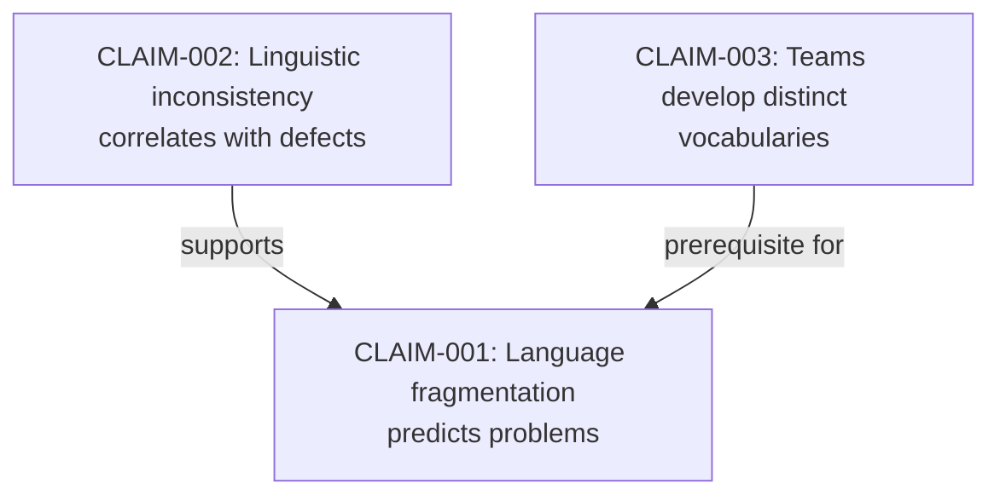

# Tactic: Claim Inventory Development

**Version:** 1.0.0  
**Date:** 2026-02-10  
**Status:** Active  
**Invoked By:** [Evidence-Based Requirements Analysis](../approaches/evidence-based-requirements.md)

---

## Purpose

Systematically catalog **verifiable claims from research sources** with evidence classification, enabling testable requirements and traceable validation.

---

## Prerequisites

- [ ] Research sources identified (papers, books, interviews, data)
- [ ] Access to source materials (physical books, digital articles, datasets)
- [ ] Claim inventory structure defined (YAML, JSON, or markdown)
- [ ] Understanding of evidence types (empirical, observational, theoretical, prescriptive)

---

## Procedure

### Step 1: Identify Research Sources

**Objective:** Catalog all claim sources

**Source Categories:**

1. **Academic Literature:**
   - [ ] Peer-reviewed papers
   - [ ] Conference proceedings
   - [ ] Literature reviews
   - [ ] PhD dissertations

2. **Industry Publications:**
   - [ ] Technical books
   - [ ] Industry reports
   - [ ] White papers
   - [ ] Case studies

3. **Internal Artifacts:**
   - [ ] Architecture Decision Records (ADRs)
   - [ ] Post-mortems
   - [ ] Retrospectives
   - [ ] Production incident reports

4. **Stakeholder Input:**
   - [ ] User interviews
   - [ ] Developer surveys
   - [ ] Domain expert consultations
   - [ ] Customer feedback

5. **Production Data:**
   - [ ] System logs
   - [ ] Metrics dashboards
   - [ ] A/B test results
   - [ ] Performance benchmarks

**Output:** Annotated reading list with source metadata

**Time Estimate:** 1-2 hours

---

### Step 2: Extract Claims from Sources

**Objective:** Identify verifiable assertions

**Extraction Method:**

**For Each Source:**

1. **Read Systematically:**
   - Focus on conclusions, findings, recommendations
   - Note methodology (how did they reach conclusion?)
   - Identify supporting evidence (data, case studies, theory)

2. **Extract Assertions:**
   - **Look for:** "X causes Y", "X improves Y", "X correlates with Y"
   - **Avoid:** Opinions without evidence, vague statements
   - **Capture:** Exact quote with page number/timestamp

3. **Record Context:**
   - What problem is being addressed?
   - What constraints apply? (domain, scale, time period)
   - What alternatives were considered?

**Example Extraction:**

```markdown
**Source:** Eric Evans, Domain-Driven Design (2003), Chapter 2, p. 34

**Claim:** "A project faces serious problems when its language is fractured."

**Context:** 
- Large enterprise software projects
- Multiple development teams
- Complex business domains

**Supporting Evidence:**
- Author's 20+ years consulting experience
- Observational patterns from client projects
- No quantitative data provided
```

**Output:** Raw claim list with source citations (20-50 claims typical)

**Time Estimate:** 4-8 hours (depends on source count and complexity)

---

### Step 3: Classify Evidence Type

**Objective:** Categorize each claim by evidence strength

**Evidence Type Definitions:**

**1. Empirical (Quantitative)**
- **Definition:** Measurable, reproducible data from experiments or production
- **Indicators:** Statistical tests, p-values, effect sizes, confidence intervals
- **Strength:** Highest confidence, falsifiable
- **Example:** "Linguistic inconsistency correlates with defect rates (r=0.67, p<0.01)"

**2. Observational (Qualitative)**
- **Definition:** Patterns observed in practice, case studies, field notes
- **Indicators:** "In my experience...", "We observed...", "Case study showed..."
- **Strength:** Contextual validity, may not generalize
- **Example:** "Teams that communicate frequently converge on shared terminology"

**3. Theoretical (Conceptual)**
- **Definition:** Logical deductions from established principles
- **Indicators:** "Based on X theory...", "If X then Y (logically)..."
- **Strength:** Broad applicability, depends on theory validity
- **Example:** "Cognitive load limits vocabulary size per team (per Miller's Law)"

**4. Prescriptive (Best Practices)**
- **Definition:** Recommendations from authorities, industry standards
- **Indicators:** "We recommend...", "Best practice is...", "Industry standard..."
- **Strength:** Expert consensus, context-dependent
- **Example:** "DDD prescribes ubiquitous language within bounded contexts"

**Classification Process:**

For each claim:
```yaml
claim_id: "CLAIM-001"
claim: "Language fragmentation predicts system problems"
source: "Eric Evans, Domain-Driven Design (2003), Chapter 2"
evidence_type: "observational"  # empirical | observational | theoretical | prescriptive
confidence_level: "medium"      # high | medium | low
rationale_for_classification: "Based on author's consulting experience, no quantitative data"
```

**Output:** Claims with evidence type classification

**Time Estimate:** 2-3 hours

---

### Step 4: Assess Testability

**Objective:** Determine if each claim can be validated

**Testability Criteria:**

**✅ Fully Testable**
- **Definition:** Can be validated with concrete experiment in pilot phase
- **Indicators:** Measurable outcome, controlled variables, clear success criteria
- **Example:** "Glossary adoption improves onboarding speed"
  - **Test:** Measure time-to-first-PR for new developers before/after glossary
  - **Metrics:** Hours from hire to first merged PR
  - **Success:** >20% reduction in onboarding time

**⚠️ Partially Testable**
- **Definition:** Can be indirectly measured, requires interpretation
- **Indicators:** Proxy metrics needed, confounding variables present
- **Example:** "Bounded contexts reduce cognitive load"
  - **Test:** Survey developer stress levels, measure context-switching frequency
  - **Metrics:** Self-reported stress score, context switch count per day
  - **Success:** >15% reduction in stress score (confounded by many factors)

**❌ Not Testable**
- **Definition:** Subjective, unfalsifiable, or requires years to validate
- **Indicators:** Vague outcome, no measurable metric, too long-term
- **Example:** "Better architecture leads to happiness"
  - **Problem:** "Happiness" ill-defined, confounding variables unlimited
  - **Action:** Refine claim or accept as philosophical position

**Assessment Process:**

For each claim:
```yaml
claim_id: "CLAIM-001"
claim: "Language fragmentation predicts system problems"
testability: "testable"  # testable | partially_testable | not_testable
testability_notes: |
  Can measure correlation between terminology inconsistency score (AST analysis) 
  and defect density (historical bug reports) in pilot codebase.
proposed_experiment:
  metrics:
    - Naming consistency score (0-100)
    - Defect density (bugs per KLOC)
  data_collection: "Scan 6 months of commits + bug reports"
  analysis: "Pearson correlation, target r > 0.5"
  success_criteria: "r > 0.5 with p < 0.05"
  confounds: ["Code age", "Team experience", "Module complexity"]
```

**Output:** Claims with testability assessment and experiment proposals

**Time Estimate:** 3-4 hours

---

### Step 5: Map Claim Relationships

**Objective:** Identify dependencies and conflicts between claims

**Relationship Types:**

**1. Supporting Claims**
- **Definition:** Claim B provides evidence for Claim A
- **Example:** 
  - A: "Language-first architecture improves quality"
  - B: "Linguistic inconsistency correlates with defects" (supports A)

**2. Contradicting Claims**
- **Definition:** Claims make incompatible assertions
- **Example:**
  - A: "Global glossary improves consistency"
  - B: "Bounded contexts require local vocabularies" (contradicts A)
- **Resolution:** Document conflict, investigate further

**3. Prerequisite Claims**
- **Definition:** Claim A must be true for Claim B to be valid
- **Example:**
  - A: "Teams develop distinct vocabularies" (prerequisite)
  - B: "Context boundaries align with team boundaries" (depends on A)

**4. Alternative Claims**
- **Definition:** Different explanations for same phenomenon
- **Example:**
  - A: "Defects caused by terminology ambiguity"
  - B: "Defects caused by insufficient testing"
- **Action:** Design experiments to distinguish

**Mapping Process:**

Create relationship graph:
```yaml
claims:
  - id: "CLAIM-001"
    claim: "Language fragmentation predicts system problems"
    supports: []
    supported_by: ["CLAIM-002", "CLAIM-003"]
    contradicts: []
    prerequisites: []
    
  - id: "CLAIM-002"
    claim: "Linguistic inconsistency correlates with defects"
    supports: ["CLAIM-001"]
    supported_by: []
    contradicts: []
    prerequisites: []
```

Visualize (Mermaid):


**Output:** Claim relationship map

**Time Estimate:** 2-3 hours

---

### Step 6: Prioritize for Validation

**Objective:** Decide which claims to test first

**Prioritization Matrix:**

| Impact | Testability | Effort | Priority |
|--------|-------------|--------|----------|
| High   | Testable    | Quick  | **P0** (Validate immediately) |
| High   | Partially   | Moderate | **P1** (Design proxy metrics) |
| High   | Not testable | N/A    | **P2** (Defer or reframe) |
| Medium | Testable    | Quick  | **P1** |
| Medium | Partially   | Moderate | **P2** |
| Low    | Any         | Any    | **P3** (Deprioritize) |

**Impact Assessment:**
- **High:** Directly affects architecture decisions, large investment, safety-critical
- **Medium:** Influences design choices, moderate impact on quality
- **Low:** Nice-to-know, minor implications

**Effort Estimation:**
- **Quick:** <1 week data collection + analysis
- **Moderate:** 1-4 weeks
- **Lengthy:** >4 weeks

**Prioritization Process:**

```yaml
claim_id: "CLAIM-001"
impact: "high"              # high | medium | low
testability: "testable"     # testable | partially_testable | not_testable
effort: "moderate"          # quick | moderate | lengthy
priority: "P1"              # P0 | P1 | P2 | P3
rationale: "Core hypothesis for experiment, tests language-architecture link"
```

**Output:** Prioritized claim backlog

**Time Estimate:** 1-2 hours

---

### Step 7: Document Claim Inventory

**Objective:** Create structured, queryable claim database

**Inventory Format (YAML Example):**

```yaml
metadata:
  title: "Ubiquitous Language Experiment Claim Inventory"
  version: "1.0.0"
  date: "2026-02-10"
  author: "Researcher Ralph"
  
categories:
  - id: "language-architecture"
    name: "Language and Architecture Relationship"
  - id: "bounded-contexts"
    name: "Bounded Contexts and Organizational Boundaries"
  - id: "tooling-feasibility"
    name: "Tooling and Economic Feasibility"

claims:
  - id: "CLAIM-001"
    category: "language-architecture"
    claim: "Language fragmentation predicts system problems"
    source: "Eric Evans, Domain-Driven Design (2003), Chapter 2, p. 34"
    evidence_type: "observational"
    testability: "testable"
    testability_notes: "Measure correlation between terminology inconsistency and defect rates"
    impact: "high"
    effort: "moderate"
    priority: "P1"
    status: "proposed"
    validation_status: "pending"
    related_claims: ["CLAIM-002", "CLAIM-003"]
    proposed_experiment:
      hypothesis: "Terminology inconsistency score correlates with defect density (r > 0.5)"
      metrics: ["Naming consistency score", "Defect density per KLOC"]
      data_collection: "Analyze 6 months Git history + bug reports"
      analysis_method: "Pearson correlation"
      success_criteria: "r > 0.5 with p < 0.05"
      confounds: ["Code age", "Team experience", "Module complexity"]
      timeline: "2 weeks"
```

**Output:** Structured claim inventory (YAML, JSON, or database)

**Time Estimate:** 2-3 hours

---

### Step 8: Link Claims to Requirements

**Objective:** Establish traceability from evidence to requirements

**Traceability Pattern:**

```
Evidence → Claim → Hypothesis → Requirement → Acceptance Criteria
```

**Example Trace:**

```markdown
**Evidence:** Bavota et al. (2015) - Naming inconsistency correlates with defects

**Claim CLAIM-002:** "Linguistic inconsistency correlates with defect rates (r=0.67)"

**Hypothesis:** If we reduce naming inconsistency, we will reduce defects

**Requirement REQ-001:** Implement PR-level glossary validation
  - **Rationale:** Based on CLAIM-002 (validated empirically)
  - **Expected Outcome:** 15-20% reduction in integration defects
  
**Acceptance Criteria:**
  - AC-001: PR checks flag cross-context terminology violations
  - AC-002: Developers receive advisory-level feedback (<2s response time)
  - AC-003: Suppression requires written justification
```

**Linking Process:**

Create bidirectional references:
```yaml
# In claim inventory
claims:
  - id: "CLAIM-002"
    linked_requirements: ["REQ-001", "REQ-005"]

# In requirements spec
requirements:
  - id: "REQ-001"
    rationale_claims: ["CLAIM-002"]
    evidence_confidence: "high"
```

**Output:** Traceability matrix (Claims ↔ Requirements)

**Time Estimate:** 1-2 hours

---

## Success Criteria

**Claim inventory is successful when:**
- ✅ 100% of requirements trace to validated claims
- ✅ Evidence types are diverse (not all observational or theoretical)
- ✅ >70% of claims are testable or partially testable
- ✅ >60% of proposed claims validated within 6 months
- ✅ 10-30% rejection rate (indicates intellectual honesty, not rubber-stamping)

---

## Common Issues and Solutions

**Issue 1: Too many claims (overwhelm)**
**Solution:** Focus on 20-30 high-impact claims, defer the rest

**Issue 2: All observational evidence (weak)**
**Solution:** Seek empirical studies, design validation experiments

**Issue 3: Cherry-picking evidence (confirmation bias)**
**Solution:** Pre-register hypotheses, document rejected claims

**Issue 4: No validation follow-through**
**Solution:** Time-box validation phase (4-6 weeks), prioritize ruthlessly

---

## Related Documentation

**Approaches:**
- [Evidence-Based Requirements Analysis](../approaches/evidence-based-requirements.md) - Strategic framework

**Directives:**
- [Directive 034: Specification-Driven Development](../directives/034_spec_driven_development.md) - Requirements process

**Reference Docs:**
- Research Findings Template
- Validation Experiment Template

---

## Version History

- **1.0.0** (2026-02-10): Initial version extracted from ubiquitous language experiment research

---

**Curation Status:** ✅ Claire Approved (Doctrine Stack Compliant)
