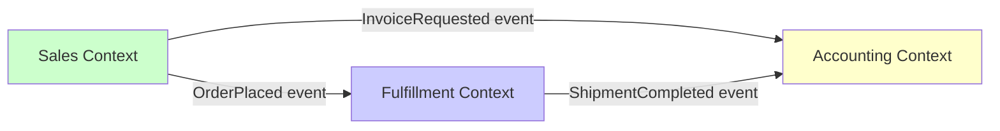

# Tactic: Context Boundary Inference

**Version:** 1.0.0  
**Date:** 2026-02-10  
**Status:** Active  
**Invoked By:** [Bounded Context Linguistic Discovery](../approaches/bounded-context-linguistic-discovery.md), [Language-First Architecture](../approaches/language-first-architecture.md)

---

## Purpose

Detect context boundaries from team structure and terminology conflicts using systematic analysis of organizational and linguistic patterns.

---

## Prerequisites

- [ ] Access to organizational structure (teams, reporting lines)
- [ ] Access to codebase and documentation
- [ ] Ability to interview team members (optional but recommended)
- [ ] Glossary extraction completed (see [Terminology Extraction](terminology-extraction-mapping.tactic.md))

---

## Procedure

### Step 1: Map Organizational Communication Structure

**Objective:** Understand who talks to whom and how often

**Activities:**

1. **Create Team Interaction Map:**
   ```
   Teams:
   - Sales Engineering (5 people)
   - Fulfillment Operations (8 people)
   - Customer Success (4 people)
   - Platform Team (6 people)
   ```

2. **Document Communication Frequency:**
   ```
   High frequency (daily+):
   - Sales ↔ Customer Success
   - Fulfillment ↔ Platform
   
   Medium frequency (weekly):
   - Sales ↔ Fulfillment
   
   Low frequency (monthly):
   - Customer Success ↔ Platform
   ```

3. **Identify Shared Artifacts:**
   - Which teams contribute to same repositories?
   - Which teams share documentation?
   - Which teams attend same meetings?

**Output:** Team communication matrix

**Conway's Law Prediction:** Expect semantic boundaries to align with low-frequency communication boundaries.

**Time Estimate:** 1-2 hours

---

### Step 2: Detect Terminology Conflict Clusters

**Objective:** Find where same terms mean different things

**Method A: Direct Comparison**

Ask teams to define key terms independently:

```markdown
## Survey Format

**Term:** "Order"

**Sales Team Definition:** _______________________
**Fulfillment Team Definition:** _______________________
**Accounting Team Definition:** _______________________

**Are these the same concept?** [ ] Yes [ ] No
```

Analyze responses:
- **Same definition** → Shared context
- **Different definitions** → Context boundary exists

**Method B: Code Analysis**

Extract term usage from codebases:

```bash
# Find "Order" class definitions across repos
rg "class Order" --with-filename

# Compare usage contexts
rg "Order\." --context 3 | less

# Look for translation patterns
rg "to.*Order|from.*Order" --only-matching
```

Indicators of boundary:
- ❌ Same class name in multiple repos with different fields
- ❌ Translation functions (`toSalesOrder`, `toFulfillmentOrder`)
- ❌ Duplicate logic with different terminology

**Method C: LLM-Assisted Semantic Analysis**

For each term:
```markdown
Prompt: "Analyze the following two definitions. Are they describing the same concept or different concepts?"

Definition 1 (Sales): "Order is a customer's intent to purchase products."
Definition 2 (Fulfillment): "Order is a warehouse picking instruction."

Output: DIFFERENT concepts. Recommended context boundary.
```

**Output:** Conflict matrix (terms × teams)

**Time Estimate:** 2-4 hours

---

### Step 3: Identify Vocabulary Ownership Patterns

**Objective:** Which teams "own" which terminology domains

**Analysis:**

1. **Code Ownership:**
   ```bash
   # Who commits to files containing term "Order"?
   git log --all --format='%an' -- '*Order*' | sort | uniq -c | sort -rn
   ```

2. **Documentation Authorship:**
   - Who wrote READMEs mentioning "Customer"?
   - Who maintains API docs with "Fulfillment" terminology?

3. **Meeting Attendance:**
   - Which teams discuss "Sales Pipeline"?
   - Which teams discuss "Warehouse Operations"?

**Pattern Recognition:**

If **Team A** exclusively uses terms `{Customer, Quote, Contract}` and **Team B** exclusively uses terms `{Shipment, Warehouse, Inventory}`, they likely belong to separate contexts.

If **Team A** and **Team B** both use term `Order` with different definitions, a boundary exists between them.

**Output:** Vocabulary ownership map

**Time Estimate:** 1-2 hours

---

### Step 4: Overlay Vocabulary Boundaries on Team Boundaries

**Objective:** Propose context boundaries aligned with both team and semantic structure

**Process:**

1. **Create Overlay Map:**

   ```
   Organizational Boundaries:
   - Sales Engineering | Fulfillment Operations
   - Fulfillment Operations | Platform Team
   
   Semantic Boundaries (detected):
   - {Customer, Quote, Contract} | {Shipment, Warehouse, Inventory}
   - Sales "Order" ≠ Fulfillment "Order"
   
   Alignment Check:
   ✅ Organizational boundary aligns with semantic boundary
   ⚠️ Misalignment detected
   ```

2. **Hypothesis Formation:**

   **Proposed Bounded Contexts:**
   - **Sales Context:** Owned by Sales Engineering team
     - Terms: Customer, Quote, Contract, SalesOrder
     - Boundary: Interfaces with Fulfillment via OrderPlaced event
   
   - **Fulfillment Context:** Owned by Fulfillment Operations team
     - Terms: Shipment, Warehouse, PickingInstruction, FulfillmentOrder
     - Boundary: Receives OrderPlaced event, translates to FulfillmentOrder

3. **Identify Misalignments:**

   If vocabulary boundaries do NOT align with team boundaries:
   - ⚠️ Team structure issue (Conway's Law violation)
   - ⚠️ Terminology drift (requires clarification)
   - ⚠️ Hidden shared responsibility (needs resolution)

**Output:** Proposed context map with boundaries

**Time Estimate:** 2-3 hours

---

### Step 5: Define Context Relationships

**Objective:** Specify how contexts interact

**Relationship Patterns:**

**1. Upstream/Downstream**
- **Definition:** Data flows from upstream (provider) to downstream (consumer)
- **Example:** Sales (upstream) → Fulfillment (downstream)
- **Translation:** Downstream may translate upstream terms

**2. Anti-Corruption Layer (ACL)**
- **Definition:** Downstream protects itself with translation layer
- **Example:** Fulfillment ACL translates SalesOrder → FulfillmentOrder
- **Code Pattern:** Adapter, Mapper, Translator classes

**3. Published Language**
- **Definition:** Upstream publishes stable API (JSON Schema, OpenAPI)
- **Example:** Sales publishes OrderPlaced event schema
- **Code Pattern:** Event definitions, API specifications

**4. Shared Kernel**
- **Definition:** Small shared model between contexts (high coordination)
- **Example:** Shared "Address" value object
- **Warning:** Use sparingly, creates coupling

**5. Conformist**
- **Definition:** Downstream accepts upstream model exactly
- **Example:** Accepting industry-standard regulatory format
- **Warning:** Loses local autonomy

**Documentation Format:**

```markdown
## Context Map

### Sales Context → Fulfillment Context
- **Relationship:** Upstream/Downstream
- **Integration:** OrderPlaced event (Published Language)
- **Translation:** Sales "Order" → Fulfillment "PickingInstruction"
- **Anti-Corruption Layer:** Fulfillment adapter translates event
```

**Output:** Context map with relationship types

**Time Estimate:** 1-2 hours

---

### Step 6: Validate with Stakeholders

**Objective:** Confirm proposed boundaries with teams

**Validation Activities:**

1. **Workshop with Teams:**
   - Present proposed context boundaries
   - Ask: "Does this match how you think about the domain?"
   - Ask: "Where would boundaries cause friction?"
   - Ask: "Are we missing any contexts?"

2. **Iterate Based on Feedback:**
   - Adjust boundaries to respect natural process flows
   - Merge contexts if separation adds no value
   - Split contexts if cognitive load too high

3. **Test with Event Storming:**
   - Run collaborative workshop
   - Map domain events and commands
   - Check if contexts align with event clusters

**Red Flags (Invalid Boundaries):**
- ❌ Boundaries cut across natural business processes
- ❌ Teams reject proposed ownership
- ❌ Most interactions require translation (too fragmented)
- ❌ Boundaries exist for architectural fashion, not domain reality

**Green Flags (Valid Boundaries):**
- ✅ Teams recognize vocabulary differences
- ✅ Boundaries align with team communication patterns
- ✅ Business processes respect boundaries
- ✅ Translation rules are clear and minimal

**Output:** Validated context map with team approval

**Time Estimate:** 2-4 hours (workshops)

---

### Step 7: Document Context Boundaries

**Objective:** Create authoritative context documentation

**Deliverables:**

**1. Context Canvas (Per Context):**

```markdown
## Sales Context

**Purpose:** Manage customer relationships and sales pipeline

**Ubiquitous Language:**
- Customer: Person or organization who purchases
- Quote: Preliminary pricing proposal
- Contract: Legally binding agreement
- SalesOrder: Customer's intent to purchase

**Ownership:** Sales Engineering Team

**Bounded By:**
- Does NOT include warehouse operations
- Does NOT include shipping logistics
- Does NOT include payment processing

**Upstream From:** (none)
**Downstream To:** Fulfillment Context (OrderPlaced event)

**Translation Rules:**
- Sales "Order" → Fulfillment "PickingInstruction"
- Sales "Customer" → Fulfillment "RecipientAddress"
```

**2. Context Map Diagram:**



**3. Architecture Decision Record:**

```markdown
# ADR-XXX: Bounded Context Structure

**Status:** Accepted

**Context:**
Terminology analysis revealed vocabulary conflicts between Sales and Fulfillment teams.

**Decision:**
Establish explicit bounded contexts with Anti-Corruption Layers at boundaries.

**Consequences:**
- (+) Clear vocabulary per team
- (+) Reduced accidental coupling
- (-) Translation overhead at boundaries
- (-) Event schema maintenance
```

**Output:** Context documentation artifacts

**Time Estimate:** 2-3 hours

---

## Success Criteria

**Context boundaries are well-defined when:**
- ✅ Each context has explicit ownership (team/role)
- ✅ Ubiquitous language documented per context
- ✅ Translation rules defined at boundaries
- ✅ No shared mutable state across contexts
- ✅ Teams understand their context relationships
- ✅ Code modules align with context boundaries

---

## Common Issues and Solutions

**Issue 1: Too many contexts**
**Solution:** Start with 2-3, split only when cognitive load or team structure demands

**Issue 2: Artificial boundaries**
**Solution:** Validate with event storming, ensure business workflows respect boundaries

**Issue 3: No team buy-in**
**Solution:** Involve teams early, co-create boundaries, don't impose top-down

**Issue 4: Constant cross-context coupling**
**Solution:** Reconsider boundary placement, may be wrong split

---

## Related Documentation

**Approaches:**
- [Bounded Context Linguistic Discovery](../approaches/bounded-context-linguistic-discovery.md) - Strategic framework
- [Language-First Architecture](../approaches/language-first-architecture.md) - Overall approach

**Tactics:**
- [Terminology Extraction and Mapping](terminology-extraction-mapping.tactic.md) - Data collection

**Reference Docs:**
- [DDD Core Concepts Reference](../docs/ddd-core-concepts-reference.md) - Context mapping patterns
- Conway's Law Patterns - See `.contextive/contexts/organizational.yml`

---

## Version History

- **1.0.0** (2026-02-10): Initial version extracted from ubiquitous language experiment research

---

**Curation Status:** ✅ Claire Approved (Doctrine Stack Compliant)
