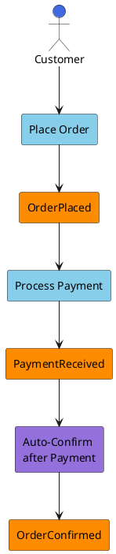

# Tactic: Event Storming for Boundary Discovery

**Version:** 1.0.0  
**Date:** 2026-02-10  
**Status:** Active  
**Invoked By:** [Bounded Context Linguistic Discovery](../approaches/bounded-context-linguistic-discovery.md)

---

## Purpose

Use collaborative workshop techniques to discover domain events, processes, and bounded context boundaries through visual mapping with sticky notes or digital equivalents.

---

## Prerequisites

- [ ] Stakeholders available (domain experts, developers, product owners)
- [ ] Workshop space (physical wall + stickies OR digital board)
- [ ] 2-4 hour time block
- [ ] Facilitator familiar with Event Storming technique

---

## Procedure

### Step 1: Domain Event Discovery

**Objective:** Identify all business-significant state changes

**Actions:**
1. **Use orange stickies** for domain events
2. **Name in past tense:** OrderPlaced, PaymentReceived, ShipmentCompleted
3. **Ask:** "What happens in this business process?"
4. **Capture everything:** Don't filter yet, breadth over depth

**Output:** 50-200 domain events on timeline

**Time Estimate:** 45-60 minutes

---

### Step 2: Identify Event Clusters

**Objective:** Find natural groupings of related events

**Actions:**
1. **Arrange events on timeline:** Left to right, chronological flow
2. **Identify clusters:**
   - Which events occur together?
   - Which never interact?
   - Where are natural process boundaries?

3. **Mark boundaries:** Use vertical lines or different colored tape

**Output:** 3-7 event clusters representing potential contexts

**Time Estimate:** 30 minutes

---

### Step 3: Map Actors and Commands

**Objective:** Add richer context to understand who does what

**Sticky Colors:**
- **Blue:** Actors (roles who trigger actions)
- **Purple:** Policies (automated rules/triggers)
- **Light Blue:** Commands (user actions that cause events)

**Actions:**
1. **Identify actors:** Who triggers each event?
2. **Document commands:** What action caused this event?
3. **Note policies:** What automated rules fired?

**Output:** Rich event map with actors, commands, and policies

**Time Estimate:** 30-45 minutes

---

### Step 4: Draw Context Boundaries

**Objective:** Propose explicit bounded contexts

**Boundary Signals:**
- Event clusters that separate naturally
- Different actors own different processes
- Vocabulary diverges between clusters
- Different teams responsible for different areas

**Actions:**
1. **Draw boundaries** around event clusters
2. **Name each context:** Sales, Fulfillment, Accounting, etc.
3. **Identify handoffs:** Where does one context hand off to another?
4. **Note translation needs:** Where do terms change meaning?

**Output:** Visual context map with boundaries and relationships

**Time Estimate:** 30-45 minutes

---

### Step 5: Validate and Document

**Objective:** Confirm boundaries with stakeholders

**Validation Questions:**
1. Do these contexts match how you think about the business?
2. Where would boundaries cause friction?
3. Are we missing any contexts?
4. Do the handoffs make sense?

**Documentation:**
1. Take photos of physical board OR export digital board
2. Create digital context map (see PlantUML template)
3. Document vocabulary per context
4. Identify translation rules at boundaries

**Output:** Validated context map, documented in ADR or architecture doc

**Time Estimate:** 30 minutes

---

## Visual Templates

### PlantUML Event Storming Diagram

**Template:** See `doctrine/templates/diagrams/event-storming.plantuml`

---

## Success Criteria

**Event Storming is successful when:**
- ✅ 50-200 domain events identified
- ✅ 3-7 event clusters (potential contexts) identified
- ✅ Actors, commands, and policies mapped
- ✅ Context boundaries proposed and validated
- ✅ Vocabulary differences noted at boundaries
- ✅ Stakeholders recognize the model

---

## Common Issues and Solutions

**Issue 1: Too many events (overwhelm)**
**Solution:** Focus on happy path first, add edge cases later

**Issue 2: Participants disagree on vocabulary**
**Solution:** GOOD! This reveals hidden bounded contexts. Document both terms.

**Issue 3: No natural clusters**
**Solution:** Domain may be simple (single context). Look for sub-domains.

**Issue 4: Boundaries cut across processes**
**Solution:** Review - boundaries should respect workflow. Adjust if needed.

---

## Tips for Facilitators

1. **Start with happy path:** Don't get bogged down in edge cases initially
2. **Encourage disagreement:** Conflicts reveal important boundaries
3. **Move fast:** Don't perfect each sticky, capture breadth first
4. **Use silence:** Let participants think, don't fill every gap
5. **Timebox sections:** 30-45 min per step, take breaks
6. **Document immediately:** Capture results before board is cleaned

---

## Related Documentation

**Approaches:**
- [Bounded Context Linguistic Discovery](../approaches/bounded-context-linguistic-discovery.md) - Strategic framework

**Tactics:**
- [Team Interaction Mapping](team-interaction-mapping.tactic.md) - Organizational analysis
- [Context Boundary Inference](context-boundary-inference.tactic.md) - Comprehensive boundary detection

**Templates:**
- PlantUML Event Diagram - `doctrine/templates/diagrams/event-storming.plantuml`

**References:**
- Alberto Brandolini, *Introducing Event Storming* (2013)
- [DDD Core Concepts Reference](../docs/ddd-core-concepts-reference.md) - Domain events explained

---

## Version History

- **1.0.0** (2026-02-10): Initial extraction from bounded-context-linguistic-discovery approach

---

**Curation Status:** ✅ Extracted per feedback (comment 2785999233)
