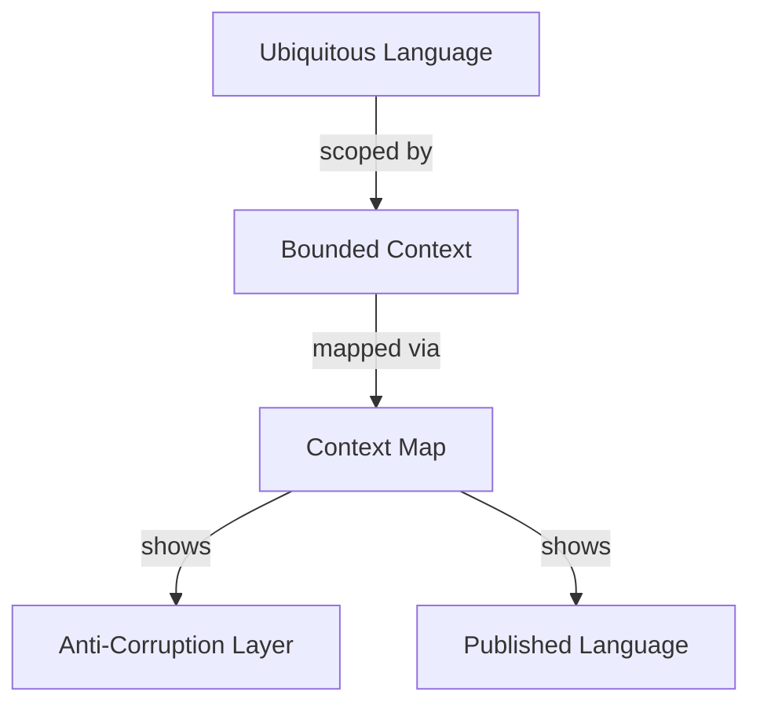

# Tactic: Terminology Extraction and Mapping

**Version:** 1.0.0  
**Date:** 2026-02-10  
**Status:** Active  
**Invoked By:** [Living Glossary Practice](../approaches/living-glossary-practice.md), [Bounded Context Linguistic Discovery](../approaches/bounded-context-linguistic-discovery.md)

---

## Purpose

Systematically extract domain terms from multiple sources and map their relationships to build a comprehensive, maintainable glossary.

---

## Prerequisites

- [ ] Source materials identified (code, docs, transcripts, specs)
- [ ] Glossary structure defined (YAML, JSON, or markdown)
- [ ] Ownership model established (per bounded context)
- [ ] Tools available (grep/rg, AST parsers, LLM access)

---

## Procedure

### Step 1: Identify Source Materials

**Objective:** Catalog all terminology sources for extraction

**Actions:**
1. **Codebase:**
   - [ ] Class, module, function names
   - [ ] Code comments and docstrings
   - [ ] Test descriptions
   - [ ] Error messages

2. **Documentation:**
   - [ ] README files
   - [ ] Architecture Decision Records (ADRs)
   - [ ] API documentation
   - [ ] User guides

3. **Communication:**
   - [ ] Meeting transcripts (anonymized)
   - [ ] Slack/Teams channels
   - [ ] Email threads (anonymized)
   - [ ] Issue tracker descriptions

4. **Specifications:**
   - [ ] Requirements documents
   - [ ] User stories
   - [ ] Acceptance criteria
   - [ ] Event storming outputs

**Output:** Source inventory with access methods

**Time Estimate:** 30 minutes - 1 hour

---

### Step 2: Extract Candidate Terms

**Objective:** Identify potential glossary terms from sources

**Method A: Manual Extraction (Small Scale)**

For small codebases (<10k LOC):
```bash
# Extract class names
rg "^class (\w+)" --only-matching --no-filename | sort | uniq

# Extract function/method names (Python example)
rg "^def (\w+)" --only-matching --no-filename | sort | uniq

# Extract comments mentioning domain concepts
rg "# .*\b(Customer|Order|Payment|Fulfillment)\b" --only-matching
```

**Method B: Automated Extraction (Large Scale)**

For large codebases (>10k LOC):
```python
# Example: Extract terms using AST parsing
import ast
import glob

terms = set()
for file in glob.glob("src/**/*.py", recursive=True):
    with open(file) as f:
        tree = ast.parse(f.read())
        for node in ast.walk(tree):
            if isinstance(node, ast.ClassDef):
                terms.add(node.name)
            elif isinstance(node, ast.FunctionDef):
                terms.add(node.name)

# Output: terms.txt
with open("terms.txt", "w") as f:
    for term in sorted(terms):
        f.write(f"{term}\n")
```

**Method C: LLM-Assisted Extraction**

For documents and prose:
```markdown
Prompt: "Extract domain terminology from the following text. List only nouns and noun phrases that represent domain concepts, not generic terms like 'data' or 'info'."

Input: [paste document section]

Output: Structured list of terms with context
```

**Filters (Apply During Extraction):**
- ❌ Generic terms: "data", "info", "manager", "handler"
- ❌ Framework terms: "controller", "service", "repository" (unless domain-specific)
- ❌ Implementation details: "list", "dict", "array"
- ✅ Domain nouns: "Customer", "Order", "Invoice"
- ✅ Domain verbs: "Place [Order]", "Fulfill", "Refund"
- ✅ Domain adjectives: "Pending [Order]", "Validated [Address]"

**Output:** Candidate term list (100-500 terms typical for medium project)

**Time Estimate:** 2-4 hours (depends on codebase size and automation)

---

### Step 3: Categorize by Domain

**Objective:** Organize terms into conceptual categories

**Categories:**

1. **Core DDD Concepts** (if DDD-based system)
   - Ubiquitous Language, Bounded Context, Aggregate, etc.

2. **Business Domain** (context-specific)
   - Sales: Customer, Order, Quote, Contract
   - Fulfillment: Shipment, Warehouse, Picking, Packing
   - Accounting: Invoice, Payment, Ledger, Transaction

3. **Organizational** (team/process terms)
   - Team roles, meeting types, delivery cadences

4. **Technical Domain** (shared infrastructure)
   - Authentication, Authorization, Logging, Monitoring

5. **Anti-Patterns** (what NOT to do)
   - Dictionary DDD, Performative Compliance, Anemic Domain Model

**Method:**

Create category mapping:
```yaml
categories:
  business_sales:
    - Customer
    - Order
    - Quote
  business_fulfillment:
    - Shipment
    - Warehouse
    - PickingInstruction
  technical_auth:
    - Principal
    - Credential
    - Session
  antipatterns:
    - DictionaryDDD
    - AnemicDomainModel
```

**Output:** Categorized term list

**Time Estimate:** 1-2 hours

---

### Step 4: Define Terms with Context

**Objective:** Create structured glossary entries

**Entry Format:**

```yaml
term: "Bounded Context"
definition: "Explicit boundary within which a domain model and its ubiquitous language have clear, consistent meaning."
context: "DDD Core"
bounded_context: "Framework"  # Which context owns this term
source: "Domain-Driven Design, Eric Evans (2003)"
usage_examples:
  - "Sales and Fulfillment are separate bounded contexts."
  - "Each bounded context has its own ubiquitous language."
related_terms:
  - "Ubiquitous Language"
  - "Context Map"
  - "Semantic Boundary"
synonyms: []
antonyms: []
status: "canonical"
owner: "architect-alphonso"
enforcement_tier: "advisory"
decision_history:
  - date: "2026-02-10"
    rationale: "Core DDD term, widely adopted in team"
    alternatives_considered: ["Domain Boundary", "Semantic Context"]
```

**Quality Gates (Per Term):**

Before adding to glossary:
1. ✅ **Is it used consistently?** (Not one-off usage)
2. ✅ **Does it have a clear owner?** (Context or team responsible)
3. ✅ **Is definition unambiguous?** (Domain expert can validate)
4. ✅ **Does it relate to existing terms?** (Not isolated)
5. ✅ **Is it non-obvious?** (Not generic like "data" or "info")

**Output:** Structured glossary entries (20-50 core terms for initial version)

**Time Estimate:** 4-8 hours (depends on term count and complexity)

---

### Step 5: Map Relationships

**Objective:** Document how terms relate to each other

**Relationship Types:**

1. **Primary Dependencies**
   ```
   Ubiquitous Language
       ↓ scoped by
   Bounded Context
       ↓ mapped via
   Context Map
   ```

2. **Synonyms and Variants**
   - "User" ≈ "Customer" ≈ "Account Holder" (context-dependent)

3. **Antonyms and Contrasts**
   - "Upstream" ↔ "Downstream"
   - "Canonical" ↔ "Deprecated"

4. **Part-Whole Relationships**
   - "Order" contains "Order Line Items"
   - "Aggregate" contains "Entities"

5. **Cross-Context Mappings**
   - Sales "Order" → Fulfillment "Picking Instruction"
   - Customer "User" → Auth "Principal"

**Visualization:**

Create concept map (Mermaid):


**Output:** Relationship map (visual and structured)

**Time Estimate:** 2-3 hours

---

### Step 6: Assign Ownership and Enforcement

**Objective:** Define who maintains each term and how it's enforced

**Ownership Assignment:**

Per bounded context:
```yaml
bounded_contexts:
  sales:
    owner: "sales-team-lead"
    terms:
      - "Customer"
      - "Order"
      - "Quote"
  fulfillment:
    owner: "fulfillment-architect"
    terms:
      - "Shipment"
      - "Warehouse"
      - "PickingInstruction"
```

**Enforcement Tier Assignment:**

Default rules:
- **New terms:** Advisory (encourage adoption, don't block)
- **Canonical terms:** Advisory (suggest usage)
- **Deprecated terms:** Acknowledgment Required (warn, require confirmation)
- **Banned terms:** Hard Failure (block PR, require fix)

Per term:
```yaml
term: "password"
enforcement_tier: "hard_failure"  # Security policy
rationale: "Never log passwords, use 'credential hash'"
```

**Output:** Ownership and enforcement configuration

**Time Estimate:** 1 hour

---

### Step 7: Validate with Stakeholders

**Objective:** Ensure glossary is accurate and useful

**Validation Activities:**

1. **Domain Expert Review:**
   - [ ] Share glossary with domain experts
   - [ ] Ask: "Are definitions correct?"
   - [ ] Ask: "Are there missing key terms?"
   - [ ] Ask: "Are relationships accurate?"

2. **Developer Review:**
   - [ ] Share with development teams
   - [ ] Ask: "Can you code using these terms?"
   - [ ] Ask: "Are enforcement tiers appropriate?"
   - [ ] Ask: "Are there conflicts with existing code?"

3. **Cross-Team Alignment:**
   - [ ] Identify cross-context term usage
   - [ ] Resolve conflicts (same term, different meanings)
   - [ ] Define translation rules at boundaries

**Output:** Validated glossary with feedback incorporated

**Time Estimate:** 2-4 hours (meetings and revisions)

---

### Step 8: Deploy and Integrate

**Objective:** Make glossary available in development workflow

**Integration Points:**

1. **IDE Integration (Contextive):**
   ```bash
   # Install Contextive plugin for VS Code
   code --install-extension deref-dev.contextive
   
   # Configure .contextive/definitions.yml
   contexts:
     - name: "Sales"
       terms:
         - term: "Customer"
           definition: "Person or organization who purchases products"
   ```

2. **PR-Level Validation:**
   ```yaml
   # .github/workflows/glossary-check.yml
   name: Glossary Validation
   on: pull_request
   jobs:
     check:
       runs-on: ubuntu-latest
       steps:
         - uses: actions/checkout@v2
         - name: Check terminology
           run: ./scripts/check-glossary.sh
   ```

3. **Documentation Cross-Reference:**
   ```markdown
   # In specs and ADRs, link to glossary:
   The [Customer](#customer) places an [Order](#order).
   ```

**Output:** Operational glossary infrastructure

**Time Estimate:** 2-4 hours (tooling setup)

---

## Maintenance Cycle

After initial deployment:

**Weekly:**
- Review glossary candidates (agent-generated)
- Triage new terms (approve/reject/defer)
- Update enforcement tiers as needed

**Quarterly:**
- Staleness audit (outdated definitions)
- Coverage assessment (missing terms)
- Conflict resolution (ambiguities)

**Annually:**
- Governance retrospective
- Hard failure justification review
- Organizational alignment check

---

## Success Criteria

**Glossary is successful when:**
- ✅ >80% of domain terms documented
- ✅ >75% of developers use glossary actively (IDE plugin, spec references)
- ✅ <10% of terms marked stale
- ✅ <10% of PRs suppress glossary checks
- ✅ >5 glossary updates per quarter (continuous maintenance)

---

## Common Issues and Solutions

**Issue 1: Too many terms (overwhelm)**
**Solution:** Start with 20-30 core terms, expand incrementally

**Issue 2: Definitions too vague**
**Solution:** Include usage examples, non-examples, and context boundaries

**Issue 3: No one maintains glossary**
**Solution:** Mandatory ownership assignment, quarterly review cadence

**Issue 4: Enforcement too strict**
**Solution:** Default advisory-only, escalate tier only with justification

---

## Related Documentation

**Approaches:**
- [Living Glossary Practice](../approaches/living-glossary-practice.md) - Maintenance workflow
- [Bounded Context Linguistic Discovery](../approaches/bounded-context-linguistic-discovery.md) - Context identification

**Directives:**
- [Directive 018: Traceable Decisions](../directives/018_traceable_decisions.md) - Document terminology in ADRs

**Reference Docs:**
- [DDD Core Concepts Reference](../docs/ddd-core-concepts-reference.md) - Core terminology
- Contextive Glossaries - See `.contextive/contexts/` directory

---

## Version History

- **1.0.0** (2026-02-10): Initial version extracted from ubiquitous language experiment research

---

**Curation Status:** ✅ Claire Approved (Doctrine Stack Compliant)
