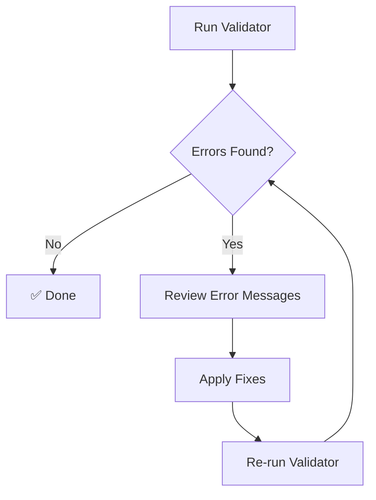

# Runbook: Fixing Task Validation Errors

## Purpose

This runbook provides step-by-step procedures for addressing common task validation errors reported by the `validate-task-schema.py` validator.

**Intended Audience**: Curator Claire (task file maintenance), All agents (self-service fixes)

## Prerequisites

- Access to repository root
- Python 3.9+ installed
- Understanding of YAML syntax

## Validation Workflow



## Common Error Patterns

### Error 1: Timestamp Format Issues

**Symptom**:
```
❌ assigned_at must be ISO8601 with Z suffix
  Current: 2026-02-09 04:40:00+00:00
  Suggested: 2026-02-09T04:40:00Z
```

**Root Cause**: 
- Using space instead of `T` separator
- Using timezone offset `+00:00` instead of `Z` suffix

**Fix Steps**:

1. Open the task file in a text editor
2. Locate the timestamp field mentioned in the error
3. Replace the current value with the suggested format
4. Apply the transformation pattern:

```yaml
# ❌ Before
assigned_at: 2026-02-09 04:40:00+00:00
started_at: 2026-02-09 04:40:00+00:00
completed_at: 2026-02-09 04:50:42+00:00

# ✅ After
assigned_at: 2026-02-09T04:40:00Z
started_at: 2026-02-09T04:40:00Z
completed_at: 2026-02-09T04:50:42Z
```

**Validation**: Re-run validator to confirm fix

```bash
python tools/validators/validate-task-schema.py path/to/task.yaml
```

---

### Error 2: Missing Result Block (status="done")

**Symptom**:
```
❌ result block required for completed tasks
  Expected structure:
    result:
      summary: "Description of what was accomplished"
      artefacts:
        - path/to/file1.py
```

**Root Cause**: Task marked as `done` but missing required result structure

**Fix Steps**:

1. Check if result content exists elsewhere in the file (e.g., inline text)
2. Extract or compose the result summary
3. List all created artifacts/artefacts
4. Add the result block:

```yaml
status: done
# ... other fields ...
result:
  summary: "Brief description of what was accomplished"
  artefacts:  # Can also use "artifacts"
    - path/to/created/file1.py
    - path/to/created/file2.md
```

**Special Cases**:

- **Result exists as plain text**: Convert to structured format
  ```yaml
  # ❌ Before
  result: |
    Implementation complete.
    Created file1.py and file2.md.
  
  # ✅ After
  result:
    summary: "Implementation complete"
    artefacts:
      - path/to/file1.py
      - path/to/file2.md
  ```

- **No artifacts created**: Use empty list
  ```yaml
  result:
    summary: "Analysis complete, no files created"
    artefacts: []
  ```

**Validation**: Re-run validator

---

### Error 3: Invalid Result Artefacts Structure

**Symptom**:
```
❌ result.artefacts/artifacts must be a list of strings
  Hint: Use 'artefacts' or 'artifacts', not 'artifacts_created'
```

**Root Cause**: 
- Using wrong field name (e.g., `artifacts_created` instead of `artifacts`)
- Using nested structure instead of flat list
- Non-string entries in list

**Fix Steps**:

1. Identify the incorrect field name or structure
2. Rename or restructure to match schema

```yaml
# ❌ Before (wrong field name)
result:
  summary: "Done"
  artifacts_created:
    - file1.py

# ✅ After
result:
  summary: "Done"
  artifacts:
    - file1.py
```

```yaml
# ❌ Before (nested structure)
result:
  summary: "Done"
  artefacts:
    - name: file1.py
      type: source

# ✅ After
result:
  summary: "Done"
  artefacts:
    - file1.py
```

**Validation**: Re-run validator

---

### Error 4: Invalid Status Value

**Symptom**:
```
❌ invalid status 'complete', expected one of ['assigned', 'blocked', 'done', 'error', 'inbox', 'in_progress', 'new']
```

**Root Cause**: Using a status value not defined in TaskStatus enum

**Fix Steps**:

1. Check the current status value
2. Map to the correct TaskStatus enum value
3. Update the file

**Status Mapping**:
| Common Mistake | Correct Value |
|----------------|---------------|
| `complete`     | `done`        |
| `completed`    | `done`        |
| `failed`       | `error`       |
| `pending`      | `inbox`       |
| `working`      | `in_progress` |

```yaml
# ❌ Before
status: complete

# ✅ After
status: done
```

**Validation**: Re-run validator

---

## Bulk Validation and Fixing

### Validate All Tasks in a Directory

```bash
# Validate all done tasks
find work/collaboration/done -name "*.yaml" -type f | \
  xargs python tools/validators/validate-task-schema.py

# Validate specific agent's tasks
python tools/validators/validate-task-schema.py \
  work/collaboration/done/python-pedro/*.yaml
```

### Create Fix Batch

For multiple files with similar issues:

1. **Generate fix list**:
   ```bash
   python tools/validators/validate-task-schema.py \
     work/collaboration/done/python-pedro/*.yaml 2>&1 | \
     tee validation-errors.txt
   ```

2. **Review patterns**: Identify common issues

3. **Create fix script** (example for timestamp fixes):
   ```bash
   # Example: Fix timestamp format in multiple files
   for file in work/collaboration/done/python-pedro/*.yaml; do
     sed -i 's/\([0-9]\{4\}-[0-9]\{2\}-[0-9]\{2\}\) \([0-9]\{2\}:[0-9]\{2\}:[0-9]\{2\}\)+00:00/\1T\2Z/g' "$file"
   done
   ```

4. **Validate fixes**:
   ```bash
   python tools/validators/validate-task-schema.py \
     work/collaboration/done/python-pedro/*.yaml
   ```

**⚠️ WARNING**: Always commit before bulk operations, test on a single file first

---

## Escalation Procedures

### When to Escalate

Escalate to the appropriate agent when:

1. **Timestamp issues**: More than 10 files → Create task for Curator Claire
2. **Schema design issues**: Validator rejects valid patterns → DevOps Danny
3. **Enum updates needed**: New status values required → Python Pedro + DevOps Danny
4. **Bulk migration**: More than 20 files → Planning Petra (create migration task)

### Escalation Template

```yaml
id: [timestamp]-fix-task-validation-errors
agent: curator-claire
status: inbox
priority: high
title: "Fix Task Validation Errors in python-pedro Directory"
description: |
  Multiple task files in work/collaboration/done/python-pedro/ 
  are failing validation:
  
  - 4 files: Timestamp format issues
  - 3 files: Missing result blocks
  
  See validation-errors.txt for full details.
  
  Expected effort: 2 hours
artefacts: []
context:
  validation_report: work/reports/validation-errors.txt
  affected_directory: work/collaboration/done/python-pedro/
```

---

## Preventive Measures

### For Agents Creating Tasks

1. **Use templates**: Copy from `work/collaboration/done/[agent]/` for structure
2. **Validate before commit**: Run validator on your task files
3. **Use Z suffix**: Always use `2026-02-09T04:40:00Z` format for timestamps
4. **Complete result blocks**: Don't forget result block when setting status to `done`

### Pre-commit Hook (Optional)

```bash
# .git/hooks/pre-commit
#!/bin/bash
# Validate changed task files before commit

changed_tasks=$(git diff --cached --name-only --diff-filter=ACM | grep 'work/.*\.yaml$')

if [ -n "$changed_tasks" ]; then
    echo "Validating task files..."
    echo "$changed_tasks" | xargs python tools/validators/validate-task-schema.py
    if [ $? -ne 0 ]; then
        echo "❌ Task validation failed. Fix errors before committing."
        exit 1
    fi
fi
```

---

## Testing Validation Fixes

### Single File Validation

```bash
python tools/validators/validate-task-schema.py path/to/task.yaml
```

**Expected output**:
```
✅ Task schema validation passed
```

### Regression Testing

After fixing multiple files, ensure no new issues introduced:

```bash
# Validate entire done directory
find work/collaboration/done -name "*.yaml" | \
  xargs python tools/validators/validate-task-schema.py

# Check exit code
if [ $? -eq 0 ]; then
    echo "✅ All tasks valid"
else
    echo "❌ Validation errors remain"
fi
```

---

## References

- **Validator Documentation**: `tools/validators/README.md`
- **Task Schema**: `src/common/task_schema.py`
- **Status Enum**: `src/common/types.py` (TaskStatus)
- **ADR-043**: Status Enumeration Standard
- **ADR-042**: Shared Task Domain Model

---

## Change History

| Date       | Author       | Change                                    |
|------------|--------------|-------------------------------------------|
| 2026-02-09 | DevOps Danny | Initial runbook creation                  |
| 2026-02-09 | DevOps Danny | Added enhanced error message examples     |

---

**Questions or Issues?** Contact DevOps Danny or Python Pedro
