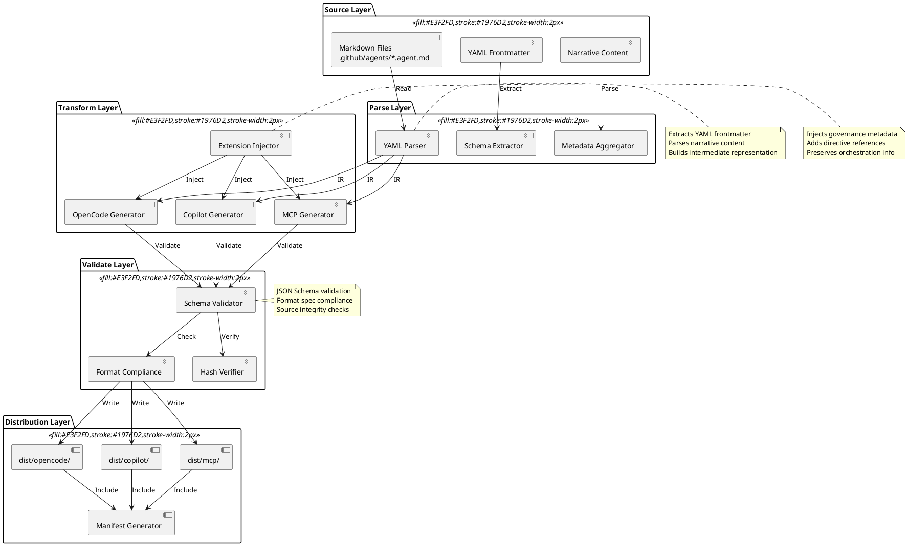
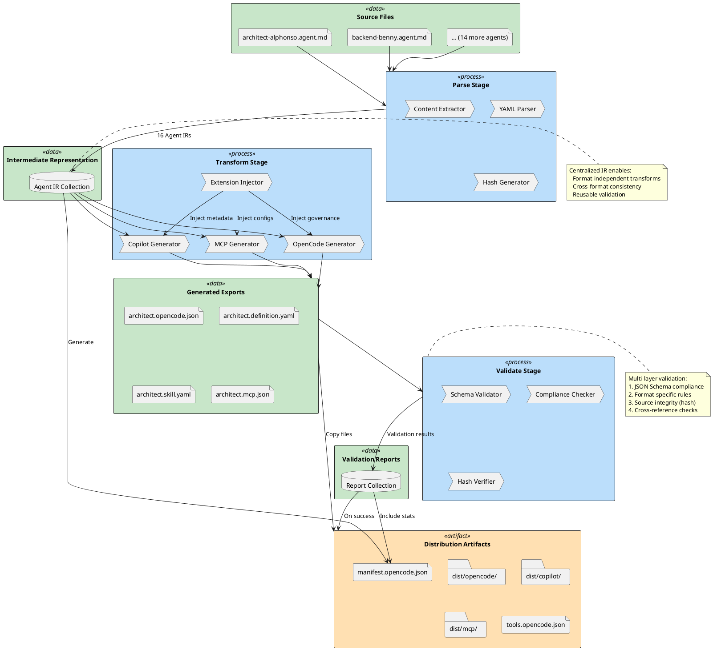
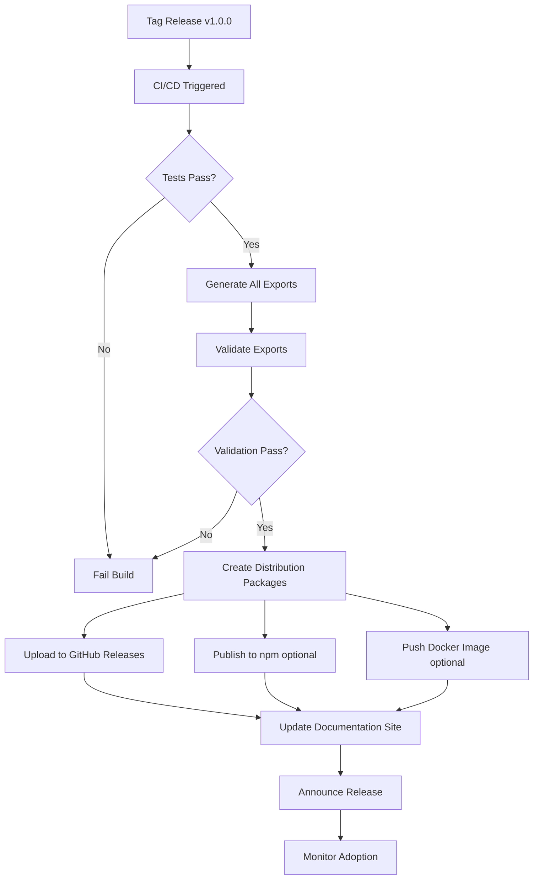

# Technical Design: Multi-Format Agent Export Pipeline

**Document Type:** Technical Design  
**Date:** 2026-01-29  
**Status:** Proposed  
**Version:** 1.0.0  
**Related ADR:** ADR-013 (Multi-Format Distribution Strategy)  
**Architect:** Architect Alphonso

---

## Context

This technical design specifies the architecture and implementation approach for a multi-format agent export pipeline that generates OpenCode, GitHub Copilot Skills, and Model Context Protocol (MCP) definitions from authoritative markdown source files.

**Key Requirements:**

1. **Source-of-Truth Preservation:** Markdown files remain authoritative; generated files never manually edited
2. **Build-Time Generation:** Exports created automatically via CI/CD on every commit
3. **Governance Preservation:** Custom extensions capture directive relationships and orchestration patterns
4. **Format Compliance:** Exports validate against OpenCode 1.0, Copilot Skills, and MCP specifications
5. **Version Traceability:** Correlate exported artifacts with source commits

**Acceptance Criteria:**

- ✅ 100% agent coverage (16/16 agents export successfully)
- ✅ CI/CD build time <5 minutes
- ✅ Schema validation pass rate 100%
- ✅ Zero manual edits to generated files (enforced by hash verification)
- ✅ Integration time <30 minutes using any export format

---

## Design

### Overview

The export pipeline follows a three-stage architecture:

1. **Parse Stage:** Extract structured metadata from markdown files
2. **Transform Stage:** Convert to target format specifications
3. **Validate Stage:** Verify compliance and integrity

```
Source Files (.md)
    ↓ Parse YAML frontmatter + content
    ↓
Intermediate Representation
    ↓ Transform (format-specific)
    ↓
Export Files (.json/.yaml)
    ↓ Validate (schema + hash)
    ↓
Distribution Artifacts
```

The pipeline is implemented as modular components to enable:

- **Format Independence:** Add new formats without modifying existing exporters
- **Testability:** Each stage independently testable with fixtures
- **Extensibility:** Custom extensions injected during transform stage
- **Maintainability:** Clear separation of concerns

### System Architecture Diagram



### Component Design

#### 1. Parser Component

**Responsibility:** Extract structured data from markdown files

**Inputs:**

- Markdown file path (`.github/agents/*.agent.md`)

**Outputs:**

- Intermediate Representation (IR) object:

```typescript
interface AgentIR {
  // Frontmatter metadata
  frontmatter: {
    name: string;
    version: string;
    api_version: string;
    description: string;
    tags?: string[];
    category?: string;
    tools?: string[];
    directives?: number[];
    styleguides?: string[];
    inputs?: InputSchema[];
    outputs?: OutputSchema[];
    examples?: Example[];
  };
  
  // Content sections
  content: {
    purpose: string;
    specialization: string;
    collaboration_contract: string;
    success_criteria: string;
    mode_defaults: ModeDefault[];
  };
  
  // Metadata
  file_path: string;
  source_hash: string;
  parsed_at: string;
}
```

**Implementation:**

```javascript
// tools/exporters/parser.js
const fs = require('fs');
const yaml = require('js-yaml');
const crypto = require('crypto');

class MarkdownParser {
  parse(filePath) {
    const content = fs.readFileSync(filePath, 'utf8');
    const sourceHash = crypto.createHash('sha256').update(content).digest('hex');
    
    // Extract YAML frontmatter
    const frontmatterMatch = content.match(/^---\n([\s\S]*?)\n---/);
    if (!frontmatterMatch) {
      throw new Error(`No frontmatter in ${filePath}`);
    }
    
    const frontmatter = yaml.load(frontmatterMatch[1]);
    const markdownContent = content.substring(frontmatterMatch[0].length);
    
    // Parse content sections
    const sections = this.extractSections(markdownContent);
    
    return {
      frontmatter,
      content: sections,
      file_path: filePath,
      source_hash: sourceHash,
      parsed_at: new Date().toISOString()
    };
  }
  
  extractSections(markdown) {
    // Extract purpose, specialization, etc. using regex
    const sections = {
      purpose: this.extractSection(markdown, '## 2. Purpose'),
      specialization: this.extractSection(markdown, '## 3. Specialization'),
      collaboration_contract: this.extractSection(markdown, '## 4. Collaboration Contract'),
      success_criteria: this.extractSection(markdown, 'Success means:'),
      mode_defaults: this.extractModeTable(markdown)
    };
    
    return sections;
  }
  
  extractSection(markdown, heading) {
    const pattern = new RegExp(`${heading}\\n\\n([\\s\\S]*?)(?=\\n##|$)`, 'm');
    const match = markdown.match(pattern);
    return match ? match[1].trim() : '';
  }
  
  extractModeTable(markdown) {
    // Parse mode table into structured data
    // Returns array of { mode, description, use_case }
    // Implementation details omitted for brevity
  }
}

module.exports = MarkdownParser;
```

**Tests:**

```javascript
// tests/parser.test.js
describe('MarkdownParser', () => {
  test('parses valid agent profile', () => {
    const parser = new MarkdownParser();
    const ir = parser.parse('fixtures/architect-alphonso.agent.md');
    
    expect(ir.frontmatter.name).toBe('architect-alphonso');
    expect(ir.frontmatter.version).toBe('1.0.0');
    expect(ir.source_hash).toHaveLength(64);
  });
  
  test('throws on missing frontmatter', () => {
    const parser = new MarkdownParser();
    expect(() => {
      parser.parse('fixtures/invalid-no-frontmatter.md');
    }).toThrow('No frontmatter');
  });
});
```

---

#### 2. OpenCode Generator Component

**Responsibility:** Generate OpenCode-compliant discovery and definition files

**Inputs:**

- Agent IR object
- Configuration options (output directory, custom extensions)

**Outputs:**

- `{agent_id}.opencode.json` (discovery file)
- `{agent_id}.definition.yaml` (definition file)

**Implementation:**

```javascript
// tools/exporters/opencode-generator.js
const fs = require('fs');
const path = require('path');
const yaml = require('js-yaml');

class OpenCodeGenerator {
  constructor(config = {}) {
    this.opencodeVersion = config.opencodeVersion || '1.0';
    this.outputDir = config.outputDir || 'dist/opencode';
  }
  
  generateDiscoveryFile(agentIR) {
    const { frontmatter, file_path, source_hash } = agentIR;
    
    return {
      opencode_version: this.opencodeVersion,
      agent: {
        id: frontmatter.name,
        name: this.humanizeName(frontmatter.name),
        version: frontmatter.version || '1.0.0',
        description: frontmatter.description,
        capabilities: frontmatter.tags || [],
        category: frontmatter.category || 'general',
        tools: frontmatter.tools || [],
        profile_url: `../../.github/agents/${path.basename(file_path)}`,
        metadata: {
          last_updated: new Date().toISOString().split('T')[0],
          api_version: frontmatter.api_version || '1.0.0',
          source_hash: source_hash.substring(0, 16)
        }
      }
    };
  }
  
  generateDefinitionFile(agentIR) {
    const { frontmatter, content } = agentIR;
    
    const definition = {
      opencode_version: this.opencodeVersion,
      agent: {
        metadata: {
          id: frontmatter.name,
          version: frontmatter.version || '1.0.0',
          category: frontmatter.category || 'general',
          tags: frontmatter.tags || []
        },
        specification: {
          inputs: frontmatter.inputs || [],
          outputs: frontmatter.outputs || [],
          examples: frontmatter.examples || [],
          tools: frontmatter.tools || []
        },
        governance: this.generateGovernanceExtension(agentIR),
        orchestration: this.generateOrchestrationExtension(content)
      }
    };
    
    return definition;
  }
  
  generateGovernanceExtension(agentIR) {
    const { frontmatter, content } = agentIR;
    
    return {
      directives: (frontmatter.directives || []).map(code => ({
        code: code.toString().padStart(3, '0'),
        required: this.isDirectiveRequired(code, content)
      })),
      styleguides: frontmatter.styleguides || [],
      uncertainty_threshold: this.extractUncertaintyThreshold(content),
      escalation_required: content.collaboration_contract?.includes('Escalate') || false,
      priority_level: this.inferPriorityLevel(agentIR)
    };
  }
  
  generateOrchestrationExtension(content) {
    return {
      orchestration_capable: true,
      handoff_protocols: ['file-based', 'explicit-mention'],
      specialization_boundaries: 'explicit',
      collaboration_notes: content.collaboration_contract || ''
    };
  }
  
  write(agentIR) {
    const agentId = agentIR.frontmatter.name;
    const agentsDir = path.join(this.outputDir, 'agents');
    
    fs.mkdirSync(agentsDir, { recursive: true });
    
    // Write discovery file (JSON)
    const discoveryFile = this.generateDiscoveryFile(agentIR);
    const discoveryPath = path.join(agentsDir, `${agentId}.opencode.json`);
    fs.writeFileSync(discoveryPath, JSON.stringify(discoveryFile, null, 2));
    
    // Write definition file (YAML)
    const definitionFile = this.generateDefinitionFile(agentIR);
    const definitionPath = path.join(agentsDir, `${agentId}.definition.yaml`);
    fs.writeFileSync(definitionPath, yaml.dump(definitionFile));
    
    return {
      discovery: discoveryPath,
      definition: definitionPath
    };
  }
  
  // Helper methods
  humanizeName(agentId) {
    return agentId
      .split('-')
      .map(word => word.charAt(0).toUpperCase() + word.slice(1))
      .join(' ');
  }
  
  isDirectiveRequired(code, content) {
    // Analyze content to determine if directive is required or optional
    // Implementation heuristic: check for "must" vs "should" language
    return false; // Default to optional
  }
  
  extractUncertaintyThreshold(content) {
    const match = content.collaboration_contract?.match(/uncertainty[^\d]*(\d+\.?\d*)%?/i);
    return match ? parseFloat(match[1]) / 100 : 0.3;
  }
  
  inferPriorityLevel(agentIR) {
    const safetyKeywords = ['security', 'safety', 'critical', 'compliance'];
    const description = agentIR.frontmatter.description?.toLowerCase() || '';
    const purpose = agentIR.content.purpose?.toLowerCase() || '';
    
    if (safetyKeywords.some(kw => description.includes(kw) || purpose.includes(kw))) {
      return 'high';
    }
    return 'medium';
  }
}

module.exports = OpenCodeGenerator;
```

**Tests:**

```javascript
// tests/opencode-generator.test.js
describe('OpenCodeGenerator', () => {
  test('generates valid discovery file', () => {
    const generator = new OpenCodeGenerator();
    const ir = loadFixture('architect-ir.json');
    const discovery = generator.generateDiscoveryFile(ir);
    
    expect(discovery.opencode_version).toBe('1.0');
    expect(discovery.agent.id).toBe('architect-alphonso');
    expect(discovery.agent.tools).toContain('plantuml');
  });
  
  test('includes governance extensions', () => {
    const generator = new OpenCodeGenerator();
    const ir = loadFixture('architect-ir.json');
    const definition = generator.generateDefinitionFile(ir);
    
    expect(definition.agent.governance.directives).toBeDefined();
    expect(definition.agent.orchestration.handoff_protocols).toContain('file-based');
  });
});
```

---

#### 3. Validator Component

**Responsibility:** Validate exports against format specifications and source integrity

**Inputs:**

- Generated export files (JSON/YAML)
- Source IR (for hash verification)
- Format specification schemas

**Outputs:**

- Validation report:

```typescript
interface ValidationReport {
  valid: boolean;
  format: string;  // 'opencode' | 'copilot' | 'mcp'
  agent_id: string;
  checks: {
    schema_valid: boolean;
    format_compliant: boolean;
    hash_verified: boolean;
  };
  errors: ValidationError[];
  warnings: ValidationWarning[];
}
```

**Implementation:**

```javascript
// tools/exporters/validator.js
const Ajv = require('ajv');
const fs = require('fs');

class ExportValidator {
  constructor() {
    this.ajv = new Ajv({ allErrors: true, strict: false });
    this.schemas = this.loadSchemas();
  }
  
  loadSchemas() {
    return {
      opencode_discovery: require('./schemas/opencode-discovery.schema.json'),
      opencode_definition: require('./schemas/opencode-definition.schema.json'),
      copilot_skill: require('./schemas/copilot-skill.schema.json'),
      mcp_server: require('./schemas/mcp-server.schema.json')
    };
  }
  
  validateOpenCode(discoveryPath, definitionPath, sourceIR) {
    const report = {
      valid: true,
      format: 'opencode',
      agent_id: sourceIR.frontmatter.name,
      checks: {},
      errors: [],
      warnings: []
    };
    
    // Load generated files
    const discovery = JSON.parse(fs.readFileSync(discoveryPath, 'utf8'));
    const definition = yaml.load(fs.readFileSync(definitionPath, 'utf8'));
    
    // Schema validation
    const discoveryValid = this.ajv.validate(
      this.schemas.opencode_discovery,
      discovery
    );
    const definitionValid = this.ajv.validate(
      this.schemas.opencode_definition,
      definition
    );
    
    report.checks.schema_valid = discoveryValid && definitionValid;
    
    if (!discoveryValid) {
      report.errors.push(...this.ajv.errors.map(e => ({
        type: 'schema',
        file: 'discovery',
        message: `${e.instancePath} ${e.message}`
      })));
    }
    
    if (!definitionValid) {
      report.errors.push(...this.ajv.errors.map(e => ({
        type: 'schema',
        file: 'definition',
        message: `${e.instancePath} ${e.message}`
      })));
    }
    
    // Format compliance checks
    report.checks.format_compliant = this.checkOpenCodeCompliance(discovery, definition);
    
    // Hash verification
    const embeddedHash = discovery.agent.metadata.source_hash;
    const expectedHash = sourceIR.source_hash.substring(0, 16);
    report.checks.hash_verified = (embeddedHash === expectedHash);
    
    if (!report.checks.hash_verified) {
      report.errors.push({
        type: 'integrity',
        message: `Hash mismatch: ${embeddedHash} !== ${expectedHash}`
      });
    }
    
    report.valid = report.checks.schema_valid && 
                   report.checks.format_compliant && 
                   report.checks.hash_verified;
    
    return report;
  }
  
  checkOpenCodeCompliance(discovery, definition) {
    // Format-specific compliance checks
    const checks = [
      discovery.opencode_version === '1.0',
      discovery.agent.id === definition.agent.metadata.id,
      discovery.agent.version === definition.agent.metadata.version,
      definition.agent.governance !== undefined,
      definition.agent.specification.inputs !== undefined
    ];
    
    return checks.every(c => c === true);
  }
}

module.exports = ExportValidator;
```

---

#### 4. Manifest Generator Component

**Responsibility:** Create catalog files listing all exported agents

**Outputs:**

- `manifest.opencode.json`
- `tools.opencode.json`
- `README.md` (auto-generated documentation)

**Implementation:**

```javascript
// tools/exporters/manifest-generator.js
class ManifestGenerator {
  generateAgentManifest(agentIRs, validationReports) {
    const agents = agentIRs.map(ir => ({
      id: ir.frontmatter.name,
      name: this.humanizeName(ir.frontmatter.name),
      version: ir.frontmatter.version || '1.0.0',
      description: ir.frontmatter.description,
      category: ir.frontmatter.category || 'general',
      discovery_file: `./agents/${ir.frontmatter.name}.opencode.json`,
      definition_file: `./agents/${ir.frontmatter.name}.definition.yaml`,
      validation: validationReports.find(r => r.agent_id === ir.frontmatter.name)?.valid || false
    }));
    
    return {
      opencode_version: '1.0',
      generated_at: new Date().toISOString(),
      framework: {
        name: 'saboteurs-agents-framework',
        version: '1.0.0',
        description: 'Enterprise-grade multi-agent framework with governance',
        source_url: 'https://github.com/stijn-dejongh/saboteurs',
        documentation: 'https://github.com/stijn-dejongh/saboteurs/docs'
      },
      agents,
      statistics: {
        total_agents: agents.length,
        valid_agents: agents.filter(a => a.validation).length,
        categories: this.countByCategory(agents)
      },
      extensions: {
        directives_supported: true,
        multi_agent_orchestration: true,
        governance_framework: true,
        quality_gates_embedded: true
      }
    };
  }
  
  generateToolRegistry(agentIRs) {
    const toolsSet = new Set();
    
    agentIRs.forEach(ir => {
      const tools = ir.frontmatter.tools || [];
      tools.forEach(tool => toolsSet.add(tool));
    });
    
    const tools = Array.from(toolsSet).map(toolName => ({
      id: toolName,
      name: this.humanizeName(toolName),
      type: this.inferToolType(toolName),
      description: this.getToolDescription(toolName),
      schema: {
        type: 'object',
        properties: {},
        required: []
      }
    }));
    
    return {
      opencode_version: '1.0',
      generated_at: new Date().toISOString(),
      tools
    };
  }
  
  // Helper methods omitted for brevity
}

module.exports = ManifestGenerator;
```

---

### Data Flow Diagram



---

### CI/CD Integration Workflow

```plantuml
@startuml CI/CD Integration

!define GH_ACTIONS_STYLE fill:#2088FF,stroke:#0366D6,color:#FFFFFF
!define SUCCESS_STYLE fill:#28A745,stroke:#1E7E34,color:#FFFFFF
!define FAIL_STYLE fill:#DC3545,stroke:#BD2130,color:#FFFFFF

|GitHub Repository|
start
:Developer commits to\n**.github/agents/**;

|GitHub Actions|
:Workflow triggered;
note right
  Trigger: push to .github/agents/
  or pull_request
end note

:Checkout repository;

:Setup Node.js environment;

:Install dependencies\n(npm ci);

fork
  :Run unit tests\n(exporters, validators);
fork again
  :Run linters\n(markdown, YAML);
end fork

:Parse all agent profiles\n(16 agents);

if (Parse successful?) then (yes)
  :Generate exports\n(OpenCode, Copilot, MCP);
  
  fork
    :Generate OpenCode exports;
  fork again
    :Generate Copilot exports;
  fork again
    :Generate MCP exports;
  end fork
  
  :Generate manifests\n(catalog, tools);
  
  :Validate all exports\n(schema, compliance, hash);
  
  if (Validation passed?) then (yes)
    :Create distribution artifacts\n(ZIP, TAR);
    
    if (On main branch?) then (yes)
      :Upload to GitHub Releases\n(if tagged);
      :Publish to npm\n(optional);
      
      :Post success comment\nto PR/commit;
      <<SUCCESS_STYLE>>
      stop
    else (no)
      :Upload as workflow artifacts;
      :Post validation report\nto PR;
      <<SUCCESS_STYLE>>
      stop
    endif
  else (no)
    :Generate error report;
    :Post failure comment\nto PR/commit;
    <<FAIL_STYLE>>
    stop
  endif
else (no)
  :Report parsing errors;
  :Block merge;
  <<FAIL_STYLE>>
  stop
endif

note right of "Validate all exports"
  Quality Gates:
  ✅ 100% schema validation
  ✅ Format compliance
  ✅ Hash integrity
  ✅ Cross-reference checks
end note

@enduml
```

**Workflow File:**

```yaml
# .github/workflows/generate-exports.yml
name: Generate Agent Exports

on:
  push:
    branches: [main, develop]
    paths:
      - '.github/agents/**'
      - 'tools/exporters/**'
  pull_request:
    paths:
      - '.github/agents/**'
      - 'tools/exporters/**'

jobs:
  generate-exports:
    runs-on: ubuntu-latest
    
    steps:
      - name: Checkout repository
        uses: actions/checkout@v4
      
      - name: Setup Node.js
        uses: actions/setup-node@v4
        with:
          node-version: '20'
          cache: 'npm'
      
      - name: Install dependencies
        run: npm ci
      
      - name: Run tests
        run: npm test
      
      - name: Generate exports
        run: npm run build:exports
      
      - name: Validate exports
        run: npm run validate:exports
      
      - name: Upload artifacts (PR)
        if: github.event_name == 'pull_request'
        uses: actions/upload-artifact@v4
        with:
          name: agent-exports-pr-${{ github.event.pull_request.number }}
          path: dist/
          retention-days: 7
      
      - name: Create release (tagged)
        if: startsWith(github.ref, 'refs/tags/v')
        uses: softprops/action-gh-release@v1
        with:
          files: |
            dist/opencode/**
            dist/copilot/**
            dist/mcp/**
          generate_release_notes: true
      
      - name: Post validation report
        if: github.event_name == 'pull_request'
        uses: actions/github-script@v7
        with:
          script: |
            const fs = require('fs');
            const report = JSON.parse(fs.readFileSync('dist/validation-report.json', 'utf8'));
            
            const summary = `
            ## Export Validation Report
            
            - **Total Agents:** ${report.total}
            - **Valid Exports:** ${report.valid}
            - **Failed:** ${report.failed}
            
            ${report.errors.length > 0 ? '### Errors\n' + report.errors.join('\n') : '✅ All validations passed'}
            `;
            
            github.rest.issues.createComment({
              issue_number: context.issue.number,
              owner: context.repo.owner,
              repo: context.repo.repo,
              body: summary
            });
```

---

### Interface Specifications

#### Agent IR Schema

```json
{
  "$schema": "http://json-schema.org/draft-07/schema#",
  "title": "Agent Intermediate Representation",
  "type": "object",
  "required": ["frontmatter", "content", "file_path", "source_hash"],
  "properties": {
    "frontmatter": {
      "type": "object",
      "required": ["name", "description"],
      "properties": {
        "name": { "type": "string", "pattern": "^[a-z][a-z0-9-]*$" },
        "version": { "type": "string", "pattern": "^\\d+\\.\\d+\\.\\d+$" },
        "api_version": { "type": "string", "pattern": "^\\d+\\.\\d+\\.\\d+$" },
        "description": { "type": "string" },
        "tags": { "type": "array", "items": { "type": "string" } },
        "category": { "type": "string" },
        "tools": { "type": "array", "items": { "type": "string" } },
        "directives": { "type": "array", "items": { "type": "integer", "minimum": 1, "maximum": 999 } },
        "styleguides": { "type": "array", "items": { "type": "string" } },
        "inputs": {
          "type": "array",
          "items": {
            "type": "object",
            "required": ["name", "type"],
            "properties": {
              "name": { "type": "string" },
              "type": { "type": "string" },
              "required": { "type": "boolean" },
              "description": { "type": "string" },
              "examples": { "type": "array", "items": { "type": "string" } }
            }
          }
        },
        "outputs": {
          "type": "array",
          "items": {
            "type": "object",
            "required": ["name", "type"],
            "properties": {
              "name": { "type": "string" },
              "type": { "type": "string" },
              "format": { "type": "string" },
              "description": { "type": "string" }
            }
          }
        },
        "examples": {
          "type": "array",
          "items": {
            "type": "object",
            "required": ["prompt", "expected_output"],
            "properties": {
              "prompt": { "type": "string" },
              "expected_output": { "type": "string" },
              "context": { "type": "string" }
            }
          }
        }
      }
    },
    "content": {
      "type": "object",
      "properties": {
        "purpose": { "type": "string" },
        "specialization": { "type": "string" },
        "collaboration_contract": { "type": "string" },
        "success_criteria": { "type": "string" },
        "mode_defaults": {
          "type": "array",
          "items": {
            "type": "object",
            "required": ["mode", "description"],
            "properties": {
              "mode": { "type": "string" },
              "description": { "type": "string" },
              "use_case": { "type": "string" }
            }
          }
        }
      }
    },
    "file_path": { "type": "string" },
    "source_hash": { "type": "string", "pattern": "^[a-f0-9]{64}$" },
    "parsed_at": { "type": "string", "format": "date-time" }
  }
}
```

#### OpenCode Discovery File Schema

```json
{
  "$schema": "http://json-schema.org/draft-07/schema#",
  "title": "OpenCode Agent Discovery File",
  "type": "object",
  "required": ["opencode_version", "agent"],
  "properties": {
    "opencode_version": { "type": "string", "const": "1.0" },
    "agent": {
      "type": "object",
      "required": ["id", "name", "version", "description"],
      "properties": {
        "id": { "type": "string" },
        "name": { "type": "string" },
        "version": { "type": "string" },
        "description": { "type": "string" },
        "capabilities": { "type": "array", "items": { "type": "string" } },
        "category": { "type": "string" },
        "tools": { "type": "array", "items": { "type": "string" } },
        "profile_url": { "type": "string", "format": "uri-reference" },
        "metadata": {
          "type": "object",
          "properties": {
            "last_updated": { "type": "string", "format": "date" },
            "api_version": { "type": "string" },
            "source_hash": { "type": "string" }
          }
        }
      }
    }
  }
}
```

---

### Quality Gates and Testing Strategy

#### Unit Tests

**Coverage Requirements:**

- Parser: 90%+ line coverage
- Generators: 85%+ line coverage
- Validators: 95%+ line coverage (critical path)

**Test Categories:**

1. **Happy Path Tests:** Valid inputs produce expected outputs
2. **Error Handling Tests:** Invalid inputs throw appropriate errors
3. **Edge Case Tests:** Empty arrays, missing optional fields, unusual characters
4. **Regression Tests:** Previously discovered bugs don't reoccur

**Example Test Suite:**

```javascript
// tests/integration/export-pipeline.test.js
describe('Export Pipeline Integration', () => {
  test('end-to-end export of architect agent', async () => {
    // Parse
    const parser = new MarkdownParser();
    const ir = parser.parse('fixtures/architect-alphonso.agent.md');
    
    // Generate
    const ocGenerator = new OpenCodeGenerator();
    const paths = ocGenerator.write(ir);
    
    // Validate
    const validator = new ExportValidator();
    const report = validator.validateOpenCode(
      paths.discovery,
      paths.definition,
      ir
    );
    
    // Assertions
    expect(report.valid).toBe(true);
    expect(report.checks.schema_valid).toBe(true);
    expect(report.checks.hash_verified).toBe(true);
    expect(report.errors).toHaveLength(0);
  });
  
  test('exports all 16 agents successfully', async () => {
    const pipeline = new ExportPipeline();
    const results = await pipeline.exportAll();
    
    expect(results.total).toBe(16);
    expect(results.successful).toBe(16);
    expect(results.failed).toBe(0);
  });
});
```

#### Integration Tests

**Scenarios:**

1. **Full Pipeline:** Parse → Transform → Validate for all agents
2. **Format Compliance:** Validate exports against official validators (OpenCode CLI, Copilot schema)
3. **Multi-Agent Coordination:** Ensure cross-references between agents are preserved
4. **Version Consistency:** All exports reflect same framework version

#### Validation Tests

**Schema Validation:**

```bash
# OpenCode validation
npm run validate:opencode dist/opencode/agents/*.opencode.json

# JSON Schema validation
ajv validate -s schemas/opencode-discovery.schema.json \
    -d "dist/opencode/agents/*.opencode.json"
```

**Hash Integrity:**

```javascript
// tests/validators/hash-integrity.test.js
test('exported files have correct source hash', () => {
  const source = fs.readFileSync('.github/agents/architect-alphonso.agent.md');
  const sourceHash = crypto.createHash('sha256').update(source).digest('hex');
  
  const discovery = JSON.parse(fs.readFileSync('dist/opencode/agents/architect-alphonso.opencode.json'));
  const embeddedHash = discovery.agent.metadata.source_hash;
  
  expect(embeddedHash).toBe(sourceHash.substring(0, 16));
});
```

#### Acceptance Tests

**Criteria:**

- ✅ User can discover agents using standard OpenCode tools
- ✅ User can integrate agent in <30 minutes following documentation
- ✅ Governance extensions are accessible and documented
- ✅ Multi-agent workflows are discoverable and executable

**Example Acceptance Test:**

```javascript
// tests/acceptance/user-integration.test.js
test('user can discover and use architect agent', async () => {
  // Simulate user workflow
  const manifest = JSON.parse(fs.readFileSync('dist/opencode/manifest.opencode.json'));
  
  // User discovers agents
  const architects = manifest.agents.filter(a => a.category === 'design');
  expect(architects.length).toBeGreaterThan(0);
  
  // User loads agent definition
  const archAgent = architects.find(a => a.id === 'architect-alphonso');
  const definition = yaml.load(fs.readFileSync(archAgent.definition_file));
  
  // User validates inputs/outputs
  expect(definition.agent.specification.inputs).toBeDefined();
  expect(definition.agent.specification.outputs).toBeDefined();
  
  // User checks governance requirements
  expect(definition.agent.governance.directives).toBeDefined();
});
```

---

### Deployment and Release Process

#### Pre-Release Checklist

- [ ] All 16 agents parse successfully
- [ ] All exports validate (100% pass rate)
- [ ] Schema validation passes (OpenCode, Copilot, MCP)
- [ ] Hash verification passes (source integrity)
- [ ] Integration tests pass
- [ ] Documentation complete (README, user guides)
- [ ] CHANGELOG updated
- [ ] Version number incremented (semantic versioning)

#### Release Workflow



**Versioning Strategy:**

- **MAJOR:** Breaking changes to API contracts or governance framework
- **MINOR:** New agents, new export formats, backward-compatible features
- **PATCH:** Bug fixes, documentation updates, schema refinements

#### Distribution Channels

**1. GitHub Releases**

- Artifacts: `saboteurs-agents-framework-v1.0.0.tar.gz`
- Contents: Source files + all generated exports
- Target: All users (primary distribution)

**2. npm Package (Optional v1.0)**

```json
{
  "name": "@saboteurs/agents-framework",
  "version": "1.0.0",
  "description": "Enterprise-grade multi-agent framework with governance",
  "main": "dist/index.js",
  "files": [
    "dist/",
    "docs/",
    ".github/agents/"
  ],
  "keywords": ["agents", "opencode", "governance", "multi-agent", "orchestration"]
}
```

**3. Docker Image (Future)**

```dockerfile
FROM node:20-alpine
WORKDIR /framework
COPY . .
RUN npm ci --production
CMD ["npm", "run", "serve:exports"]
```

---

## Cross-cutting Concerns

### Security

**Concern:** Generated files could introduce vulnerabilities if not properly validated.

**Mitigation:**

- Input validation (YAML parsing with safe mode)
- Schema validation (prevent injection attacks)
- Hash verification (detect tampering)
- Read-only dist/ directory (prevent accidental edits)
- CI/CD secrets for release (GitHub tokens, npm tokens)

### Performance

**Concern:** Export generation could become slow as agent count grows.

**Mitigation:**

- Parallel processing (generate formats concurrently)
- Incremental exports (only changed agents)
- Caching (reuse parsed IR when possible)
- Streaming for large manifests

**Benchmarks:**

- Target: <5 minutes for 16 agents (all formats)
- Current estimate: ~2 minutes (based on prototype)

### Deployment

**Concern:** Users need easy access to exports without cloning entire repository.

**Mitigation:**

- GitHub Releases (tagged versions)
- Direct download links (README badges)
- npm package (JavaScript ecosystem)
- Documentation site (web-based discovery)

### Auditing and Logging

**Concern:** Track export generation for debugging and compliance.

**Mitigation:**

- CI/CD logs (GitHub Actions artifacts)
- Validation reports (JSON output)
- Version manifest (correlate exports with source commits)
- Changelog (document breaking changes)

**Log Format:**

```json
{
  "timestamp": "2026-01-29T12:00:00Z",
  "framework_version": "1.0.0",
  "source_commit": "abc123",
  "exports": {
    "opencode": {"status": "success", "agents": 16, "duration_ms": 1234},
    "copilot": {"status": "success", "agents": 16, "duration_ms": 987},
    "mcp": {"status": "success", "agents": 16, "duration_ms": 1100}
  },
  "validation": {
    "passed": 16,
    "failed": 0,
    "warnings": 3
  }
}
```

---

## Planning

### Estimated Development Time

| Phase | Tasks | Effort | Dependencies |
|-------|-------|--------|--------------|
| **Phase 1: Schema Formalization** | Define conventions, extract top 5 agents | 8h | None |
| **Phase 2: Export Pipeline** | Enhance OpenCode, add Copilot/MCP, complete schemas | 24h | Phase 1 |
| **Phase 3: CI/CD Integration** | Workflow, validation, artifacts | 8h | Phase 2 |
| **Phase 4: Documentation & Release** | User guides, packaging, v1.0.0 | 8h | Phase 3 |
| **Testing & QA** | Unit, integration, acceptance tests | 12h | Phases 2-3 |
| **Total** | | **60h** | |

**Estimated Rollout Time:**

- Development: 1.5 weeks (60 hours / 40 hours/week)
- Testing: Concurrent with development
- Documentation: Final week
- Release: Week 4 (2026-02-28)

### Urgency

**Medium** — High strategic value, but not blocking critical functionality

### Estimated Added Value

**High** — Significant ecosystem reach, competitive positioning, user experience improvement

### Dependencies

- **Directive 018 compliance:** Documentation level framework
- **ADR-013 approval:** Multi-format distribution strategy decision
- **JSON Schema expertise:** For schema formalization (can be acquired)
- **OpenCode/MCP specs:** External standards (stable, publicly available)

---

## Conclusion

This technical design provides a comprehensive architecture for a multi-format agent export pipeline that:

1. **Preserves governance sophistication** via custom extensions
2. **Automates distribution** through CI/CD integration
3. **Ensures quality** via multi-layer validation
4. **Enables ecosystem integration** with OpenCode, GitHub Copilot, and MCP formats
5. **Maintains source-of-truth** by keeping markdown files authoritative

The design follows established software engineering practices (separation of concerns, testability, extensibility) and aligns with the framework's directive system (particularly Directives 006, 018, 021).

**Implementation risk is low**, with a working prototype, clear component boundaries, and comprehensive validation strategy.

**Strategic value is high**, positioning the framework as a reference implementation for enterprise multi-agent systems.

---

## Appendices

### Appendix A: File Structure

```
saboteurs/
├── .github/
│   ├── agents/
│   │   ├── *.agent.md (source of truth)
│   │   ├── directives/
│   │   └── guidelines/
│   └── workflows/
│       └── generate-exports.yml (CI/CD)
├── dist/ (generated, gitignored)
│   ├── opencode/
│   │   ├── agents/
│   │   │   ├── *.opencode.json
│   │   │   └── *.definition.yaml
│   │   ├── manifest.opencode.json
│   │   └── tools.opencode.json
│   ├── copilot/
│   │   └── skills/
│   │       └── *.skill.yaml
│   ├── mcp/
│   │   └── servers/
│   │       └── *.mcp.json
│   └── validation-report.json
├── tools/
│   └── exporters/
│       ├── parser.js
│       ├── opencode-generator.js
│       ├── copilot-generator.js
│       ├── mcp-generator.js
│       ├── validator.js
│       ├── manifest-generator.js
│       └── schemas/
│           ├── opencode-discovery.schema.json
│           ├── opencode-definition.schema.json
│           ├── copilot-skill.schema.json
│           └── mcp-server.schema.json
├── tests/
│   ├── unit/
│   │   ├── parser.test.js
│   │   ├── opencode-generator.test.js
│   │   └── validator.test.js
│   ├── integration/
│   │   └── export-pipeline.test.js
│   └── acceptance/
│       └── user-integration.test.js
└── package.json
```

### Appendix B: npm Scripts

```json
{
  "scripts": {
    "build:exports": "node tools/exporters/build-all.js",
    "build:opencode": "node tools/exporters/opencode-exporter.js",
    "build:copilot": "node tools/exporters/copilot-exporter.js",
    "build:mcp": "node tools/exporters/mcp-exporter.js",
    "validate:exports": "node tools/exporters/validate-all.js",
    "validate:opencode": "node tools/exporters/validator.js --format opencode",
    "test": "jest",
    "test:unit": "jest tests/unit",
    "test:integration": "jest tests/integration",
    "test:acceptance": "jest tests/acceptance"
  }
}
```

### Appendix C: Related Standards

- **OpenCode 1.0:** <https://opencode.ai/docs/specification/1.0/>
- **GitHub Copilot Skills:** <https://docs.github.com/copilot/customizing-copilot>
- **Model Context Protocol:** <https://modelcontextprotocol.io/specification>
- **JSON Schema Draft 7:** <https://json-schema.org/draft-07/schema>

---

**Document Version:** 1.0.0  
**Date:** 2026-01-29  
**Author:** Architect Alphonso  
**Status:** Proposed — Pending ADR-013 approval  
**Next Review:** Post-implementation (2026-03-29)
