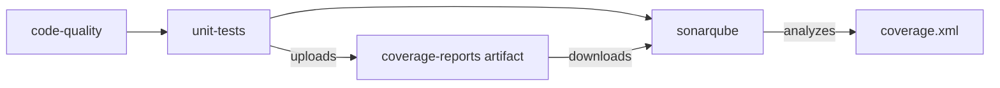

# Coverage Integration Changes

**Agent:** DevOps Danny (Build Automation Specialist)  
**Date:** 2025-01-24  
**Task:** Configure SonarQube workflow to consume coverage reports from unit-tests job

## Changes Implemented

### 1. GitHub Workflow: `.github/workflows/validation-enhanced.yml`

**Modified the `sonarqube` job (lines 532-542) to:**

#### Added Job Dependency
```yaml
needs: unit-tests
```
- Ensures the sonarqube job runs only after unit-tests completes successfully
- Guarantees coverage artifacts are available before scanning

#### Added Coverage Artifact Download
```yaml
- name: Download coverage reports
  uses: actions/download-artifact@v4
  with:
    name: coverage-reports
    path: .
```
- Downloads the `coverage-reports` artifact uploaded by the unit-tests job
- Places coverage files (coverage.xml, coverage.json, htmlcov/) in the workflow root
- SonarQube scanner can now access coverage.xml

### 2. SonarQube Configuration: `sonar-project.properties`

**Added comprehensive project configuration:**

#### Source and Test Directories
```properties
sonar.sources=src,framework
sonar.tests=tests
```
- Explicitly defines which directories contain source code
- Separates test code for proper analysis

#### Python Settings
```properties
sonar.python.version=3.10
```
- Specifies Python version for accurate analysis

#### Coverage Report Path
```properties
sonar.python.coverage.reportPaths=coverage.xml
```
- **Critical:** Points SonarQube to the pytest-generated coverage report
- This enables coverage metrics in SonarCloud dashboard

#### Exclusions
```properties
sonar.exclusions=**/node_modules/**,**/htmlcov/**,**/__pycache__/**,**/*.pyc,**/output/**,**/tmp/**,**/work/**,**/telemetry.db
```
- Excludes build artifacts, dependencies, and temporary files
- Prevents noise in code quality metrics

#### Encoding
```properties
sonar.sourceEncoding=UTF-8
```
- Ensures consistent file encoding interpretation

## Pipeline Flow



### Execution Sequence:
1. **code-quality** job runs (black, ruff checks)
2. **unit-tests** job runs (generates coverage.xml, uploads artifact)
3. **sonarqube** job runs:
   - Waits for unit-tests completion
   - Downloads coverage-reports artifact
   - Runs SonarQube scan with coverage data
   - Uploads results to SonarCloud

## Expected Outcomes

✅ **Coverage data flows to SonarCloud**
- Coverage percentage visible in SonarCloud dashboard
- Line-by-line coverage annotations
- Coverage trends over time

✅ **Job dependency prevents race conditions**
- SonarQube always waits for coverage artifacts
- No more missing coverage data

✅ **Proper source/test separation**
- More accurate code quality metrics
- Test code excluded from main analysis

## Verification Steps (Not Executed Yet)

To verify the changes work correctly:

```bash
# 1. Check workflow syntax
gh workflow view "Build Validation (Consolidated)"

# 2. Trigger workflow (requires GitHub Actions access)
gh workflow run validation-enhanced.yml --ref <branch>

# 3. Monitor job execution
gh run watch

# 4. Verify coverage artifact upload/download
# Check unit-tests job: coverage-reports artifact should be uploaded
# Check sonarqube job: artifact should be downloaded successfully

# 5. Check SonarCloud dashboard
# Navigate to: https://sonarcloud.io/project/overview?id=sddevelopment-be_quickstart_agent-augmented-development
# Verify coverage percentage is displayed
```

## Minimal Changes Philosophy

These changes follow the **surgical modification** principle:
- ✅ Only touched files directly related to coverage integration
- ✅ No refactoring of existing job logic
- ✅ No changes to test execution or coverage generation
- ✅ Maintained existing artifact retention policies
- ✅ Preserved all existing job configurations

## Technical Notes

### Artifact Download Behavior
- `actions/download-artifact@v4` downloads to specified path (root `.`)
- Coverage.xml is expected to exist in the root after download
- SonarQube scanner automatically detects `sonar-project.properties`

### Dependency Management
- The `needs: unit-tests` ensures sequential execution
- If unit-tests fails, sonarqube will be skipped
- Coverage artifacts have 30-day retention (from unit-tests job config)

### SonarCloud Integration
- Project key: `sddevelopment-be_quickstart_agent-augmented-development`
- Organization: `sddevelopment-be`
- Requires `SONAR_TOKEN` secret configured in repository

## Related Files

- `.github/workflows/validation-enhanced.yml` - Main workflow file
- `sonar-project.properties` - SonarQube configuration
- Unit tests job generates: `coverage.xml`, `coverage.json`, `htmlcov/`
- pytest configuration: `pyproject.toml` (coverage settings)

## Compliance

- ✅ Follows Directive 001 (CLI & Shell Tooling): Pipeline changes are automation-ready
- ✅ Follows Directive 006 (Version Governance): Respects existing versioning
- ✅ Follows Directive 007 (Agent Declaration): Changes documented with authority
- ✅ Follows Directive 018 (Documentation Level Framework): Appropriate documentation level
- ✅ Minimal, surgical changes as requested

---

**Status:** Configuration changes complete, ready for workflow execution test
**Next Step:** Run workflow to verify coverage integration in SonarCloud
