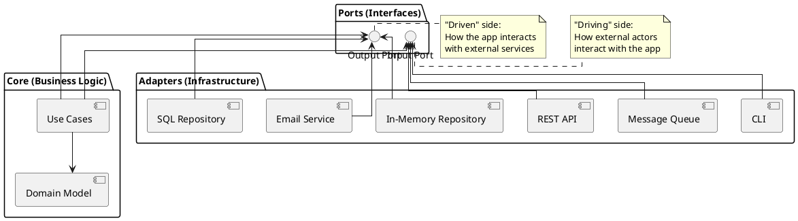

+++
title = "Ports and Adapters Architecture Primer"
subtitle = "Isolating business logic from external dependencies through boundary interfaces"
aliases = ["ports-and-adapters", "hexagonal-architecture", "clean-architecture", "onion-architecture", "architectural/hexagonal"]
author = "Stijn Dejongh"
outputs = ['html', 'rss', 'json']
draft = true
tags = ["architecture", "patterns", "ports-adapters", "hexagonal", "clean-architecture", "primer", "reference"]
summary = """
Ports and Adapters (also known as Hexagonal Architecture, Clean Architecture, or Onion Architecture) structures 
applications to isolate business logic from infrastructure concerns. External systems interact through defined 
interfaces (ports), implemented by interchangeable components (adapters), enabling testability and technology independence.
"""
+++

## 1. Concept Overview

Ports and Adapters architecture, introduced by Alistair Cockburn in 2005, addresses a fundamental challenge: how to write business logic that doesn't become tightly coupled to databases, web frameworks, message queues, or other infrastructure.

**Core idea:**

- **Business logic** lives in the center, ignorant of external technologies
- **Ports** are interfaces defining how the business logic interacts with the outside world
- **Adapters** are implementations of those ports for specific technologies
- Direction of dependency: Infrastructure depends on business logic, never the reverse

**Key identifying features:**

- Business rules have no import statements referencing frameworks or databases
- Multiple adapter implementations can satisfy the same port (e.g., in-memory vs. SQL repository)
- Application can run in different contexts (CLI, web, tests) without changing core logic
- Infrastructure can be swapped without touching business code

**Problem domain:**

- Applications that must survive technology migrations (database → NoSQL, REST → gRPC)
- Systems requiring extensive automated testing (ports enable test doubles)
- Long-lived applications where frameworks become obsolete before the business logic does
- Teams wanting to defer infrastructure decisions until requirements are clearer

**Authoritative References:**

- [Hexagonal Architecture (Alistair Cockburn)](https://alistair.cockburn.us/hexagonal-architecture/) — Original formulation
- [Clean Architecture (Robert C. Martin)](https://blog.cleancoder.com/uncle-bob/2012/08/13/the-clean-architecture.html) — Popularized variant
- [Onion Architecture (Jeffrey Palermo)](https://jeffreypalermo.com/2008/07/the-onion-architecture-part-1/) — Alternative framing
- [Growing Object-Oriented Software (Freeman & Pryce)](http://www.growing-object-oriented-software.com/) — Ports & Adapters in practice
- [Domain-Driven Design (Eric Evans)](https://www.domainlanguage.com/ddd/) — Foundational concepts for domain modeling

## 2. Structural Sketch

### High-Level View



### Layered Perspective (Onion Architecture view)

```
┌─────────────────────────────────────┐
│  Infrastructure Layer               │  ← Adapters (Web, DB, etc.)
│  ┌───────────────────────────────┐  │
│  │  Application Layer            │  │  ← Use Cases / Application Services
│  │  ┌─────────────────────────┐  │  │
│  │  │  Domain Layer           │  │  │  ← Entities, Value Objects, Rules
│  │  │                         │  │  │
│  │  └─────────────────────────┘  │  │
│  └───────────────────────────────┘  │
└─────────────────────────────────────┘

Dependencies point INWARD only.
Domain knows nothing about Application.
Application knows nothing about Infrastructure.
```

### Dependency Flow

**Traditional Layered Architecture (problematic):**

```
UI → Business Logic → Database
     (Business Logic imports database libraries)
```

**Ports & Adapters (dependency inversion):**

```
UI → Input Port ← Business Logic → Output Port ← Database Adapter
     (Business Logic defines ports, infrastructure implements them)
```

## 3. Operating Model

### Typical Flow of Control

**Inbound request (user action):**

```
1. HTTP Request arrives at REST Adapter
2. Adapter translates HTTP to domain objects
3. Adapter calls Use Case via Input Port interface
4. Use Case executes business logic using Domain Model
5. Use Case calls Output Port to persist changes
6. Repository Adapter implements Output Port, saves to database
7. Use Case returns result to Adapter
8. Adapter translates domain result to HTTP response
```

**Example code structure:**

**Domain layer (core):**

```java
// Domain entity (no infrastructure dependencies)
public class Order {
	private OrderId id;
	private CustomerId customerId;
	private Money total;

	public void addItem(Product product, Quantity qty) {
		// Business rules here
	}
}

// Output port (defined by domain, implemented by infrastructure)
public interface OrderRepository {
	void save(Order order);

	Optional<Order> findById(OrderId id);
}
```

**Application layer (use cases):**

```java
// Use case (orchestrates domain logic)
public class PlaceOrderUseCase {
	private final OrderRepository orderRepository;
	private final PaymentGateway paymentGateway;

	public PlaceOrderUseCase(OrderRepository orderRepository, PaymentGateway paymentGateway) {
		this.orderRepository = orderRepository;
		this.paymentGateway = paymentGateway;
	}

	public void execute(PlaceOrderCommand cmd) {
		Order order = Order.create(cmd.customerId(), cmd.items());
		orderRepository.save(order);
		paymentGateway.charge(order.total(), cmd.paymentMethod());
	}
}
```

**Infrastructure layer (adapters):**

```java
// Repository adapter (implements output port)
public class JpaOrderRepository implements OrderRepository {
	private final EntityManager em;

	@Override
	public void save(Order order) {
		em.persist(toJpaEntity(order));
	}

	@Override
	public Optional<Order> findById(OrderId id) {
		return Optional.ofNullable(em.find(OrderJpaEntity.class, id.value())).map(this::toDomain);
	}
}

// REST adapter (implements input port)
@RestController
public class OrderController {
	private final PlaceOrderUseCase placeOrderUseCase;

	@PostMapping("/orders")
	public ResponseEntity<OrderDto> placeOrder(@RequestBody PlaceOrderRequest req) {
		var cmd = new PlaceOrderCommand(req.customerId(), req.items());
		placeOrderUseCase.execute(cmd);
		return ResponseEntity.ok(/* ... */);
	}
}
```

### Ownership and Testing

**Who owns what:**

- **Domain layer:** Business owns and drives
- **Application layer:** Product/engineering collaborate
- **Infrastructure layer:** Engineering owns, business doesn't care

**Testing strategy:**

- **Domain tests:** Pure unit tests, no mocks, fast
- **Use case tests:** Use test doubles for ports (in-memory repositories)
- **Adapter tests:** Integration tests against real infrastructure
- **End-to-end tests:** Full application with all adapters wired

## 4. Strengths and Weaknesses

| Aspect                      | Strength                                          | Weakness                                      |
|-----------------------------|---------------------------------------------------|-----------------------------------------------|
| **Testability**             | Business logic tested without database/web server | Requires discipline to maintain boundaries    |
| **Technology Independence** | Swap databases/frameworks without touching core   | Adds abstraction layers and boilerplate       |
| **Maintainability**         | Business logic isolated, easier to understand     | More files and indirection                    |
| **Flexibility**             | Multiple adapters for same port (CLI + REST + MQ) | Over-engineering for simple CRUD apps         |
| **Team Scaling**            | Domain experts focus on core, engineers on infra  | Requires team alignment on architecture       |
| **Evolution**               | Framework upgrades don't break business logic     | Initial setup slower than monolithic approach |

**When it shines:**

- ✅ Complex business domains (finance, healthcare, logistics)
- ✅ Long-lived applications (10+ year lifespan)
- ✅ Multiple integration points (REST API + batch jobs + message consumers)
- ✅ Teams with strong DDD/OOP skills

**When it's overkill:**

- ⚠️ Simple CRUD applications with minimal business logic
- ⚠️ Prototypes or throwaway code
- ⚠️ Teams unfamiliar with layered architectures (learn simpler patterns first)
- ⚠️ Applications with 1-2 developers and short lifespan

## 5. When to Use / Move On

### Adoption Signals

**Consider Ports & Adapters when:**

- Existing codebase has business logic tangled with framework code
- Technology migrations are frequent (database, web framework, message broker)
- Testing requires spinning up databases and external services (slow, fragile)
- Multiple teams work on same codebase and step on each other's toes
- Business rules change frequently and must be validated independently

**Move on from Ports & Adapters when:**

- Application is primarily data transformation (ETL, reporting) with minimal business logic
- Team lacks experience and simpler architectures would deliver faster
- Over-abstraction has created "port explosion" (too many single-method interfaces)
- Adapters are just pass-through wrappers with no real translation logic

### Evolution Paths

**From simpler architectures:**

```
Big Ball of Mud → Three-Layer → Ports & Adapters → Domain-Driven Design
```

**To more specialized patterns:**

```
Ports & Adapters → CQRS (split read/write models)
                 → Event Sourcing (event-driven domain)
                 → Microservices (distributed bounded contexts)
```

## 6. Ecosystem Compatibility

### Tooling and Frameworks

**Works well with:**

- **Spring Boot (Java):** Dependency injection aligns with port/adapter wiring
- **ASP.NET Core (C#):** Middleware and DI support clean boundaries
- **Express.js (Node.js):** Routing adapters can wrap use cases
- **FastAPI (Python):** Dependency injection via function parameters

**Challenges with:**

- **Ruby on Rails:** Active Record pattern fights hexagonal architecture (requires extra discipline)
- **Django:** ORM-centric design makes domain isolation harder
- **Frameworks with heavy code generation:** Generated code often violates dependency rules

### Language Considerations

**Naturally fits:**

- **Java, C#, Kotlin:** Strong typing and interfaces make ports explicit
- **Go:** Interfaces and composition align with hexagonal principles
- **Rust:** Trait system excellent for defining ports

**Requires adaptation:**

- **Python:** Duck typing reduces port explicitness (use Protocol from typing)
- **JavaScript:** Lack of interfaces (use TypeScript or JSDoc for contracts)
- **Dynamic languages generally:** Easier to violate boundaries without compiler checks

## 7. Common Variations

### Clean Architecture (Uncle Bob)

**Differences from pure Hexagonal:**

- Emphasizes concentric circles (entities, use cases, interface adapters, frameworks)
- Adds "entities" layer for enterprise-wide business rules
- Strict dependency rule: source code dependencies only point inward

**When to use:** Teams already following SOLID principles and familiar with Robert Martin's work.

### Onion Architecture (Jeffrey Palermo)

**Differences:**

- Layers: Domain Model → Domain Services → Application Services → Infrastructure
- All dependencies point to the center (domain model)
- No cyclical dependencies allowed

**When to use:** .NET teams, emphasis on layering over ports/adapters metaphor.

### Functional Core, Imperative Shell

**Differences:**

- Core is pure functions (no side effects)
- Shell handles I/O, frameworks, state
- Ports become function signatures

**When to use:** Functional programming languages (Haskell, F#, Clojure), or functional-first teams.

### Screaming Architecture

**Differences:**

- Top-level directories named after business concepts (e.g., `orders/`, `customers/`), not technical layers
- Use cases are first-class citizens in folder structure
- Infrastructure hidden in subdirectories

**When to use:** Teams prioritizing domain visibility and business-driven organization.

## 8. Field Notes

### Practical Observations from Production Systems

**Common pitfalls:**

1. **Anemic Domain Models:** Entities become data containers, all logic in use cases
    - **Solution:** Push logic into domain objects, use cases orchestrate only

2. **Port Explosion:** Every method gets its own interface
    - **Solution:** Group related operations into cohesive ports

3. **Leaky Abstractions:** Domain entities contain framework annotations (`@Entity`, `@JsonProperty`)
    - **Solution:** Separate domain entities from persistence/serialization DTOs

4. **Adapter Duplication:** Multiple adapters duplicate translation logic
    - **Solution:** Extract shared mapping logic into dedicated translators

**Lessons learned:**

- **Start small:** Apply to one bounded context, expand if successful
- **Mappers are essential:** Invest in robust domain ↔ DTO translation
- **Use case granularity matters:** Too fine-grained → coordination hell, too coarse → hard to test
- **Infrastructure tests are valuable:** Don't over-mock; verify adapters work with real databases/APIs
- **Documentation crucial:** Architecture Decision Records (ADRs) explain why boundaries exist

**Real-world examples:**

- **TrackMeUp (personal time tracker):
  ** [GitHub - redesign/ddd_attempt branch](https://github.com/stijn-dejongh/TrackMeUp/tree/redesign/ddd_attempt) demonstrates applying hexagonal architecture to a JavaFX desktop application with event sourcing
- **DayDash (dashboard aggregator):
  ** [GitHub - sddevelopment-be/daydash](https://github.com/sddevelopment-be/daydash) shows ports/adapters with multiple data sources and API integrations

---

**Further Reading:**

- [Implementing Domain-Driven Design (Vaughn Vernon)](https://www.oreilly.com/library/view/implementing-domain-driven-design/9780133039900/) — Practical DDD with hexagonal architecture
- [Get Your Hands Dirty on Clean Architecture (Tom Hombergs)](https://reflectoring.io/book/) — Step-by-step implementation guide
- [Architecture Patterns with Python (Percival & Gregory)](https://www.cosmicpython.com/) — Ports & Adapters in Python with examples
