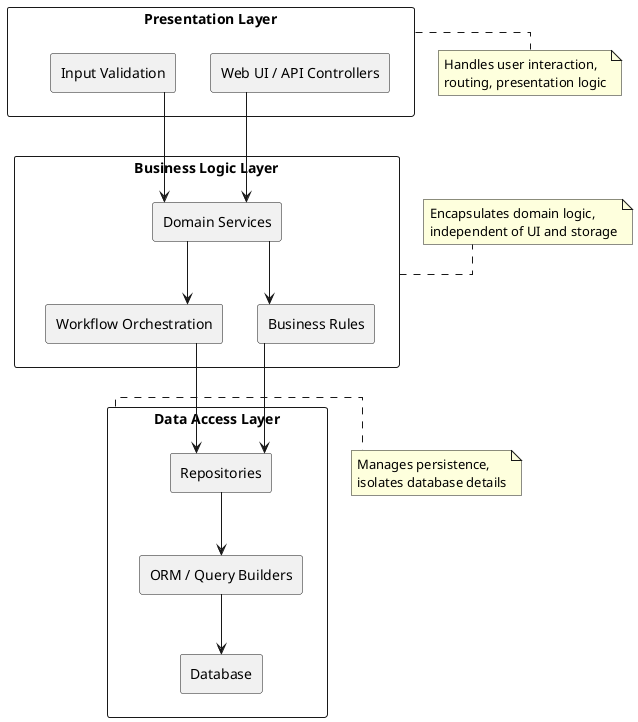

+++
title = "Three-Layer Architecture Primer"
subtitle = "Presentation–Business–Data separation for maintainable applications"
aliases = ["three-layer-architecture", "architectural/three-layer"]
author = "Stijn Dejongh"
outputs = ['html', 'rss', 'json']
date = "2025-11-13T22:00:00+00:00"
tags = ["architecture", "patterns", "primer", "reference", "layered"]
summary = """
Three-Layer Architecture (also called Three-Tier) separates applications into presentation, business logic, and data access layers. 
This clear boundary structure promotes maintainability, testability, and enables independent evolution of UI, logic, and persistence concerns.
"""
draft = true
+++

## 1. Concept Overview

Three-Layer Architecture emerged from the need to organize growing applications into understandable, maintainable sections. By separating concerns into distinct layers with defined responsibilities, teams can reason about, test, and evolve each layer independently.

**Core idea:** Divide the application into three horizontal layers that enforce dependency direction—upper layers depend on lower layers, never the reverse.

**Key identifying features:**
- **Presentation Layer:** User interface, input validation, display formatting
- **Business Logic Layer:** Domain rules, workflows, calculations, orchestration
- **Data Access Layer:** Persistence operations, database queries, external system integration

Each layer communicates only with its immediate neighbor, creating clean boundaries and reducing coupling.

**Authoritative References:**
- [Patterns of Enterprise Application Architecture (Martin Fowler)](https://martinfowler.com/books/eaa.html) — Canonical layering patterns
- [Domain-Driven Design (Eric Evans)](https://www.domainlanguage.com/ddd/) — Layered architecture in DDD context
- [Microsoft Application Architecture Guide](https://learn.microsoft.com/en-us/previous-versions/msp-n-p/ff650706(v=pandp.10)) — Enterprise layering practices

## 2. Structural Sketch

**Communication paths:**
- **User → Presentation → Business Logic:** UI accepts input, delegates to business layer
- **Business Logic → Data Access:** Business logic requests data operations
- **Data Access → Database/External Systems:** Persistence layer executes queries

**Prohibited dependencies:**
- Data Access Layer never calls Business Logic Layer
- Presentation Layer never directly accesses databases or external systems

## 3. Operating Model

**Request flow (typical web application):**
1. **Presentation Layer receives request:** Controller or API endpoint validates input
2. **Delegates to Business Logic Layer:** Calls domain service with validated data
3. **Business Logic processes request:** Applies rules, orchestrates workflow, calls repositories
4. **Data Access Layer executes persistence:** Repository translates to database operations
5. **Response flows back:** Data propagates up through layers to presentation

**Responsibility boundaries:**

| Layer | Responsibilities | Does NOT Handle |
|-------|-----------------|------------------|
| Presentation | Routing, validation, formatting, session management | Business rules, direct database access |
| Business Logic | Domain rules, calculations, orchestration, invariants | UI concerns, SQL queries |
| Data Access | CRUD operations, query optimization, transactions | Business logic, presentation formatting |

**Data flow conventions:**
- **DTOs (Data Transfer Objects):** Presentation ↔ Business Logic
- **Entities/Domain Models:** Business Logic ↔ Data Access
- **Database Rows/Documents:** Data Access ↔ Persistence

## 4. Strengths and Weaknesses

| Aspect | Strengths | Weaknesses |
|--------|----------|------------|
| **Maintainability** | Clear separation of concerns; easy to locate code | Can lead to anemic domain models if logic leaks |
| **Testability** | Layers can be tested in isolation with mocks | Integration testing requires all layers |
| **Team scaling** | Different teams can own different layers | Coordination overhead for cross-layer changes |
| **Technology flexibility** | Swap UI or database without touching business logic | Rigid boundaries can force awkward abstractions |
| **Learning curve** | Intuitive for newcomers; widely documented | Over-layering creates unnecessary indirection |
| **Performance** | Caching and optimization per layer | Layer boundaries add method call overhead |

**Common failure modes:**
- **Anemic domain model:** Business logic leaks into presentation or data layers
- **Layer bypass:** Direct database calls from presentation for "performance"
- **DTO explosion:** Excessive object mapping between layers
- **Fat service layer:** Business logic becomes a procedural script coordinator

## 5. When to Use / Move On

**Use Three-Layer Architecture when:**
- Building CRUD-heavy applications with clear read/write workflows
- Team needs shared mental model with low onboarding friction
- Technology stack might change (swap frontend, migrate database)
- Codebase will grow but domain complexity remains moderate
- Testing in isolation (unit tests per layer) is a priority

**Move on or evolve when:**
- Domain complexity exceeds what procedural service layers handle well → **Domain-Driven Design with rich domain models**
- Scaling requires independent deployment of components → **Microservices or Service-Oriented Architecture**
- Read/write patterns diverge significantly → **CQRS (Command Query Responsibility Segregation)**
- Real-time event processing becomes central → **Event-Driven Architecture**
- Application is small and stays small → **Simpler structures (e.g., MVC without explicit layering)**

**Migration paths:**
- **Introduce Hexagonal Architecture (Ports & Adapters):** Make Business Logic independent of frameworks
- **Extract bounded contexts:** Refactor layers into domain-driven modules
- **Split reads and writes:** Evolve toward CQRS while keeping layered structure

## 6. Ecosystem Compatibility

**Works well with:**

| Tool/Framework | Layer | Notes |
|---------------|-------|-------|
| **Spring MVC / ASP.NET MVC** | Presentation | Controllers map naturally to presentation layer |
| **React / Vue / Angular** | Presentation | Frontend calls backend APIs (presentation boundary) |
| **Spring Boot / Express.js** | Business Logic | Service classes host domain logic |
| **JPA / Entity Framework / Sequelize** | Data Access | ORM tools abstract database operations |
| **PostgreSQL / MySQL / MongoDB** | Data Access | Any persistence technology fits |

**Testing tools:**
- **JUnit / NUnit / Jest:** Unit test each layer independently
- **Mockito / Moq:** Mock adjacent layers
- **Testcontainers / Docker Compose:** Integration tests with real databases

**Anti-patterns to avoid:**
- Presentation code directly importing ORM entities
- Business logic services containing SQL strings
- Data access layer calling HTTP endpoints (mix of concerns)

## 7. Common Variations

**1. Four-Layer with Infrastructure:**
Add a fourth layer for cross-cutting concerns (logging, caching, messaging).

**2. Vertical Slices within Layers:**
Organize by feature/module first, then apply layers within each slice (modular monolith).

**3. Layered + Hexagonal (Onion Architecture):**
Business Logic becomes the core; Presentation and Data Access are adapters around it.

**4. Layered Microservices:**
Each microservice internally uses three layers but is deployed independently.

**5. Passive Data Layer:**
Business Logic directly uses repositories (no separate service layer for simple CRUD).

## 8. Field Notes

**From practice:**

- **Layer responsibilities drift over time.** Enforce boundaries through architecture tests (ArchUnit, NDepend) and code reviews.
  
- **Transaction boundaries matter.** Business Logic Layer typically owns transaction scope; Data Access Layer should not commit independently.

- **DTOs proliferate but serve a purpose.** They decouple presentation contracts from domain models; accept the mapping cost for flexibility.

- **Presentation Layer often becomes the dumping ground.** Resist putting "quick fixes" in controllers; push logic down to services.

- **Testing layers in isolation is powerful.** Mock repositories to test business logic without databases; mock services to test controllers without business rules.

- **Layer violations are visible in imports.** If Data Access Layer imports Presentation types, something is wrong. Use static analysis to catch this early.

- **Performance concerns tempt shortcuts.** Caching at the business or data layer is fine; direct database calls from presentation for "speed" breaks the model.

**When to relax boundaries:**
- **Read-only queries for reporting:** Sometimes a direct SQL view from presentation is pragmatic for analytics dashboards.
- **Batch processing:** Long-running jobs might bypass presentation layer entirely and call business logic directly.

**Evolution signals:**
- If services become thin wrappers around repositories, consider richer domain models.
- If cross-layer changes are constant, the layer boundaries might be wrong—realign or consider vertical slicing.
- If multiple presentations (web, mobile, API) exist, ensure Business Logic Layer is truly presentation-agnostic.

**Documentation practices:**
- Maintain a layer dependency diagram in the repository
- Use package/namespace naming to make layers explicit (`myapp.presentation`, `myapp.business`, `myapp.data`)
- Document DTO mapping rationale (why we separate presentation DTOs from domain entities)

**References for Further Reading:**
- [Clean Architecture (Robert C. Martin)](https://www.oreilly.com/library/view/clean-architecture-a/9780134494272/) — Dependency rule and layer independence
- [Building Evolutionary Architectures](https://www.oreilly.com/library/view/building-evolutionary-architectures/9781491986356/) — Evolving from layers to other patterns
- [ArchUnit User Guide](https://www.archunit.org/userguide/html/000_Index.html) — Enforcing architectural rules in tests
