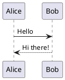
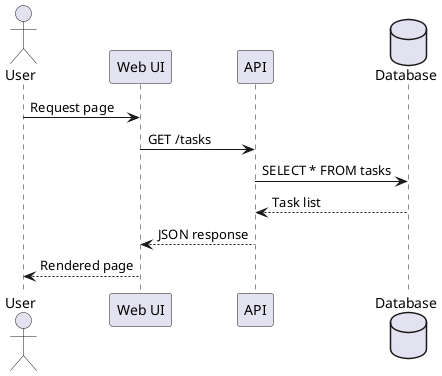
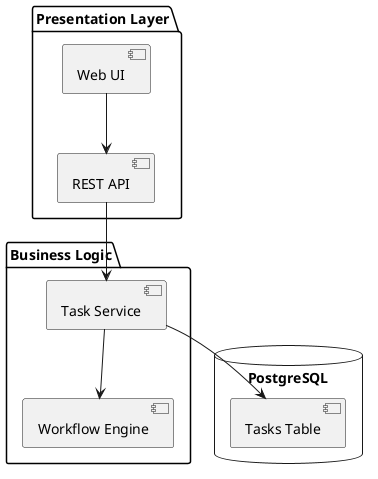
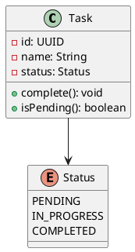
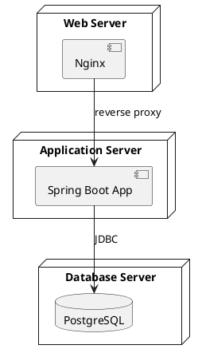
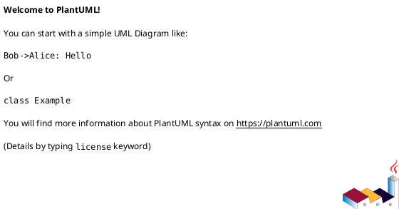
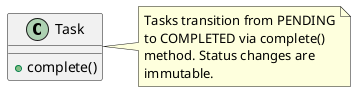
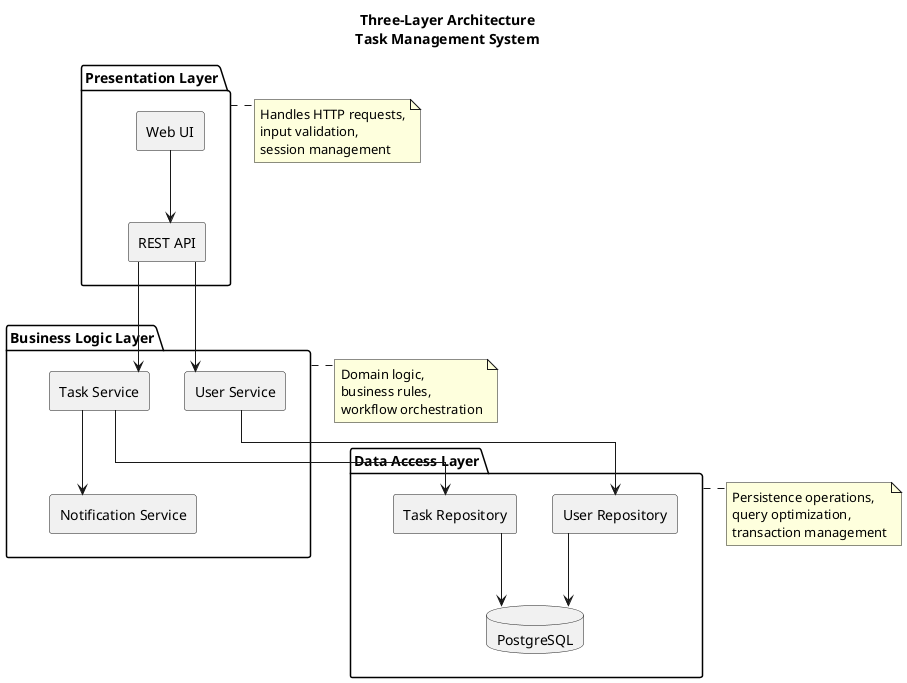

+++
title = "PlantUML Primer"
subtitle = "Text-based diagramming for version-controlled architecture documentation"
aliases = ["plantuml-primer", "markup-and-diagramming/plantuml"]
author = "Stijn Dejongh"
outputs = ['html', 'rss', 'json']
date = "2025-11-13T22:00:00+00:00"
tags = ["documentation", "diagrams", "plantuml", "primer", "reference", "uml"]
summary = """
PlantUML generates diagrams from plain-text descriptions, enabling version-controlled visual documentation. 
It supports UML diagrams, architectural sketches, and various other diagram types through a concise, 
readable syntax that integrates seamlessly with development workflows.
"""
further_exploration = [
    { type = "raw", author = "PlantUML", year = "2024", title = "PlantUML Language Reference Guide", site = "plantuml.com", link = "https://plantuml.com/guide" },
    { type = "raw", author = "PlantUML", year = "2024", title = "PlantUML Official Site", site = "plantuml.com", link = "https://plantuml.com/" },
    { type = "raw", author = "Real World PlantUML", year = "2024", title = "Community-Contributed Examples", site = "real-world-plantuml.com", link = "https://real-world-plantuml.com/" },
    { type = "raw", author = "PlantUML Stdlib", year = "2024", title = "C4-PlantUML: C4 Model Integration", site = "GitHub", link = "https://github.com/plantuml-stdlib/C4-PlantUML" },
    { type = "raw", author = "Ashley, Crashedmind", year = "2024", title = "Hitchhiker's Guide to PlantUML", site = "GitHub Pages", link = "https://crashedmind.github.io/PlantUMLHitchhikersGuide/" },
    { type = "raw", author = "ogom", year = "2024", title = "PlantUML Cheat Sheet", site = "GitHub Pages", link = "https://ogom.github.io/draw_uml/plantuml/" }
]
image = "primers/plantuml_logo"
+++

## 1. Purpose and Philosophy

PlantUML was created to solve a fundamental problem: visual diagrams in traditional tools (Visio, draw.io) don't version control well and drift from code. By describing diagrams as text, PlantUML treats diagrams like code—diffable, mergeable, and automatically renderable.

**Strengths:**

- **Version control friendly:** Plain text files in Git show meaningful diffs
- **Consistency:** Automatic layout ensures uniform styling across diagrams
- **Integration:** Renders in CI/CD, documentation sites, IDEs, and wikis
- **Expressiveness:** Supports UML (class, sequence, component), C4 models, Gantt charts, mind maps, and more
- **Toolchain independence:** Render via CLI, web service, or IDE plugins

**Limitations:**

- **Layout control:** Automatic layout sometimes produces suboptimal arrangements
- **Learning curve:** Syntax is terse; advanced features require documentation lookups
- **Rendering dependencies:** Requires Java runtime and Graphviz for some diagram types
- **Visual tweaking:** Fine-grained positioning and styling is limited compared to WYSIWYG tools

**Use PlantUML for:**

- Architecture diagrams in documentation (C4 models, component diagrams)
- Sequence diagrams for interaction flows
- Class diagrams for domain modeling
- Deployment and infrastructure diagrams
- Any diagram that should evolve with code

**Avoid PlantUML for:**

- High-fidelity mockups or pixel-perfect layouts
- Diagrams requiring frequent visual iteration (use draw.io for drafts, then migrate to PlantUML)
- Presentations where manual layout control is critical

**Authoritative References:**

- [PlantUML Official Site](https://plantuml.com/) — Syntax reference, examples, online editor
- [PlantUML Language Reference Guide](https://plantuml.com/guide) — Comprehensive syntax documentation
- [Real World PlantUML](https://real-world-plantuml.com/) — Community-contributed examples
- [C4-PlantUML](https://github.com/plantuml-stdlib/C4-PlantUML) — C4 model integration

## 2. Getting Started

To begin creating PlantUML diagrams, you need a text editor and a way to render the diagrams. The quickest path is using an online editor or IDE plugin.

**Quickest start (no installation):**
1. Visit [PlantUML Online Server](https://www.plantuml.com/plantuml/uml/)
2. Write your diagram syntax in the text area
3. See the rendered diagram update in real-time
4. Export to PNG or SVG when satisfied

**Recommended local setup:**

**Option A: VS Code (cross-platform):**
1. Install [VS Code](https://code.visualstudio.com/)
2. Install the [PlantUML extension](https://marketplace.visualstudio.com/items?itemName=jebbs.plantuml)
3. Create a file with `.puml` extension
4. Press `Alt+D` to preview the diagram
5. The extension handles rendering automatically (uses online server by default)

**Option B: Command-line with Java:**
1. Install Java Runtime (JRE 8 or later)
   - **macOS:** `brew install openjdk`
   - **Ubuntu/Debian:** `sudo apt-get install default-jre`
   - **Windows:** Download from [java.com](https://www.java.com/)
2. Install PlantUML
   - **macOS:** `brew install plantuml`
   - **Ubuntu/Debian:** `sudo apt-get install plantuml`
   - **Windows:** Download JAR from [plantuml.com/download](https://plantuml.com/download)
3. Install Graphviz (required for some diagram types)
   - **macOS:** `brew install graphviz`
   - **Ubuntu/Debian:** `sudo apt-get install graphviz`
   - **Windows:** Download from [graphviz.org](https://graphviz.org/download/)
4. Render a diagram: `plantuml diagram.puml`

**For IntelliJ IDEA users:**
- Install the [PlantUML Integration plugin](https://plugins.jetbrains.com/plugin/7017-plantuml-integration)
- Create `.puml` files and see live previews in the editor

Once set up, create a simple sequence diagram to verify everything works:



Save this as `test.puml` and render it to confirm your environment is ready.

## 3. Core Syntax

**Minimal cheatsheet:**

### Sequence Diagram




### Component Diagram




### Class Diagram




### Deployment Diagram




### C4 Context Diagram

```plantuml
@startuml
!include https://raw.githubusercontent.com/plantuml-stdlib/C4-PlantUML/master/C4_Context.puml

Person(user, "User", "Task manager user")
System(taskSystem, "Task Management System", "Manages user tasks")
System_Ext(emailSystem, "Email System", "Sends notifications")

Rel(user, taskSystem, "Uses")
Rel(taskSystem, emailSystem, "Sends emails via")
@enduml
```


## 4. Patterns and Idioms

### Documentation Structure

Organize diagrams alongside code or in dedicated directories:

```
project/
├── docs/
│   ├── architecture/
│   │   ├── context.puml          # C4 context diagram
│   │   ├── containers.puml       # C4 container diagram
│   │   └── components.puml       # Component details
│   ├── sequences/
│   │   ├── user-login.puml
│   │   └── task-workflow.puml
│   └── domain/
│       └── task-model.puml       # Class diagram
├── src/
└── README.md
```

### Common Styling Patterns

```plantuml
@startuml
' Custom styling for consistent look
skinparam shadowing false
skinparam linetype ortho
skinparam rectangle {
    BackgroundColor LightBlue
    BorderColor DarkBlue
}

rectangle "Component A" as A
rectangle "Component B" as B

A --> B
@enduml
```




### Including Shared Definitions



```plantuml
@startuml
!include common-styles.iuml

rectangle "Service" COMPONENT_COLOR
database "DB" DATABASE_COLOR
@enduml
```

### Embedding Notes and Documentation




## 5. Tooling and Rendering

PlantUML offers multiple rendering approaches, from command-line tools for batch processing to IDE integrations for interactive development. Choose the setup that best fits your workflow.

### Command-Line Rendering

The command-line interface is ideal for automation, batch processing, and CI/CD pipelines.

```bash
# Install PlantUML (requires Java)
# macOS:
brew install plantuml

# Ubuntu/Debian:
sudo apt-get install plantuml

# Windows:
# Download from https://plantuml.com/download

# Render diagram to PNG
plantuml diagram.puml

# Render to SVG (vector, preferred for web)
plantuml -tsvg diagram.puml

# Render all .puml files in directory
plantuml src/diagrams/*.puml

# Watch for changes and auto-render
plantuml -gui src/diagrams/
```

### IDE Integration

IDE plugins provide live previews, making it easy to iterate on diagrams while writing code or documentation.

- **VS Code:** [PlantUML Extension](https://marketplace.visualstudio.com/items?itemName=jebbs.plantuml)
    - Live preview, syntax highlighting, export
- **IntelliJ IDEA:** [PlantUML Integration Plugin](https://plugins.jetbrains.com/plugin/7017-plantuml-integration)
- **Eclipse:** [PlantUML Plugin](https://plantuml.com/eclipse)
- **Atom:** [PlantUML Viewer](https://atom.io/packages/plantuml-viewer)

### Online Editors

For quick experimentation without installing anything, online editors render diagrams in your browser.

- [PlantUML Online Server](https://www.plantuml.com/plantuml/uml/)
- [PlantText](https://www.planttext.com/)

### Rendering Services

You can embed diagrams dynamically in documentation by referencing source files through PlantUML's public rendering service.

```markdown
Embed in Markdown (GitHub, GitLab):

```

### Build Integration

Automate diagram rendering in continuous integration pipelines to keep visuals in sync with code changes.

```yaml
# GitHub Actions: Render PlantUML in CI
name: Render Diagrams
on: [push]
jobs:
  render:
    runs-on: ubuntu-latest
    steps:
      - uses: actions/checkout@v3
      - name: Render PlantUML
        uses: grassedge/generate-plantuml-action@v1.5
        with:
          path: docs/diagrams
          message: "Auto-generated diagrams"
```

## 6. Integration

PlantUML integrates naturally into documentation workflows, version control systems, and static site generators, treating diagrams as code artifacts.

### Hugo/Jekyll Static Sites

```bash
# Pre-render diagrams in build pipeline
#!/bin/bash
for file in src/images/*.puml; do
  plantuml -tsvg "$file" -o ../../static/images/
done
```

```markdown
# Reference in markdown

```

### Documentation as Code
```markdown
Keep diagrams next to code they document:

project/
├── src/
│   ├── domain/
│   │   ├── task.py
│   │   └── task-model.puml      # Domain model diagram
│   └── api/
│       ├── routes.py
│       └── api-sequence.puml    # API interaction diagram
```

### Version Control Workflow
```bash
# Edit diagram
vim docs/architecture.puml

# Render locally to verify
plantuml -tsvg docs/architecture.puml

# Commit both source and rendered (or generate in CI)
git add docs/architecture.puml static/images/architecture.svg
git commit -m "Update architecture diagram"
```

### Automated Diagram Updates
```makefile
# Makefile for diagram rendering
DIAGRAMS := $(wildcard docs/**/*.puml)
SVGS := $(DIAGRAMS:.puml=.svg)

all: $(SVGS)

%.svg: %.puml
	plantuml -tsvg $<

clean:
	rm -f $(SVGS)

.PHONY: all clean
```

## 7. Accessibility and Review

### Accessibility Practices
- **Alt text in markdown:** Provide meaningful descriptions when embedding diagrams
  ```markdown
  
  ```
- **SVG output preferred:** Vector graphics scale without quality loss
- **High contrast:** Use `skinparam monochrome true` for black-and-white rendering
- **Descriptive labels:** Avoid abbreviations; spell out component names

### Review and Versioning
- **Text diffs are readable:** Reviewers can see diagram changes in Git diffs
- **Comments in diagrams:** Use `' single quote` for inline comments
  ```plantuml
  @startuml
  ' This diagram shows the authentication flow
  ' Updated 2024-01-15 to reflect OAuth integration
  
  actor User
  participant "Auth Service" as Auth
  
  User -> Auth: Login request
  @enduml
  ```
- **Version markers in diagrams:**
  ```plantuml
  @startuml
  title User Authentication Flow\n(Version 2.0 - OAuth Integrated)
  ...
  @enduml
  ```

### Common Pitfalls
- **Graphviz dependency:** Some diagrams require Graphviz; install with PlantUML
- **Large diagrams become unreadable:** Break into multiple smaller diagrams
- **Layout quirks:** Use `skinparam linetype ortho` for cleaner orthogonal lines
- **Color accessibility:** Avoid red-green combinations; test with colorblind simulators
- **Over-detailing:** Keep diagrams high-level; excessive detail obscures intent

## 8. Example and Reference

**Complete working example: Three-Layer Architecture**




**Render:**
```bash
plantuml -tsvg architecture-layers.puml
```

**Embed in documentation:**
```markdown
# System Architecture

Our system uses a three-layer architecture to separate concerns:


Each layer has clear responsibilities and dependencies flow downward only.
```

**Applying custom styling to the example:**

