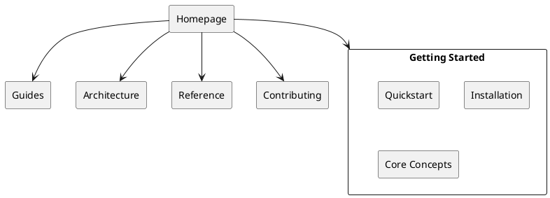

# Task: Documentation Site Architecture Diagrams

**Task ID**: `2026-01-31T1030-docsite-diagrams`  
**Assignee**: Diagrammer Agent (Diagram Dave)  
**Priority**: LOW (enhancement, optional for Batch 1)  
**Estimated Effort**: 2-3 hours  
**Depends On**: Architect Alphonso (docs-site foundation - ✅ COMPLETE)  
**Related**: `work/planning/docsite-batch-1-implementation-plan.md`

---

## Objective

Create visual diagrams to illustrate documentation site architecture, deployment flow, and user journeys. Enhance understanding through visual representations.

---

## Context

The documentation site architecture is documented in `docs-site/ARCHITECTURE.md`. The site structure, deployment process, and user journeys are described in text. Your task is to create visual diagrams to complement the text documentation.

---

## Deliverables

### 1. Site Structure Diagram

**File**: `docs-site/static/diagrams/site-structure.png` (+ source file)

**Content**:
- Section hierarchy (Homepage → 5 main sections → subsections)
- Navigation flow between sections
- Visual representation of information architecture

**Format**: PlantUML, Mermaid, or draw.io (must be exportable and maintainable)

**Embed in**: `docs-site/ARCHITECTURE.md` (Navigation Design section)

**Example Structure**:
```
Homepage
├─ Getting Started
│  ├─ Quickstart
│  ├─ Installation
│  └─ Core Concepts
├─ Guides (19 how-tos)
├─ Architecture (ADRs, Patterns)
├─ Reference (Agent Profiles, Glossary)
└─ Contributing
```

---

### 2. Build/Deployment Flow Diagram

**File**: `docs-site/static/diagrams/deployment-flow.png` (+ source file)

**Content**:
- Git push → GitHub Actions trigger
- Hugo build process (with timing: ~85ms)
- Deploy to gh-pages branch
- GitHub Pages propagation
- Total timeline: 2-3 minutes

**Format**: PlantUML, Mermaid, or flowchart tool

**Embed in**: `docs-site/ARCHITECTURE.md` (Build and Deployment section)

**Example Flow**:
```
Developer → Git Push (main) → GitHub Actions
  ↓
Hugo Build (85ms, 18 pages)
  ↓
Deploy to gh-pages branch (~30s)
  ↓
GitHub Pages Propagation (~60s)
  ↓
Live Site (2-3 min total)
```

---

### 3. User Journey Diagram

**File**: `docs-site/static/diagrams/user-journeys.png` (+ source file)

**Content**:
- Three user personas:
  1. **New User**: Landing → What is this? → Quickstart → First Task → Tutorials
  2. **Active User**: Search → How-To Guide → Related Guides → Success
  3. **Architect**: Homepage → Architecture → ADRs → Design Patterns → Implementation
- Decision points and destinations
- Visual representation of user flows

**Format**: Flowchart or journey map

**Embed in**: `docs-site/content/_index.md` (Choose Your Path section) or `docs-site/ARCHITECTURE.md`

---

## Success Criteria

- ✅ Diagrams are clear, professional, and enhance understanding
- ✅ Source files committed (diagram-as-code preferred for version control)
- ✅ PNG/SVG exports optimized for web (<100KB each)
- ✅ Diagrams embedded in relevant documentation pages
- ✅ Diagrams follow consistent visual style
- ✅ Text in diagrams is readable (minimum 12pt font)

---

## Technical Requirements

### Diagram Formats

**Preferred** (diagram-as-code for maintainability):
- PlantUML (`.puml` source → PNG/SVG export)
- Mermaid (`.mmd` source → PNG/SVG export)

**Acceptable** (if above tools insufficient):
- draw.io / diagrams.net (`.drawio` source → PNG/SVG export)
- Excalidraw (`.excalidraw` source → PNG/SVG export)

### Output Requirements

- **Source files**: Commit to `docs-site/static/diagrams/src/`
- **Export format**: PNG and/or SVG
- **Resolution**: PNG should be 2x for retina displays
- **Optimization**: Use compression (pngquant, svgo)
- **File size**: <100KB per diagram ideal

---

## Reference Materials

- **Architecture doc**: `docs-site/ARCHITECTURE.md` (sections to visualize)
- **Homepage**: `docs-site/content/_index.md` (user journey content)
- **Roadmap**: `work/planning/documentation-website-roadmap.md` (user personas)

### PlantUML Example (Site Structure)



---

## Embedding in Documentation

**Markdown syntax**:
```markdown


*Figure 1: Documentation site information architecture*
```

**Alt text**: Always include descriptive alt text for accessibility

---

## Testing Checklist

- [ ] Source files created and committed (`docs-site/static/diagrams/src/`)
- [ ] PNG/SVG exports generated (`docs-site/static/diagrams/`)
- [ ] Diagrams embedded in documentation pages
- [ ] Alt text added for accessibility
- [ ] Diagrams render correctly in Hugo build
- [ ] File sizes optimized (<100KB)
- [ ] Visual style consistent across diagrams
- [ ] Text readable at typical screen sizes

---

## Questions or Issues?

**Review**:
- `docs-site/ARCHITECTURE.md`: Content to visualize
- `work/planning/documentation-website-roadmap.md`: User journey details

**Ask**:
- Architect Alphonso for clarification on architecture details
- Writer Wendy for user journey refinement

---

**Created**: 2026-01-31  
**Status**: 🟢 Optional (Low Priority)  
**Next Steps**: Create diagrams, embed in docs, commit source files
